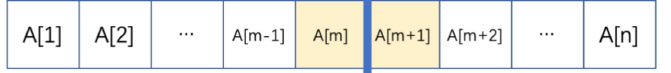
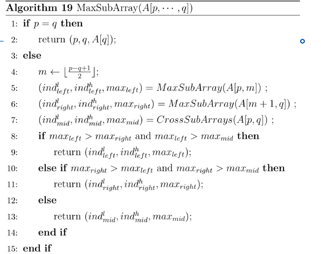
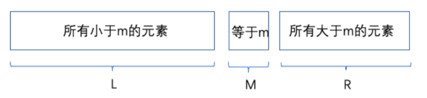
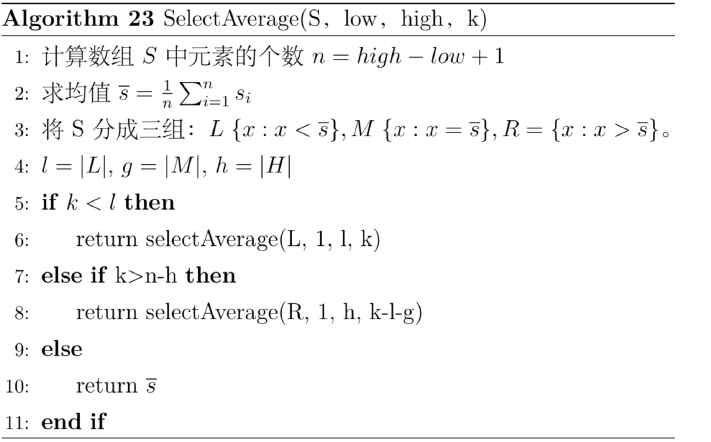
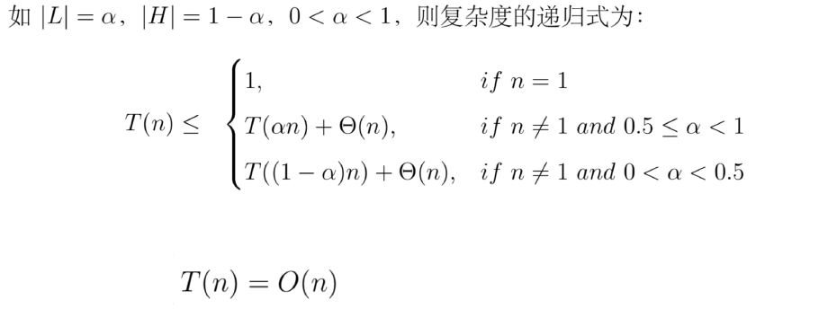

## 重要例子
### 最大子数组
- 基本步骤

对原数组进行二分，也就是将数组划分为左右相等（或者相差一个元素）的两个子数组。

对两个子问题进行递归，得到的解分别是LeftMax和RightMax.但是会出现横跨两个数组的情况，最后应该返回的是
```bash
Max{LeftMax,RightMax,CrossMax}
```
- 复杂度

T(n) = 2T(n/2) + cn.可得T(n) = O(nlog(n))

- 伪代码



- C++代码实现

```C++
#include <iostream>
#include <algorithm> // for std::max
using namespace std;

#define MAXN 100000
int n; // Number of elements
int a[MAXN];

// Find the maximum subarray sum that crosses the midpoint
int getCrossMax(int nums[], int m, int left, int right) {
    // Left half sum (including mid element)
    int leftMax = nums[m];
    int sum = leftMax;
    for (int i = m - 1; i >= left; i--) {
        sum += nums[i];
        leftMax = max(leftMax, sum);
    }

    // Right half sum (starting from m+1)
    int rightMax = 0; // Initialize to 0 in case there's no right half
    if (m + 1 <= right) {
        rightMax = nums[m + 1];
        sum = rightMax;
        for (int i = m + 2; i <= right; i++) { // Start from m + 2
            sum += nums[i];
            rightMax = max(rightMax, sum);
        }
    }
    
    return leftMax + rightMax;
}

// Recursive function to find the maximum subarray sum
int getMaxSubSum(int nums[], int left, int right) {
    if (left == right) {
        return nums[left];
    }
    int m = left + (right - left) / 2;
    int leftMax = getMaxSubSum(nums, left, m);
    int rightMax = getMaxSubSum(nums, m + 1, right);
    int crossMax = getCrossMax(nums, m, left, right);
    return max(leftMax, max(rightMax, crossMax));
}

// Main function to find the maximum subarray sum
int maxSubArraySum(int a[], int n) {
    return getMaxSubSum(a, 0, n - 1);
}

int main() {
    cin >> n; 
    for (int i = 0; i < n; i++) {
        cin >> a[i];
    }
    cout << maxSubArraySum(a, n) << endl;
    return 0;
}
```

### 第K小元素

- 如何划分子问题？

考虑一个中间元素，把原数组划分为几组

- 中间元素的选择

可以取平均元素

- 哪些子问题可以舍弃

找到对应的组，其他组舍去


- 伪代码


- 复杂度

这个复杂度不是确定的，根据L和H的比例动态改变


- C++代码实现

```C++
#include <iostream>
#include <vector>
#include <numeric>   // for accumulate
#include <algorithm> // for partition and copy_if

using namespace std;
int n;
int k; 
// 函数用于从数组 S 中查找第 k 小元素
int selectAverage(vector<int> &S, int low, int high, int k)
{
    // 1. 计算数组 S 中元素的个数 n
    int n = high - low + 1;

    // 2. 求数组 S 的平均值
    double sum = accumulate(S.begin() + low, S.begin() + high + 1, 0);
    double average = sum / n;

    // 3. 将 S 分成三组：L {x < 平均值}, M {x = 平均值}, R {x > 平均值}
    vector<int> L, M, R;

    for (int i = low; i <= high; ++i)
    {
        if (S[i] < average)
            L.push_back(S[i]);
        else if (S[i] == average)
            M.push_back(S[i]);
        else
            R.push_back(S[i]);
    }

    int l = L.size(); // L 的大小
    int m = M.size(); // M 的大小
    int r = R.size(); // R 的大小

    // 4. 判断 k 所在的区间，递归查找
    if (k <= l)
    {
        // k 在 L 中，递归到 L 中查找
        return selectAverage(L, 0, l - 1, k);
    }
    else if (k > l + m)
    {
        // k 在 R 中，递归到 R 中查找
        return selectAverage(R, 0, r - 1, k - l - m);
    }
    else
    {
        // k 在 M 中，返回平均值
        return average;
    }
}

int main()
{
  // 输入数组大小
    cout << "请输入数组大小: ";
    cin >> n;

    vector<int> S(n);

    // 输入数组元素
    cout << "请输入 " << n << " 个元素: ";
    for (int i = 0; i < n; ++i) {
        cin >> S[i];
    }

    // 输入要查找的第 k 小的元素
    cout << "请输入要查找的 k (第 k 小的元素): ";
    cin >> k;

    if (k < 1 || k > n) {
        cout << "k 的值必须在 1 到 " << n << " 之间。" << endl;
        return 1;
    }
    
    int result = selectAverage(S, 0, S.size() - 1, k);
    
    cout << "第 " << k << " 小的元素是: " << result << endl;
    
    return 0;
}
```