# Docker学习笔记记录
## 安装准备

> 环境准备

- Linux基础
- Ubuntu

> 环境查看

`uname -r` 查看内核版本，不能低于相关的要求

```Shell
$ uname -r
5.15.0-83-generic
```

## Docker安装

#### 检查并卸载老版本

```PowerShell
sudo apt-get remove docker docker-engine docker.io containerd runc
```

会显示:

docker-engine docker.io containerd runc

Reading package lists... Done

Building dependency tree... Done

Reading state information... Done

E: Unable to locate package docker-engine


#### 更新软件包

```PowerShell
apt-get install ca-certificates curl gnupg lsb-release
```


#### 添加docker官方GPG秘钥

```PowerShell
curl -fsSL http://mirrors.aliyun.com/docker-ce/linux/ubuntu/gpg | sudo apt-key add -
```


#### 安装第三方工具

```PowerShell
sudo: add-apt-repository: command not found
apt-get install software-properties-common
```

#### 添加软件源

```PowerShell
sudo add-apt-repository "deb [arch=amd64] http://mirrors.aliyun.com/docker-ce/linux/ubuntu $(lsb_release -cs) stable"
```

注意这个不能在fish中使用`$`

#### 安装docker

```PowerShell
apt-get install docker-ce docker-ce-cli containerd.io
```

#### 配置用户组

```PowerShell
sudo usermod -aG docker $USER
```

#### 安装工具

```PowerShell
apt-get -y install apt-transport-https ca-certificates curl software-properties-common
```

#### 重启docker

```PowerShell
service docker restart
```

#### 验证docker是否安装成功

```PowerShell
sudo docker run hello-world
```

**第一次会显示：**

```PowerShell
root@iZf8z3j2ckkap5ux6r0351Z ~# sudo docker run hello-world
Unable to find image 'hello-world:latest' locally
latest: Pulling from library/hello-world
c1ec31eb5944: Pull complete
Digest: sha256:a26bff933ddc26d5cdf7faa98b4ae1e3ec20c4985e6f87ac0973052224d24302
Status: Downloaded newer image for hello-world:latest

Hello from Docker!
This message shows that your installation appears to be working correctly.

To generate this message, Docker took the following steps:
 1. The Docker client contacted the Docker daemon.
 2. The Docker daemon pulled the "hello-world" image from the Docker Hub.
    (amd64)
 3. The Docker daemon created a new container from that image which runs the
    executable that produces the output you are currently reading.
 4. The Docker daemon streamed that output to the Docker client, which sent it
    to your terminal.

To try something more ambitious, you can run an Ubuntu container with:
 $ docker run -it ubuntu bash

Share images, automate workflows, and more with a free Docker ID:
 https://hub.docker.com/

For more examples and ideas, visit:
 https://docs.docker.com/get-started/
```

#### docker版本查看

```PowerShell
sudo docker version
```

#### docker阿里云加速

```PowerShell
sudo mkdir -p /etc/docker
sudo tee /etc/docker/daemon.json <<-'EOF'
{
  "registry-mirrors": ["https://fwjm47tk.mirror.aliyuncs.com"]
}
EOF
sudo systemctl daemon-reload
sudo systemctl restart docker
```

https://fwjm47tk.mirror.aliyuncs.com 这个链接要去阿里云控制台去找！每个人都是不同的！

## **Docker底层原理**

### **Docker怎么工作？**

Docker是一个client-server结构的系统，Docker的守护进程运行在主机上，通过socket从客户端访问。

DockerServer接受到Docker-Client的指令，就会执行这个指令。

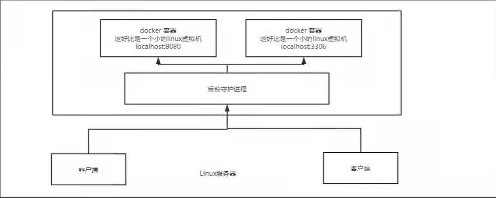
### **Docker为什么比VM快？**

1.Docker有更少的抽象层

2.Docker用的是宿主机的内核

## **Docker常用命令**

### **帮助命令**

```Bash
docker version      #版本信息
docker info                                        #系统信息
docker 命令  --help #万能命令
```

### **镜像命令**

#### Docker images查看镜像

```
docker images
```

root@iZf8z3j2ckkap5ux6r0351Z ~# docker images

REPOSITORY    TAG       IMAGE ID       CREATED         SIZE

hello-world   latest    d2c94e258dcb   11 months ago   13.3kB

解释:

REPOSITORY 镜像的仓库源

TAG                 镜像的标签

IAMGE ID         镜像的id

CREATED                镜像的创建时间

SIZE                        镜像的大小

可选项

`-a`  列出所有镜像

`-q`只显示镜像的id

#### **docker search 搜索镜像**

**`docker search`**

```PowerShell
docker search Mysql
NAME                            DESCRIPTION                                     STARS     OFFICIAL
mysql                           MySQL is a widely used, open-source relation…   15008     [OK]
mariadb                         MariaDB Server is a high performing open sou…   5722      [OK]
```

可选项

`--filter=stars=3000`搜索大于3000的

#### **docker pull下载镜像**

**`docker pull 镜像名 [:tag]`**

#### **docker rmi删除镜像**

**`docker rmi [镜像名/id]`**

**全部删除**

**`docker rmi -f $(docker images -aq)`**

### **容器命令**

有了镜像之后才可以创建容器。

#### **新建容器并启动**

```
docker run [可选参数] image
```

参数说明:

`--name='Name'`  容器名字，用来区分容器

`-d`                                后台方式运行

`-it`                        使用交互式运行，可以进入容器查看内容

`-p`                                指定容器的端口 -p 8080:8080

-p ip 主机端口 : 容器端口

-p 主机端口 : 容器端口

-p 容器端口

容器端口

`-P`                                随机端口

比如启动并进入容器

```
docker run -it centos /bin/bash
```

#### **列出运行的容器**

```
docker ps [可选参数]
```

`-a`         所有容器（包括当前和历史运行的）

`-n=?`        显示最近创建的容器

`-q`                只显示编号id

#### **退出容器**

**`exit`**        **容器停止并退出**

**`crtl +p +q`** **退出但不停止**

#### **删除容器**

1. 删除使用这个镜像的容器

```
docker container rm 4f11698297ca
```

1. 强制删除容器

```
docker container rm -f 4f11698297ca
```

1. 强制删除镜像

```
docker image rm -f 5d0da3dc9764
```

1. 删除所有停止容器

```
docker container prune
```

1. 停止并删除所有容器

```
docker container stop $(docker container ls -qa)
docker container rm $(docker container ls -qa) 
```

**删除容器并不会影响到镜像**

#### **启动和停止容器**

**`docker start id`**

**`docker restart id`**

**`docker stop id`**

**`docker kill id`**

## **容器其他命令**

### **后台启动命令**

```
docker run -d 镜像名
```

但是`docker ps`后发现该镜像停止了

这是一个常见的问题。docker使用后台启动，就必须要有一个前台进程。docker发现没有前台进程就会自动停止。

### **查看日志**

```
docker logs -f -t --tail n 容器
```

### **查看容器中进程信息**

```
docker top id
```

### **查看镜像的元信息**

```
docker inspect id
```

### **进入当前正在运行的容器**

`docker exec -it id /bin/bash` (开启新终端)

`docker attach id /bin/bash`        (进入当前正在运行的终端)

### **从容器内拷贝文件到主机**

```
docker cp 容器id:容器内路径 目的主机路径
```
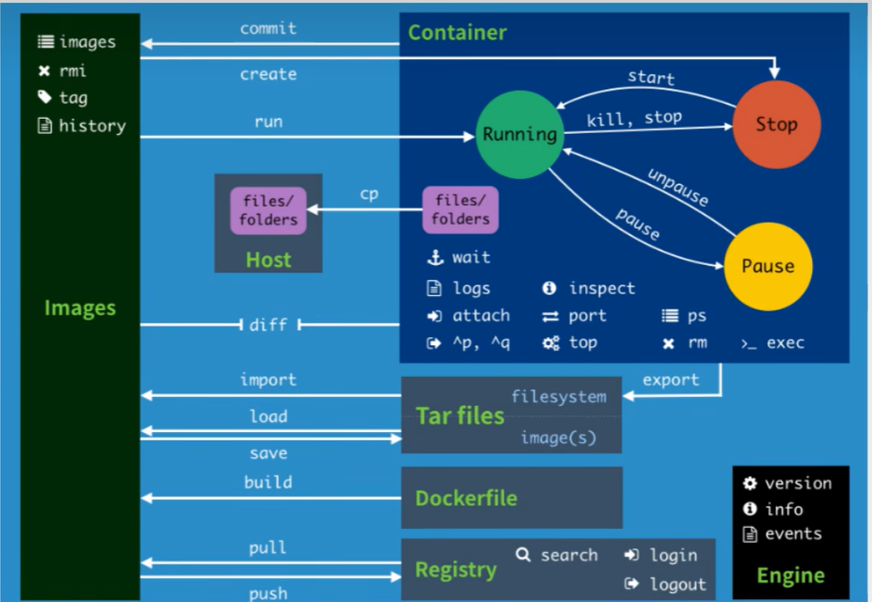

## **练习部署**

#### **部署Nginx**

- 搜索镜像(docker hub)
- 下载镜像

```Shell
root@iZf8z3j2ckkap5ux6r0351Z ~# docker pull nginx
Using default tag: latest
latest: Pulling from library/nginx
a2abf6c4d29d: Pull complete 
a9edb18cadd1: Pull complete 
589b7251471a: Pull complete 
186b1aaa4aa6: Pull complete 
b4df32aa5a72: Pull complete 
a0bcbecc962e: Pull complete 
Digest: sha256:0d17b565c37bcbd895e9d92315a05c1c3c9a29f762b011a10c54a66cd53c9b31
Status: Downloaded newer image for nginx:latest
docker.io/library/nginx:latest
```

- 查看下载

```Shell
root@iZf8z3j2ckkap5ux6r0351Z ~# docker images
REPOSITORY    TAG       IMAGE ID       CREATED         SIZE
hello-world   latest    d2c94e258dcb   11 months ago   13.3kB
nginx         latest    605c77e624dd   2 years ago     141MB
```

- 运行

```Shell
root@iZf8z3j2ckkap5ux6r0351Z ~# docker run -d --name nginx01 -p 3344:80 nginx
bbc025236c03b265248702f04a9316ef93edea9c608f4bd374be5dc4fcf7dc68
```

- 本机测试

```Shell
root@iZf8z3j2ckkap5ux6r0351Z ~# docker ps
CONTAINER ID   IMAGE     COMMAND                  CREATED          STATUS         PORTS                                   NAMES
bbc025236c03   nginx     "/docker-entrypoint.…"   12 seconds ago   Up 8 seconds   0.0.0.0:3344->80/tcp, :::3344->80/tcp   nginx01
root@iZf8z3j2ckkap5ux6r0351Z ~# curl localhost:3344
<!DOCTYPE html>
<html>
<head>
<title>Welcome to nginx!</title>
<style>
html { color-scheme: light dark; }
body { width: 35em; margin: 0 auto;
font-family: Tahoma, Verdana, Arial, sans-serif; }
</style>
</head>
<body>
<h1>Welcome to nginx!</h1>
<p>If you see this page, the nginx web server is successfully installed and
working. Further configuration is required.</p>
<p>For online documentation and support please refer to
<a href="http://nginx.org/">nginx.org</a>.<br/>
Commercial support is available at
<a href="http://nginx.com/">nginx.com</a>.</p>
<p><em>Thank you for using nginx.</em></p>
</body>
</html>
```

- Aliyun配置一下安全组

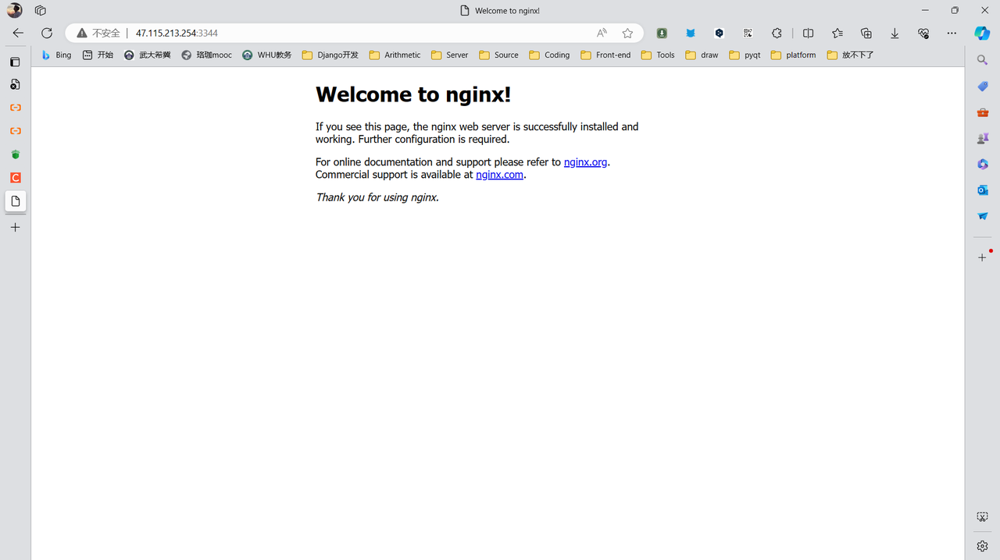
- 停止

```Shell
root@iZf8z3j2ckkap5ux6r0351Z ~# docker stop bbc025236c03
bbc025236c03
```

- 提交镜像

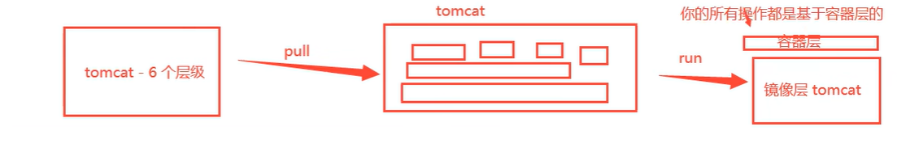
`docker commit` 提交容器成为一个新的副本

```
docker commit -m="描述信息" -a="作者" 容器id 目标镜像名:[TAG]
```

## **容器数据卷**

### **介绍**

如果数据都在容器之中，那么删除容器后，数据就会丢失！ 需求：数据可以持久化

比如MYSQL数据需要存储在本地！

容器之间可以有一个数据共享的技术！Docker容器中产生的数据，同步到本地

将容器内的目录，挂载到Linux!

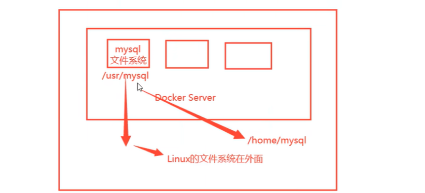

### **使用数据卷**

方式1：直接用命令挂载

```
docker run -it -v 主机目录:容器目录 image /bin/bash
```

#### **练习**

- MYSQL的数据持久化
- 下载后查看

```Plain
root@iZf8z3j2ckkap5ux6r0351Z ~ [1]# docker images
REPOSITORY    TAG       IMAGE ID       CREATED         SIZE
hello-world   latest    d2c94e258dcb   11 months ago   13.3kB
nginx         latest    605c77e624dd   2 years ago     141MB
mysql         5.7       c20987f18b13   2 years ago     448MB
```

- 启动与挂载

```Bash
root@iZf8z3j2ckkap5ux6r0351Z ~# docker run -d -p 3310:3306 -v /home/mysql/conf:/etc/mysql/conf.d/ -v /home/mysql/data:/var/lib/mysql -e MYSQL_ROOT_PASSWORD=123456 --name mysql01
```

记得配置密码:

官方测试:

```Bash
$ docker run --name some-mysql -e MYSQL_ROOT_PASSWORD=my-secret-pw -d mysql:tag
```

DBeaver也是能正常连接到!

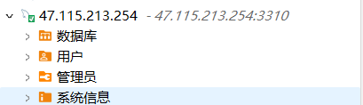

服务器本地访问挂载:

```Bash
root@iZf8z3j2ckkap5ux6r0351Z /h/m/data# ls
auto.cnf         client-key.pem  ib_logfile1         private_key.pem  sys
ca-key.pem       ib_buffer_pool  ibtmp1              public_key.pem
ca.pem           ibdata1         mysql               server-cert.pem
client-cert.pem  ib_logfile0     performance_schema  server-key.pem
```


## **Dockerfile** 

### **DockerFile介绍**

Dockerfile就是用来构建docker镜像的构建文件！

通过这个脚本可以生成镜像。


构建步骤

- 编写一个dockerfile文件
- docker build构建成为一个镜像
- docker run运行镜像
- docker push 发布镜像（Dockerhub 阿里云）

### **DockerFile构建过程**

**基础知识：**

1. 每个保留关键字都是必须大写字母
2. 执行从上到下的顺序

### 表示注释

1. 每个指令都会创建提交一个新的镜像层

Dockerfile是面向开发的，以后要发布项目，做镜像，就需要编写dockerfile文件。

逐渐成为了一个企业的标准！

- DockerFile：构建文件，定义了一切的步骤，源代码
- Dockerlmages：通过 DockerFile 构建生成的镜像，最终发布和运行的产品
- Docker容器：容器就是镜像运行起来提供服务器

### **DockerFile的指令**

常用的as follows

FROM                         #基础镜像,一切从此处进行构建

MANTAINER        #镜像是谁写的，姓名加邮箱

RUN                         #镜像构建的时候需要运行的命令

ADD                         #步骤，添加相关的内容，类似于创业基金

WORKDIR                #镜像的工作目录

VOLUMN                 #挂载的目录

EXPOSE                 #暴露端口配置

CMD                         #指定容器启动的时候要运行的命令（只有最后一个会生效），可被替代

ENTRYPOINT #指定容器启动的时候要运行的命令,可以追加命令

ONBUILD                #当构建一个被继承DockerFile的时候会执行，相当于触发指令

COPY                         #类似ADD，将文件拷贝到镜像

ENV                         #构建的时候设置环境变量

### **实战测试**

DockerHub中99%镜像都是从scratch中过来的，然后配置需要的软件和配置来进行构建

创建一个自己的ubuntu

官方的ubuntu很多命令没有

- 编写DockerFile

```Plain
FROM ubuntu
MAINTAINER JaeHua
jaelele@163.com
ENV MYPATH /usr/local
WORKDIR $MYPATH
RUN apt update
RUN apt install -y vim
EXPOSE 3001
CMD echo $MYPATH
CMD echo "----------end------------"
CMD /bin/bash
```

- 通过文件构建镜像

```Plain
$ docker build -f mydockerfile_ubuntu -t myubuntu:0.1 .
[+] Building 21.3s (8/8) FINISHED                                                                               docker:default
 => [internal] load build definition from mydockerfile_ubuntu                                                             0.0s
 => => transferring dockerfile: 255B                                                                                      0.0s
 => [internal] load metadata for docker.io/library/ubuntu:latest                                                          0.0s
 => [internal] load .dockerignore                                                                                         0.0s
 => => transferring context: 2B                                                                                           0.0s
 => [1/4] FROM docker.io/library/ubuntu:latest                                                                            0.0s
 => CACHED [2/4] WORKDIR /usr/local                                                                                       0.0s
 => [3/4] RUN apt update                                                                                                  7.9s
 => [4/4] RUN apt install -y vim                                                                                         12.5s
 => exporting to image                                                                                                    0.7s
 => => exporting layers                                                                                                   0.6s
 => => writing image sha256:6bd6b6dd54447374468f8980588cd1e58431bfc86b381c191d238835a0616805                              0.0s
 => => naming to docker.io/library/myubuntu:0.1
```

- 测试运行

```Plain
$ docker images
REPOSITORY    TAG       IMAGE ID       CREATED         SIZE
myubuntu      0.1       6bd6b6dd5444   3 minutes ago   192MB
hello-world   latest    d2c94e258dcb   11 months ago   13.3kB
nginx         latest    605c77e624dd   2 years ago     141MB
mysql         5.7       c20987f18b13   2 years ago     448MB
ubuntu        latest    ba6acccedd29   2 years ago     72.8MB
```

- 查看:

进入后工作目录是usr/local . vim也是有了。

docker history image可以查看dockerfile配置

```Plain
root@iZf8z3j2ckkap5ux6r0351Z ~$ docker history 6bd6b6dd5444
IMAGE          CREATED          CREATED BY                                      SIZE      COMMENT
6bd6b6dd5444   9 minutes ago    CMD ["/bin/sh" "-c" "/bin/bash"]                0B        buildkit.dockerfile.v0
<missing>      9 minutes ago    CMD ["/bin/sh" "-c" "echo \"----------end---…   0B        buildkit.dockerfile.v0
<missing>      9 minutes ago    CMD ["/bin/sh" "-c" "echo $MYPATH"]             0B        buildkit.dockerfile.v0
<missing>      9 minutes ago    EXPOSE map[3001/tcp:{}]                         0B        buildkit.dockerfile.v0
<missing>      9 minutes ago    RUN /bin/sh -c apt install -y vim # buildkit    68.2MB    buildkit.dockerfile.v0
<missing>      9 minutes ago    RUN /bin/sh -c apt update # buildkit            50.7MB    buildkit.dockerfile.v0
<missing>      14 minutes ago   WORKDIR /usr/local                              0B        buildkit.dockerfile.v0
<missing>      14 minutes ago   ENV MYPATH=/usr/local                           0B        buildkit.dockerfile.v0
<missing>      14 minutes ago   MAINTAINER JaeHua
jaelele@163.com
              0B        buildkit.dockerfile.v0
<missing>      2 years ago      /bin/sh -c #(nop)  CMD ["bash"]                 0B        
<missing>      2 years ago      /bin/sh -c #(nop) ADD file:5d68d27cc15a80653…   72.8MB
```

### **发布镜像**

发布镜像.由于做了卷挂载，我们直接在本地编写项目就可以发布了！1

- DockerHub

docker login

```Plain
Options:
  -p, --password string   Password
      --password-stdin    Take the password from stdin
  -u, --username string   Username
```

然后docker push image:tag

- 阿里云

在容器镜像服务里面创建命名空间，再创建容器镜像仓库。

1. 登录阿里云Docker Registry

$ docker login --username=秋刀鱼爱SEGFALUT registry.cn-heyuan.aliyuncs.com

用于登录的用户名为阿里云账号全名，密码为开通服务时设置的密码。

您可以在访问凭证页面修改凭证密码。

1. 从Registry中拉取镜像

$ docker pull registry.cn-heyuan.aliyuncs.com/jianglele/repo:[镜像版本号]

1. 将镜像推送到Registry

$$ docker login --username=秋刀鱼爱SEGFALUT registry.cn-heyuan.aliyuncs.co$$ docker tag [ImageId] registry.cn-heyuan.aliyuncs.com/jianglele/repo:[镜像版本号]$ docker push registry.cn-heyuan.aliyuncs.com/jianglele/repo:[镜像版本号]

## **部署自己的Go项目**

tips:项目要mysql.具体配置要修改，我另外开了一个mysql的容器

**Dockerfile**

```PowerShell
FROM golang:1.21.8-alpine
维护人信息
MAINTAINER jianglele
工作目录，即执行go命令的目录
WORKDIR $GOPATH/src/gin
将本地内容添加到镜像指定目录
ADD . $GOPATH/src/gin
设置开启go mod
RUN go env -w GO111MODULE=auto
设置go代理
RUN go env -w GOPROXY=https://goproxy.cn,direct
构建go应用
RUN go build -mod=mod main.go
指定镜像内部服务监听的端口
EXPOSE 3030
镜像默认入口命令，即go编译后的可执行文件
ENTRYPOINT ["./main"]
```

- 拉取仓库

git clone https://github.com/JaeHua/ToolWeb.git

- 制作镜像

```Bash
docker build -t goapp:0.1 .
[+] Building 153.3s (12/12) FINISHED                                                                            docker:default
 => [internal] load build definition from Dockerfile                                                                      0.0s
 => => transferring dockerfile: 547B                                                                                      0.0s
 => [internal] load metadata for docker.io/library/golang:1.21.8-alpine                                                  50.9s
 => [auth] library/golang:pull token for registry-1.docker.io                                                             0.0s
 => [internal] load .dockerignore                                                                                         0.0s
 => => transferring context: 2B                                                                                           0.0s
 => [1/6] FROM docker.io/library/golang:1.21.8-alpine@sha256:d7c6083c5400694f7a17b07c4fad8db9115c0e8e3cf62f781cb29cc890  38.7s
 => => resolve docker.io/library/golang:1.21.8-alpine@sha256:d7c6083c5400694f7a17b07c4fad8db9115c0e8e3cf62f781cb29cc890a  0.1s
 => => sha256:92e7ad0799b68774f9b302befa073efb6f61bad2370b28487d034a61c19efb2c 1.36kB / 1.36kB                            0.0s
 => => sha256:a3a21a3c0a162e3982700ac45ef51a05cdedf853517b914fc902be143825ba27 2.13kB / 2.13kB                            0.0s
 => => sha256:4abcf20661432fb2d719aaf90656f55c287f8ca915dc1c92ec14ff61e67fbaf8 3.41MB / 3.41MB                           18.6s
 => => sha256:e2ea43e27ed41e1206b44111529bbd2180c95be99b3c66a735ddaa8188ece043 284.21kB / 284.21kB                       18.1s
 => => sha256:ceac82a19cbbd52a67cab68c17c85361cb2b35f0a386e4529d5242f46a6ea79b 67.01MB / 67.01MB                         33.0s
 => => sha256:d7c6083c5400694f7a17b07c4fad8db9115c0e8e3cf62f781cb29cc890a64e8e 1.65kB / 1.65kB                            0.0s
 => => sha256:189c5cd48b20dfc37d098420ee58c4c2baa5aa86eb42ccfca76d3b7734869264 174B / 174B                               34.4s
 => => extracting sha256:4abcf20661432fb2d719aaf90656f55c287f8ca915dc1c92ec14ff61e67fbaf8                                 0.1s
 => => sha256:4f4fb700ef54461cfa02571ae0db9a0dc1e0cdb5577484a6d75e68dc38e8acc1 32B / 32B                                 34.6s
 => => extracting sha256:e2ea43e27ed41e1206b44111529bbd2180c95be99b3c66a735ddaa8188ece043                                 0.0s
 => => extracting sha256:ceac82a19cbbd52a67cab68c17c85361cb2b35f0a386e4529d5242f46a6ea79b                                 4.8s
 => => extracting sha256:189c5cd48b20dfc37d098420ee58c4c2baa5aa86eb42ccfca76d3b7734869264                                 0.0s
 => => extracting sha256:4f4fb700ef54461cfa02571ae0db9a0dc1e0cdb5577484a6d75e68dc38e8acc1                                 0.0s
 => [internal] load build context                                                                                         0.1s
 => => transferring context: 3.57kB                                                                                       0.0s
 => [2/6] WORKDIR /go/src/gin                                                                                             0.7s
 => [3/6] ADD . /go/src/gin                                                                                               0.3s
 => [4/6] RUN go env -w GO111MODULE=auto                                                                                  3.4s
 => [5/6] RUN go env -w GOPROXY=https://goproxy.cn,direct                                                                 5.2s
 => [6/6] RUN go build -mod=mod main.go                                                                                  46.3s
 => exporting to image                                                                                                    6.6s
 => => exporting layers                                                                                                   6.5s
 => => writing image sha256:f5a855e0056ce3dd2c83232b872a248d541b5adbd36161437d20caf874a4bc55                              0.0s
 => => naming to docker.io/library/goapp:0.1
```

- 查看制作好的镜像

```Plain
root@iZf8z3j2ckkap5ux6r0351Z /h/w/g/ToolWeb (master)# docker images
REPOSITORY    TAG       IMAGE ID       CREATED          SIZE                                                                   
goapp         0.1       f5a855e0056c   22 seconds ago   564MB
myubuntu      0.1       6bd6b6dd5444   2 hours ago      192MB
hello-world   latest    d2c94e258dcb   11 months ago    13.3kB
nginx         latest    605c77e624dd   2 years ago      141MB
mysql         5.7       c20987f18b13   2 years ago      448MB
ubuntu        latest    ba6acccedd29   2 years ago      72.8MB
```

- 运行镜像

```
docker run -d -p 3030:3030 goapp:0.1
```

最好是后台运行,避免关闭窗口就停止了。

- 本地验证

```
curl ``localhost:3030
```

浏览器验证

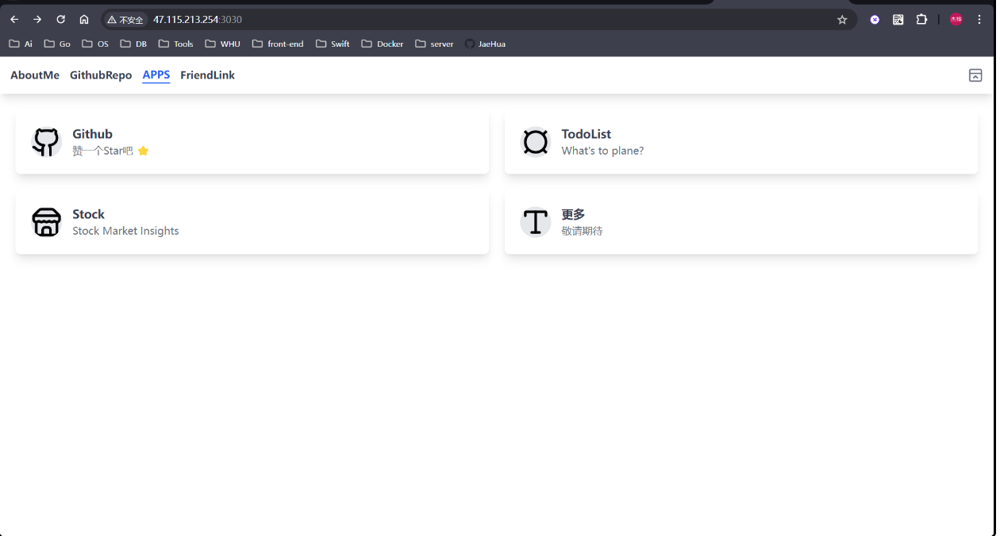
**一定要配置好安全组**

## 图形化管理工具

- 下载镜像

```JavaScript
docker pull portainer/portainer
```

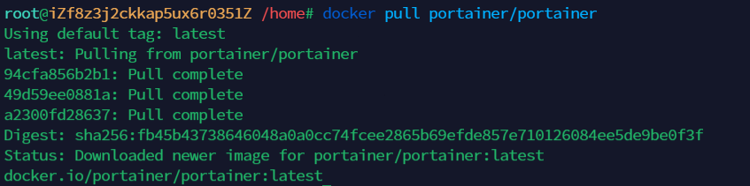
- 运行Portainer容器

```JavaScript
docker run -p 9000:9000 -p 8000:8000 --name portainer \--restart=always \-v /var/run/docker.sock:/var/run/docker.sock \-v /mydata/portainer/data:/data \-d portainer/portainer
```


- 浏览器访问ip+9000(阿里云要放行)

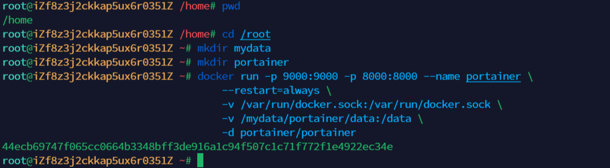

- 然后本地进行连接


- 可以愉快地管理自己的镜像了

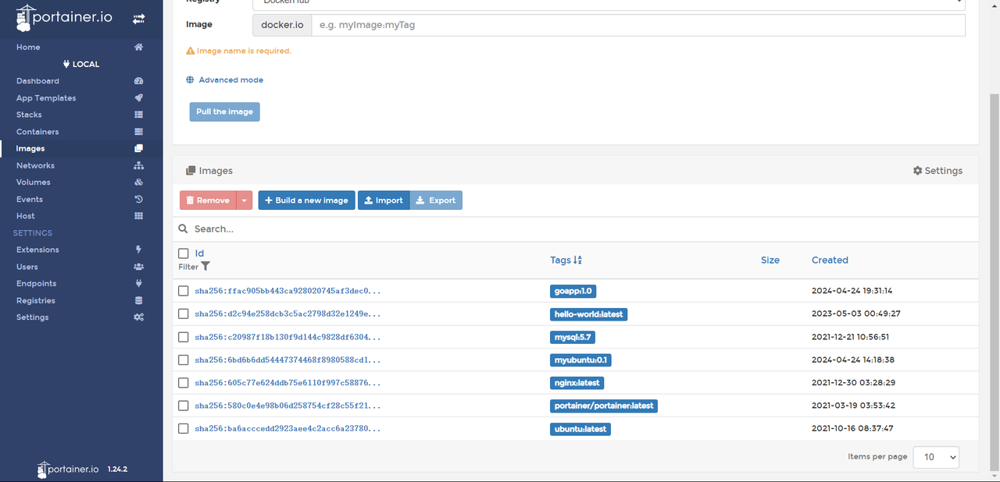
## Docker-compose

### 介绍

Docker Compose是一个用来定义和运行复杂应用的Docker工具。一个使用Docker容器的应用，通常由多个容器组成。使用Docker Compose不再需要使用shell脚本来启动容器。 

Compose 通过一个配置文件来管理多个Docker容器，在配置文件中，所有的容器通过services来定义，然后使用docker-compose脚本来启动，停止和重启应用，和应用中的服务以及所有依赖服务的容器，**非常适合组合使用多个容器进行开发的场景。**

### 安装

- 从github安装最新版

```Bash
sudo curl -L "https://github.com/docker/compose/releases/download/v2.27.0/docker-compose-$(uname -s)-$(uname -m)" -o /usr/local/bin/docker-compose
```

但是下载太慢了

- pip安装

```Bash
sudo pip install docker-compose
```

- Ubuntu建议直接apt install

```Bash
sudo apt install docker-compose
#然后链接
ln -s /usr/bin/docker-compose /usr/local/bin
```

- 代理加速

```Bash
curl -SL https://mirror.ghproxy.com/https://github.com/docker/compose/releases/download/v2.27.0/docker-compose-`uname -s`-`uname -m` -o /usr/local/bin/docker-compose
```

Tips:

然后给予权限

```Bash
sudo chmod +x /usr/local/bin/docker-compose
```

然后查看版本是否安装成功

```Bash
docker-compose --version
```

但是报错bash: /usr/local/bin/docker-compose: Text file busy。

可以用命令`fuser` 来查看是哪个进程在使用

```Bash
root@:/usr/local/bin# fuser /usr/local/bin/docker-compose
/usr/local/bin/docker-compose: 1837677
root@:/usr/local/bin# sudo kill -9 1837677
```

移除docker-compose

```Bash
 sudo rm /usr/local/bin/docker-compose
```

## docker提供外部访问

打开2375端口

- 编辑docker服务文件

```Bash
vim /lib/systemd/system/docker.service
```

- 在ExecStart行后面追加以下内容

```Bash
-H tcp://0.0.0.0:2375 -H unix://var/run/docker.sock
```

- 重新载入服务信息

```Bash
systemctl daemon-reload
```

- 重启docker服务

```Bash
systemctl restart docker.service
```

- 查看端口是否开启

```Bash
netstat -nlpt
```
## Harbor
构建自己的私有仓库镜像源。
> Harbor是一个功能强大的容器镜像注册中心，它提供了集中式的镜像管理、安全性控制、镜像复制和高可用性等功能，帮助用户更好地管理和存储Docker镜像
### 下载online-installer
https://github.com/goharbor/harbor/releases
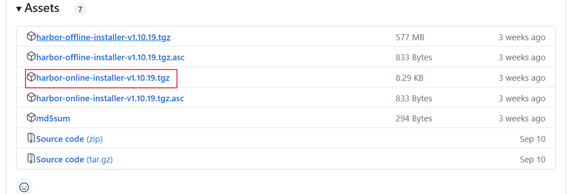
### 修改配置
* 复制一份配置文件
```
cp harbor.yml.tmpl harbor.yml
```
* 编辑复制的配置文件
```
vim harbor.yml
```
* 需要修改的地方
```
当前服务器的ip
hostname: 服务器地址
admin用户登录密码
harbor_admin_password: 123456
database:
数据库密码
  password: 123456
http:
服务端口
  port: 8858
```
* 将https相关的都注释掉
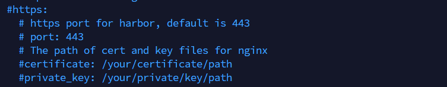
* 安装
```
./install.sh
```
出现successfully就说明安装成功了 等待几分钟，就可以访问harbor了：
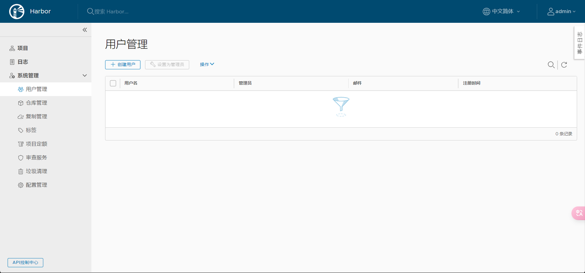