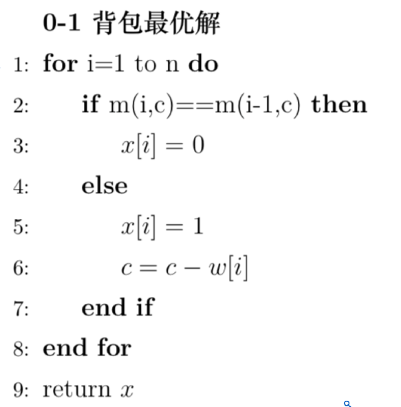

## 基本性质

- 适用场景

子问题并不独立，即子问题是可能重复的

主要用于优化问题（求最优解），且子问题具有最优子结构

> 最优子结构性质就是原问题的最优解一定包含子问题的最优解

- 最短路径问题具有最优子结构而最长路径没有

## 基本步骤

- 定义子问题，并分析最优解的结构特征

> 分治通常是将原问题对半分，而动态规划是将n规模的问题分解成n-1规模的问题

- 找出最优解对应的最优值，并递归地定义最优值
- 以自底向上的方式计算最优值
- 根据计算最优值得到的信息，构造最优解

## 重要例题

### 最大子数组问题

动态规划：

- n-1为原问题n的子问题
- 求解改为：包含数组最后一个元素的最大子数组
- 最大子数组问题最优解的结构特征为

$$
B[n] = B[n-1] \cup x_n
$$

- 找到最优解对应的最优值，并递归定义最优值

$$ b[n] =  \begin{cases}  b[n-1] + x_n & \text{if } b[n-1] > 0 \\ x_n & \text{if } b[n-1] \leq 0 \end{cases} $$

- 伪代码


- 复杂度为O(n)
- cpp代码实现

```C++
#include<iostream>
#include<vector>
using namespace std;
int n;
int MaxSubArray(vector<int>& nums) {
    int ans=nums[0];
    int sum=0;
    for(int i=0;i<nums.size();i++){
        sum+=nums[i];
        ans=max(ans,sum);
        if(sum<0) sum=0;
    }
    return ans;
}
int main(){
    cin>>n;
    vector<int> a(n);
    for(int i=0;i<n;i++){
        cin>>a[i];
    }
    cout<<MaxSubArray(a);
    return 0;
}
```

### 0-1背包问题

> 0-1背包问题：给定n种物品和一背包。物品i的重量是  wi，其价值为 vi，背包的容量为C（也就是背包的总承重为C)。问应如何选择装入背包的物品，使得装入背包中物品的总价值V最大化。

- 分析最优解结构特征
  - 一种情况是第n个物品不包括在最优解里

$$ x^* = (x_1,x_2,\dots,x_{n-1}，x_n) $$
则
$$x^* = (x_1,x_2,\dots,x_{n-1})$$
必为n-1个物品（剔除第n个物品），且背包容量为C情况下的最优解

- 第二种情况是第n个物品包含在最优解里

 则
$$(x_1,x_2,\dots,x_{n-1})$$ 
必为n-1个物品，背包容量为 
$$C -w_n $$
情况下的最优解

- 找出0-1背包问题最优解对应的最优值，并递归地定义最优值

在 n个物品，背包容量为$$C $$情况下总价值，我们用 $$m(n,C)$$表示最优值

$$ m(n, C) =  \begin{cases}  0, & \text{if } n = 0 \text{ or } C = 0 \\ \max\{m(n-1, C), m(n-1, C-w_n) + v_n\}, & w_n \leq C \\ m(n-1, C), & w_n > C \end{cases} $$

- 例子


- 伪代码



- 复杂度

在动态规划表 `dp` 中，实际上需要填充一个大小为 `(n + 1) x (c + 1)` 的表格。因此，外层循环遍历物品（`n`），内层循环遍历背包容量（`c`），导致总体复杂度为 `O(n * c)`。

- c++代码实现

```C++
/*
5 10
3 5
2 4
4 4
4 7
6 5
16
*/
#include<iostream>
using namespace std;
int n,c;
//定义一个item结构体
struct item{
    int weight;
    int value;
}items[1005];
int dp[1005][1005];
int Max01Knapsack(){
    for (int i = 1; i <= n; i++)
    {
        for (int j = 0; j <= c; j++)
        {
            if(items[i-1].weight>j){
                dp[i][j]=dp[i-1][j];
            }else{
                dp[i][j]=max(dp[i-1][j],dp[i-1][j-items[i-1].weight]+items[i-1].value);
            }
        }
    }
    return dp[n][c];
}
int main(){
    cin>>n>>c;
    for (int i = 0; i < n; i++)
    {
        cin>>items[i].weight>>items[i].value;
    }
    cout<<Max01Knapsack()<<endl;
    
    return 0;
}
```

### 最长公共子序列

- 最长公共子序列的结构


由此可见，2个序列的最长公共子序列包含了这2个序列的前缀的最长公共子序列。因此，最长公共子序列问题具有最优子结构性质。

- 递推式

$$c[i][j] = \begin{cases} 0 & i = 0, j = 0 \\ c[i-1][j-1] + 1 & i, j > 0; x_i = y_j \\ \max\{c[i][j-1], c[i-1][j]\} & i, j > 0; x_i \neq y_j \end{cases}$$

- 填表


- cpp代码实现

```C++
#include <iostream>
#include <string>
#include <vector>
#include <algorithm>
using namespace std;

vector<char> LCS(string x, string y) {
    int m = x.length();
    int n = y.length();
    int dp[m+1][n+1];
    char direction[m+1][n+1]; // 记录每个单元格是由哪个方向来的

    // 初始化 dp 数组和 direction 数组
    for (int i = 0; i <= m; i++) {
        dp[i][0] = 0;
        direction[i][0] = ' ';
    }
    for (int j = 0; j <= n; j++) {
        dp[0][j] = 0;
        direction[0][j] = ' ';
    }

    // 填充 dp 数组和 direction 数组
    for (int i = 1; i <= m; i++) {
        for (int j = 1; j <= n; j++) {
            if (x[i-1] == y[j-1]) {
                dp[i][j] = dp[i-1][j-1] + 1;
                direction[i][j] = '\\'; // 对角线方向
            } else {
                if (dp[i-1][j] >= dp[i][j-1]) {
                    dp[i][j] = dp[i-1][j];
                    direction[i][j] = '^'; // 向上方向
                } else {
                    dp[i][j] = dp[i][j-1];
                    direction[i][j] = '<'; // 向左方向
                }
            }
        }
    }

    // 根据 direction 数组构造最长公共子序列
    vector<char> result;
    int i = m, j = n;
    while (i > 0 && j > 0) {
        if (direction[i][j] == '\\') {
            result.push_back(x[i-1]);
            i--;
            j--;
        } else if (direction[i][j] == '^') {
            i--;
        } else {
            j--;
        }
    }
    reverse(result.begin(), result.end());
    return result;
}

int main() {
    string x, y;
    cin >> x;
    cin >> y;

    vector<char> result = LCS(x, y);
    for (char c : result) {
        cout << c;
    }
    cout << endl;

    return 0;
}
```