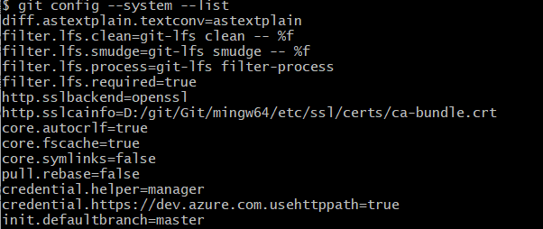
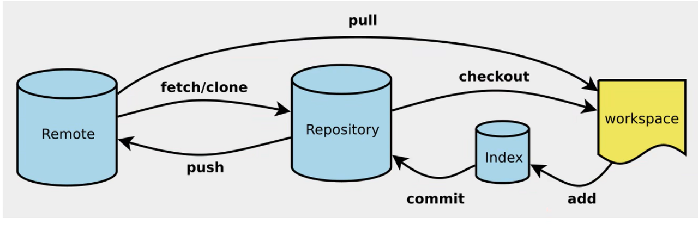

## 版本控制

> 概念

版本控制（Revisioncontrol）是一种在开发的过程中用于管理我们对文件、目录或工程等内容的修改历史，方便查看更改历史记录，备份以便恢复以前的版本的软件工程技术。

- 实现跨区域多人协同开发
- 追踪和记载一个或者多个文件的历史记录
- 组织和保护你的源代码和文档
- 统计工作量
- 并行开发、提高开发效率
- 跟踪记录整个软件的开发过程
- 减轻开发人员的负担，节省时间，同时降低人为错误

简单说就是用于管理多人协同开发项目的技术。

没有进行版本控制或者版本控制本身缺乏正确的流程管理，在软件开发过程中将会引入很多问题，如软件代码的一致性、软件内容的几余、软件过程的事物性、软件开发过程中的并发性、软件源代码的安全性，以及软件的整合等问题。

> 常见的版本控制工具

- Git
- SVN（Subversion)
- CVS(Concurrent Versions System)
- VSS(Microsoft Visual SourceSafe）
- TFS（Team Foundation Server）
- Visual Studio Online

> 版本控制分类

1. 本地版本控制

记录文件每次的更新，可以对每个版本做一个快照，或是记录补丁文件，适合个人用，如RCS。


1. 集中版本控制

所有的版本数据都保存在服务器上，协同开发者从服务器上同步更新或上传自己的修改


所有的版本数据都存在服务器上，用户的本地只有自己以前所同步的版本，如果不连网的话，用户就看不到历史版本，也无法切换版本验证问题，或在不同分支工作。而且，所有数据都保存在单一的服务器上，有很大的风险这个服务器会损坏，这样就会丢失所有的数据，当然可以定期备份。代表产品：SVN、CVS、VSS

1. 分布式版本控制

所有版本信息仓库全部同步到本地的每个用户，这样就可以在本地查看所有版本历史，可以离线在本地提交，只需在连网时push到相应的服务器或其他用户那里。由于每个用户那里保存的都是所有的版本数据，只要有一个用户的设备没有问题就可以恢复所有的数据，但这增加了本地存储空间的占用


## Git历史

同生活中的许多伟大事物一样，Git 诞生于一个极富纷争大举创新的年代。

Linux内核开源项目有着为数众多的参与者。绝大多数的Linux内核维护工作都花在了提交补丁和保存归档的繁琐事务上(1991-2002年间)。到2002年，整个项目组开始启用一个专有的分布式版本控制系统 BitKeeper 来管理和维护代码。

到了2005 年，开发BitKeeper的商业公司同Linux内核开源社区的合作关系结束，他们收回了Linux内核社区免费使用BitKeeper的权力。这就迫使Linux开源社区(特别是Linux的缔造者Linus Torvalds)基于使用BitKeeper时的经验教训l，开发出

自己的版本系统。也就是后来的 Git！

Git是目前世界上最先进的分布式版本控制系统。

**Git是免费、开源的，最初Git是为辅助****Linux内核****开发的，来替代 BitKeeper！**

## 环境配置

> git下载

- 根据对应系统下载

https://git-scm.com/


npm镜像站https://www.npmmirror.com/

> Git删除

清理环境变量，然后直接uninstall

> 启动Git


- **GitBash**：Unix与Linux风格的命令行，使用最多，推荐最多
- **GitCMD**：Windows风格的命令行
- **GitGUI**：图形界面的Git，不建议初学者使用，尽量先熟悉常用命令

> Git配置

查看配置 `git config -l`


**查看系统配置**



查看用户自己配置的


设置邮箱与名称

```Bash
git config --global user.name "xxx" #名称
git config --global user.email xxx@xxx #邮箱
```

## Git基本理论

> 工作区域

Git本地有三个工作区域：工作目录（Working Directory）、暂存区(Stage/Index)、资源库(Repository或Git Directory)。如果在加上远程的git仓库(Remote Directory)就可以分为四个工作区域。文件在这四个区域之间的转换关系如下：


- Workspace：工作区，就是你平时存放项目代码的地方
- Index／Stage：暂存区，用于临时存放你的改动，事实上它只是一个文件，保存即将提交到文件列表信息
- Repository：仓库区（或本地仓库），就是安全存放数据的位置，这里面有你提交到所有版本的数据。其中HEAD指向最新放入仓库的版本
- Remote：远程仓库，托管代码的服务器，可以简单的认为是你项目组中的一台电脑用于远程数据交换

本地的三个区域确切的说应该是git仓库中HEAD指向的版本：


- Directory：使用Git管理的一个目录，也就是一个仓库，包含我们的工作空间和Git的管理空间。
- WorkSpace：需要通过Git进行版本控制的目录和文件，这些目录和文件组成了工作空间。
- .git：存放Git管理信息的目录，初始化仓库的时候自动创建。
- Index/Stage：暂存区，或者叫待提交更新区，在提交进入repo之前，我们可以把所有的更新放在暂存区。
- Local Repo：本地仓库，一个存放在本地的版本库；HEAD会只是当前的开发分支（branch）。
- Stash：隐藏，是一个工作状态保存栈，用于保存/恢复WorkSpace中的临时状态。

> 工作流程


## Git项目搭建

> 创建工作目录与常用指令

工作目录（WorkSpace)一般就是你希望Git帮助你管理的文件夹，可以是你项目的目录，也可以是一个空目录，建议不要有中文。

日常使用只要记住下图6个命令：



> 本地仓库搭建

创建本地仓库的方法有两种：一种是创建全新的仓库，另一种是克隆远程仓库。

1. 创建全新的仓库，需要用GIT管理的项目的根目录执行：

```Bash
#在当前目录新建一个Git代码库
git init
```

1. 执行后可以看到，仅仅在项目目录多出了一个.git目录，关于版本等的所有信息都在这个目录里面。

> 克隆远程仓库

另一种方式是克隆远程目录，由于是将远程服务器上的仓库完全镜像一份至本地！

```Bash
#克隆一个项目和它的整个代码历史（版本信息)
git clone [url]
```

## Git文件操作

> 文件4种状态

版本控制就是对文件的版本控制，要对文件进行修改、提交等操作，首先要知道文件当前在什么状态，不然可能会提交了现在还不想提交的文件，或者要提交的文件没提交上。

- Untracked:未跟踪，此文件在文件夹中，但并没有加入到git库，不参与版本控制.通过`git add`状态变为`Staged`
- Unmodify:文件已经入库，未修改，即版本库中的文件快照内容与文件夹中完全一致.这种类型的文件有两种去处，如果它被修改,而变为`Modified`.如果使用用`git rm`移出版本库，则成为`Untracked`文件
- Modified:文件已修改，仅仅是修改,并没有进行其他的操作.这个文件也有两个去处,通过`git add`可进入暂存`staged`状态，使用`git checkout`则丢弃修改过，返回到`unmodify`状态，这个`git checkout`即从库中取出文件，覆盖当前修改！
- Staged:暂存状态.执行`git commit`则将修改同步到库中，这时库中的文件和本地文件又变为一致，文件为`Unmodify`状态.执行 `git reset HEAD filename`取消暂存，文件状态为`Modified`

> 查看文件状态

```Bash
#查看指定文件状态
git status [filename]
#查看所有文件状态
git status
```

> 忽略文件

有些时候我们不想把某些文件纳入版本控制中，比如数据库文件，临时文件，设计文件等

在主目录下建立".gitignore"文件，此文件有如下规则：

1. 忽略文件中的空行或以井号（#）开始的行将会被忽略。
2. 可以使用Linux通配符。例如：星号（＊）代表任意多个字符，问号（？）代表一个字符，方括号（[abc]）代表可选字符范围，大括号（{string1,string2...}）代表可选的字符串等。
3. 如果名称的最前面有一个感叹号（！），表示例外规则，将不被忽略。
4. 如果名称的最前面是一个路径分隔符（/），表示要忽略的文件在此目录下，而子目录中的文件不忽略。
5. 如果名称的最后面是一个路径分隔符（/），表示要忽略的是此目录下该名称的子目录，而非文件（默认文件或目录都忽略）。

```Bash
*.txt    #忽略所有.txt结尾的文件
!lib.txt    #但lib.txt除外
/temp    #仅忽略项目根目录下的TODO文件，不包括其它目录temp
build/    #忽略build/目录下的所有文件
doc/*.txt    #会忽略doc/notes.txt但不包括doc/server/arch.txt
```

## Git分支


git分支中常用指令

```Bash
# 列出本地所有分支
git branch

#列出所有远程分支
git branch -r

#新建一个分支，但依然停留在当前分支
git branch[branch-name]

#新建一个分支，并切换到该分支
git checkout -b [branch]

#合并指定分支到当前分支
git merge [branch]

#删除分支
git branch -d [branch-name]

#删除远程分支
git push origin --delete[branch-name]
git branch -dr [remote/branch]
```

如果同一个文件在合并分支时都被修改了则会引起冲突：解决的办法是我们可以修改冲突文件后重新提交！Y

**master****主分支应该非常稳定，用来发布新版本，一般情况下不允许在上面工作**，工作一般情况下在新建的dev分支上工作，工作完后，比如上要发布，或者说dev分支代码稳定后可以合并到主分支master上来。