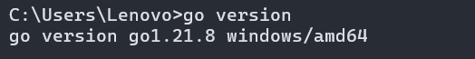

## SDk安装配置

官网：https://golang.google.cn/dl/

根据自己的电脑来安装对应版本

### 环境配置

以win为例，在高级环境设置里新建环境变量：

```
GOROOT`   `GOPATH
```

新增一个path:`path`：%GOROOT%\bin

最后在命令行测试一下

```
go version
```



## Go mod依赖管理

- go.sum创建 `go mod init <module-name>`
- 依赖下载 `go mod download`
- 依赖移除 `go mod tidy`

**下载第三方依赖:**

```
go get [package]` `go install [package]
```

> go get 会拉取源码，同时执行install;
>
> go install 只拉取可执行文件

## Golang 语言结构

### package声明

每个Go源文件都必须以`package`声明开始。`package`用于定义文件所属的包。包的名称通常是小写字母，且不能包含下划线或大写字母。

```Go
package main
```

### `init` 函数

`init`函数是一个特殊的函数，用于初始化包。每个包可以有多个`init`函数，它们会在程序执行前自动调用。`init`函数不能有参数和返回值。

### 注释

Go语言支持两种注释风格：

- 单行注释：使用`//`
- 多行注释：使用`/* ... */`

## 基础语法

- 二十五个关键字

```Go
break    default      func    interface    select
case     defer        go      map          struct
chan     else         goto    package      switch
const    fallthrough  if      range        type
continue for          import  return       var
```

- 定义变量

```Go
//定义三个类型都是“type”的变量
var vname1, vname2, vname3 type
//初始化“variableName”的变量为“value”值，类型是“type”
var variableName type = value
/*
    定义三个变量，它们分别初始化为相应的值
    vname1为v1，vname2为v2，vname3为v3
    然后Go会根据其相应值的类型来初始化它们
*/
var vname1, vname2, vname3 = v1, v2, v3
//  编译器会根据初始化的值自动推导出相应的类型
vname1, vname2, vname3 := v1, v2, v3
```

- 定义常量

所谓常量，也就是在程序编译阶段就确定下来的值，而程序在运行时无法改变该值

```Go
const constantName = value
//如果需要，也可以明确指定常量的类型：
const Pi float32 = 3.1415926
```

## 基础数据类型

### 布尔类型

在Go中，布尔值的类型为`bool`，值是`true`或`false`，默认为`false`。

```Go
var isActive bool  // 全局变量声明
var enabled, disabled = true, false  // 忽略类型的声明
```

### 数值类型

整数类型有无符号和带符号两种。Go同时支持`int`和`uint`，这两种类型的长度相同，但具体长度取决于不同编译器的实现。Go里面也有直接定义好位数的类型：`rune`, `int8`, `int16`, `int32`, `int64`和`byte`, `uint8`, `uint16`, `uint32`, `uint64`。其中`rune`是`int32`的别称，`byte`是`uint8`的别称。

需要注意的一点是，这些类型的变量之间不允许互相赋值或操作，不然会在编译时引起编译器报错。

### 字符串

Go中的字符串都是采用`UTF-8`字符集编码。字符串是用一对双引号（`""`）或反引号（）括起来定义，它的类型是`string`。

```Go
s := "hello"
s = "c" + s[1:] // 字符串虽不能更改，但可进行切片操作
fmt.Printf("%s\n", s)
```

### 错误类型

Go内置有一个`error`类型，专门用来处理错误信息，Go的`package`里面还专门有一个包`errors`来处理错误

```Go
err := errors.New("emit macho dwarf: elf header corrupted")
if err != nil {
    fmt.Print(err)
}
```

### iota枚举

Go里面有一个关键字`iota`，这个关键字用来声明`enum`的时候采用，它默认开始值是0，const中每增加一行加1

```Go
const (
    x = iota // x == 0
    y = iota // y == 1
    z = iota // z == 2
    w        // 常量声明省略值时，默认和之前一个值的字面相同。这里隐式地说w = iota，因此w == 3。其实上面y和z可同样不用"= iota"
)
const v = iota // 每遇到一个const关键字，iota就会重置，此时v == 0
const (
    h, i, j = iota, iota, iota //h=0,i=0,j=0 iota在同一行值相同
)
```

## 派生数据类型

### 数组

`array`就是数组，它的定义方式如下：

```Go
var arr [n]type
```

数组之间的赋值是值的赋值，即当把一个数组作为参数传入函数的时候，传入的其实是该数组的副本，而不是它的指针。如果要使用指针，那么就需要用到后面介绍的`slice`类型了。

数组可以使用另一种`:=`来声明

```Go
a := [3]int{1, 2, 3} // 声明了一个长度为3的int数组
b := [10]int{1, 2, 3} // 声明了一个长度为10的int数组，其中前三个元素初始化为1、2、3，其它默认为0
c := [...]int{4, 5, 6} // 可以省略长度而采用`...`的方式，Go会自动根据元素个数来计算长度
```

Go支持嵌套数组，即多维数组。比如下面的代码就声明了一个二维数组：

```Go
// 声明了一个二维数组，该数组以两个数组作为元素，其中每个数组中又有4个int类型的元素
doubleArray := [2][4]int{[4]int{1, 2, 3, 4}, [4]int{5, 6, 7, 8}}
// 上面的声明可以简化，直接忽略内部的类型
easyArray := [2][4]int{{1, 2, 3, 4}, {5, 6, 7, 8}}
```

### 切片

很多应用场景中，数组并不能满足需求。在初始定义数组时，并不知道需要多大的数组，因此就需要“动态数组”。在Go里面这种数据结构叫`slice`

`slice`并不是真正意义上的动态数组，而是一个引用类型。`slice`总是指向一个底层`array`，`slice`的声明也可以像`array`一样，只是不需要长度。

```Go
// 和声明array一样，只是少了长度
var fslice []int
```

**`slice`****有一些简便的操作**

- `slice`的默认开始位置是0，`ar[:n]`等价于`ar[0:n]`
- `slice`的第二个序列默认是数组的长度，`ar[n:]`等价于`ar[n:len(ar)]`
- 如果从一个数组里面直接获取`slice`，可以这样`ar[:]`，因为默认第一个序列是0，第二个是数组的长度，即等价于`ar[0:len(ar)]`

### 字典

它的格式为`map[keyType]valueType`

```Go
// 声明一个key是字符串，值为int的字典,这种方式的声明需要在使用之前使用make初始化
var numbers map[string]int
// 另一种map的声明方式
numbers = make(map[string]int)
numbers["one"] = 1  //赋值
numbers["ten"] = 10 //赋值
numbers["three"] = 3
fmt.Println("第三个数字是: ", numbers["three"]) // 读取数据
// 打印出来如:第三个数字是: 3
```

- `map`和其他基本型别不同，它不是thread-safe，在多个go-routine存取时，必须使用mutex lock机制

### 结构体

Go语言中，也和C或者其他语言一样，可以声明新的类型，作为其它类型的属性或字段的容器。例如，可以创建一个自定义类型`person`代表一个人的实体。这个实体拥有属性：姓名和年龄。这样的类型称之`struct`。如下代码所示:

```Go
type person struct {
    name string
    age int
}
```

- struct的匿名字段

```Go
type Human struct {
    name string
    age int
    weight int
}
type Student struct {
    Human  // 匿名字段，那么默认Student就包含了Human的所有字段
    speciality string
}
```

### 函数

函数是Go里面的核心设计，它通过关键字`func`来声明，它的格式如下：

```Go
func funcName(input1 type1, input2 type2) (output1 type1, output2 type2) {
    //这里是处理逻辑代码
    //返回多个值
    return value1, value2
}
```

- **变参**

o函数支持变参。接受变参的函数是有着不定数量的参数的。为了做到这点，首先需要定义函数使其接受变参：

```Go
func myfunc(arg ...int) {}
```

`arg ...int`告诉Go这个函数接受不定数量的参数。注意，这些参数的类型全部是`int`。在函数体中，变量`arg`是一个`int`的`slice`：

```Go
for _, n := range arg {
 fmt.Printf("And the number is: %d\n", n)
}
```

- **传值与传指针**

传一个参数值到被调用函数里面时，实际上是传了这个值的一份copy，当在被调用函数中修改参数值的时候，调用函数中相应实参不会发生任何变化，因为数值变化只作用在copy上。

- 传指针使得多个函数能操作同一个对象。
- 传指针比较轻量级 (8bytes),只是传内存地址，可以用指针传递体积大的结构体。如果用参数值传递的话, 在每次copy上面就会花费相对较多的系统开销（内存和时间）。所以当要传递大的结构体的时候，用指针是一个明智的选择。
- Go语言中`channel`，`slice`，`map`这三种类型的实现机制类似指针，所以可以直接传递，而不用取地址后传递指针。（注：若函数需改变`slice`的长度，则仍需要取地址传递指针）
- **defer**

Go语言中有种不错的设计，即延迟（defer）语句，可以在函数中添加多个defer语句。当函数执行到最后时，这些defer语句会按照逆序执行，最后该函数返回。特别是当进行一些打开资源的操作时，遇到错误需要提前返回，在返回前需要关闭相应的资源，不然很容易造成资源泄露等问题。

- panic和recover

Go没有像Java那样的异常机制，**它不能抛出异常**，而是使用了`panic`和`recover`机制。一定要记住，应当把它作为最后的手段来使用，也就是说，代码中应当没有，或者很少有`panic`的东西。这是个强大的工具，请明智地使用它。

**Panic**

> 是一个内建函数，可以中断原有的控制流程，进入一个`panic`状态中。当函数`F`调用`panic`，函数F的执行被中断，但是`F`中的延迟函数会正常执行，然后F返回到调用它的地方。在调用的地方，`F`的行为就像调用了`panic`。这一过程继续向上，直到发生`panic`的`goroutine`中所有调用的函数返回，此时程序退出。`panic`可以直接调用`panic`产生。也可以由运行时错误产生，例如访问越界的数组。

**Recover**

> 是一个内建的函数，可以让进入`panic`状态的`goroutine`恢复过来。`recover`仅在延迟函数中有效。在正常的执行过程中，调用`recover`会返回`nil`，并且没有其它任何效果。如果当前的`goroutine`陷入`panic`状态，调用`recover`可以捕获到`panic`的输入值，并且恢复正常的执行。

### 接口

`interface`是一组`method`签名的组合，通过`interface`来定义对象的一组行为。`interface`类型定义了一组方法，如果某个对象实现了某个接口的所有方法，则此对象就实现了此接口。详细的语法参考下面这个例子

```Go
type Human struct {
    name string
    age int
    phone string
}
type Student struct {
    Human //匿名字段Human
    school string
    loan float32
}
type Employee struct {
    Human //匿名字段Human
    company string
    money float32
}
//Human对象实现Sayhi方法
func (h *Human) SayHi() {
    fmt.Printf("Hi, I am %s you can call me on %s\n", h.name, h.phone)
}
// Human对象实现Sing方法
func (h *Human) Sing(lyrics string) {
    fmt.Println("La la, la la la, la la la la la...", lyrics)
}
//Human对象实现Guzzle方法
func (h *Human) Guzzle(beerStein string) {
    fmt.Println("Guzzle Guzzle Guzzle...", beerStein)
}
// Employee重载Human的Sayhi方法
func (e *Employee) SayHi() {
    fmt.Printf("Hi, I am %s, I work at %s. Call me on %s\n", e.name,
        e.company, e.phone) //此句可以分成多行
}
//Student实现BorrowMoney方法
func (s *Student) BorrowMoney(amount float32) {
    s.loan += amount // (again and again and...)
}
//Employee实现SpendSalary方法
func (e *Employee) SpendSalary(amount float32) {
    e.money -= amount // More vodka please!!! Get me through the day!
}
// 定义interface
type Men interface {
    SayHi()
    Sing(lyrics string)
    Guzzle(beerStein string)
}
type YoungChap interface {
    SayHi()
    Sing(song string)
    BorrowMoney(amount float32)
}
type ElderlyGent interface {
    SayHi()
    Sing(song string)
    SpendSalary(amount float32)
}
```

- 空interface

空interface(interface{})不包含任何的method，正因为如此，所有的类型都实现了空interface。空interface对于描述起不到任何的作用(因为它不包含任何的method），但是空interface需要存储任意类型的数值的时候相当有用，因为它可以存储任意类型的数值。它有点类似于C语言的void*类型。

## 零值

```Go
int     0
int8    0
int32   0
int64   0
uint    0x0
rune    0 //rune的实际类型是 int32
byte    0x0 // byte的实际类型是 uint8
float32 0 //长度为 4 byte
float64 0 //长度为 8 byte
bool    false
string  ""
```

## make与new关键词使用与区别

`make`用于内建类型（`map`、`slice` 和`channel`）的内存分配。`new`用于各种类型的内存分配。

内建函数`new`本质上说跟其它语言中的同名函数功能一样：`new(T)`分配了零值填充的`T`类型的内存空间，并且返回其地址，即一个`*T`类型的值。用Go的术语说，它返回了一个指针，指向新分配的类型`T`的零值。有一点非常重要：

`new`返回指针。

内建函数`make(T, args)`与`new(T)`有着不同的功能，make只能创建`slice`、`map`和`channel`，并且返回一个有初始值(非零)的`T`类型，而不是`*T`。本质来讲，导致这三个类型有所不同的原因是指向数据结构的引用在使用前必须被初始化。例如，一个`slice`，是一个包含指向数据（内部`array`）的指针、长度和容量的三项描述符；在这些项目被初始化之前，`slice`为`nil`。对于`slice`、`map`和`channel`来说，`make`初始化了内部的数据结构，填充适当的值。

`make`返回初始化后的（非零）值。

## 特殊的import

### 点操作

有时候会看到如下的方式导入包

```Go
import(
    . "fmt"
)
```

这个点操作的含义就是这个包导入之后在调用这个包的函数时，可以省略前缀的包名，也就是前面调用的fmt.Println("hello world")可以省略的写成`Println("hello world")`

### 别名操作

别名操作顾名思义可以把包命名成另一个用起来容易记忆的名字

```Go
import(
        f "fmt"
    )
```

别名操作的话调用包函数时前缀变成了前缀，即`f.Println("hello world")`

### _操作

这个操作经常是让很多人费解的一个操作符，下面这个`import`

```Go
import (
    "database/sql"
    _ "github.com/ziutek/mymysql/godrv"
)
```

`_`操作其实是引入该包，而不直接使用包里面的函数，而是调用了该包里面的`init函数`。

## 流程控制

### If

`if`也许是各种编程语言中最常见的了，它的语法概括起来就是：如果满足条件就做某事，否则做另一件事。

Go里面`if`条件判断语句中不需要括号

```Go
if x > 10 {
    fmt.Println("x is greater than 10")
} else {
    fmt.Println("x is less than 10")
}
```

### For

go里面最强大的一个控制逻辑就是`for`，它既可以用来循环读取数据，又可以当作`while`来控制逻辑，还能迭代操作。

```Go
for expression1; expression2; expression3 {
    //...
}
```

`expression1`、`expression2`和`expression3`都是表达式，其中`expression1`和`expression3`是变量声明或者函数调用返回值之类的，`expression2`是用来条件判断，`expression1`在循环开始之前调用，`expression3`在每轮循环结束之时调用。

### switch

有些时候需要写很多的`if-else`来实现一些逻辑处理，这个时候代码看上去就很丑很冗长，而且也不易于以后的维护，这个时候`switch`就能很好的解决这个问题。它的语法如下

```Go
switch sExpr {
case expr1:
    some instructions
case expr2:
    some other instructions
case expr3:
    some other instructions
default:
    other code
}
```

## methods

在 Golang 中，方法（methods）是与特定类型相关联的函数。类似面向对象语言中的成员函数，方法可以访问该类型的数据和其他方法。

方法定义由关键字 func 开始，后面跟上接收者、方法名、参数列表和返回值列表。方法定义的基本语法如下：

```Go
func (r ReceiverType) methodName(parameterList) (returnParameterList) {
  // 方法体
}
```

具体含义如下：

r：是接收者类型（receiver）的简写，一般使用接收者首字母的小写格式（如果方法体中使用不到可以省略）。

- ReceiverType： 表示接收者类型，可以是结构体、自定义函数类型等。
- methodName： 表示方法名，根据惯例，方法名的首字母通常使用大写字母。
- parameterList： 表示方法的参数列表，类似于函数的参数列表。
- returnParameterList： 表示方法的返回值，可以有多个返回值。

方法体：包含实现方法功能的代码块。

## 泛型

- 泛型的定义

在 Go 1.18 及以后版本中，泛型通过类型参数引入。你可以定义函数、类型和接口，使它们能够接受不同的数据类型。

```Go
func Print[T any](value T) {
    fmt.Println(value)
}
```

- 泛型的利弊

> 优点

1. **代码复用**：可以编写一次代码，处理多种数据类型，减少重复代码。
2. **类型安全**：在编译时检查类型，避免运行时错误。
3. **可读性**：使用泛型可以使代码更清晰，不需要为每种类型创建单独的实现。

> 缺点

1. **复杂性**：泛型代码可能比非泛型代码更复杂，影响可读性。
2. **编译时间**：使用泛型可能增加编译时间。
3. **学习曲线**：对于初学者，理解泛型的概念和用法可能需要额外的学习。

- 泛型使用场景

1. **数据结构**：如栈、队列、链表等，可以使用泛型来支持不同数据类型。
2. **算法**：排序、查找等算法可以通用化，适应不同类型的数组。
3. **通用函数**：如打印、比较等操作，可以使用泛型来简化函数定义。

- 泛型的限制

1. **类型约束**：泛型参数可以指定类型约束，但不能使用非接口类型的约束。
2. **不支持某些类型**：例如，不能直接使用函数类型作为泛型参数。

- 泛型函数

泛型函数可以接受一个或多个类型参数。

```Go
func Swap[T any](a, b T) (T, T) {
    return b, a
}
```

- 泛型类型

泛型类型允许创建可以接受类型参数的类型。

```Go
type Pair[T any] struct {
    First  T
    Second T
}
```

- 泛型接口

可以定义泛型接口以要求实现特定的方法。

```Go
type Stringer[T any] interface {
    String() string
}
```

- 泛型结构体

使用泛型结构体来创建可以接受不同类型的结构体。

```Plain
type List[T any] struct {
    items []T
}
```

- 泛型接收者

方法接收者也可以是泛型的，这样可以使方法适用于多种类型。

```Go
func (l *List[T]) Add(item T) {
    l.items = append(l.items, item)
}
```

## Encoding

Go 的 `encoding` 包提供了丰富的工具来处理不同格式的数据编码和解码。通过使用这些包，开发者可以轻松地在不同数据格式之间转换，以满足存储和传输的需求。常用的编码格式包括 JSON、XML 和 Gob，每种格式都有其特定的用途和特点。

> json为例子

使用 `encoding/json` 包`encoding/json` 包用于处理 JSON 数据的编码和解码。

- 编码（将结构体转换为 JSON）

```Go
package main
import (
    "encoding/json"
    "fmt"
)

type Person struct {
    Name string json:"name"
    Age  int    json:"age"
}

func main() {
    person := Person{Name: "Alice", Age: 30}
    jsonData, err := json.Marshal(person)
    if err != nil {
        fmt.Println(err)
    }
    fmt.Println(string(jsonData)) // {"name":"Alice","age":30}
}
```

解码（将 JSON 转换为结构体）

```Go
func main() {
    jsonStr := {"name":"Bob","age":25}
    var person Person
    err := json.Unmarshal([]byte(jsonStr), &person)
    if err != nil {
        fmt.Println(err)
    }
    fmt.Println(person) // {Bob 25}
}
```

## Math

常见的用法:

```Go
package main

import (
    "fmt"
    "math"
)

func main() {
    // 基本运算
    a := 5.0
    b := 2.0
    fmt.Printf("Sum: %f\n", a+b)
    fmt.Printf("Difference: %f\n", a-b)
    fmt.Printf("Product: %f\n", a*b)
    fmt.Printf("Quotient: %f\n", a/b)

    // 幂和平方根
    fmt.Printf("Power: %f\n", math.Pow(a, b))
    fmt.Printf("Square Root: %f\n", math.Sqrt(25))

    // 三角函数
    angle := math.Pi / 3
    fmt.Printf("Sin: %f\n", math.Sin(angle))
    fmt.Printf("Cos: %f\n", math.Cos(angle))
    fmt.Printf("Tan: %f\n", math.Tan(angle))

    // 对数和指数
    fmt.Printf("Natural Log: %f\n", math.Log(10))
    fmt.Printf("Log10: %f\n", math.Log10(100))
    fmt.Printf("Exp: %f\n", math.Exp(1))

    // 常量
    fmt.Printf("Pi: %f\n", math.Pi)
    fmt.Printf("E: %f\n", math.E)

    // 最大值和最小值
    fmt.Printf("Max: %f\n", math.Max(a, b))
    fmt.Printf("Min: %f\n", math.Min(a, b))
}
```

## Reflect

Go语言实现了反射，所谓反射就是能检查程序在运行时的状态。一般用到的包是`reflect`包。如何运用`reflect`包，官方的这篇文章详细的讲解了`reflect`包的实现原理，`laws of reflection` 链接地址为 http://golang.org/doc/articles/laws_of_reflection.html

使用reflect一般分成三步，：要去反射是一个类型的值(这些值都实现了`空interface`)，首先需要把它转化成`reflect`对象(`reflect.Type`或者`reflect.Value`，根据不同的情况调用不同的函数)。这两种获取方式如下：

```Go
t := reflect.TypeOf(i)    //得到类型的元数据,通过t能获取类型定义里面的所有元素
v := reflect.ValueOf(i)   //得到实际的值，通过v获取存储在里面的值，还可以去改变值
```

转化为reflect对象之后就可以进行一些操作了，也就是将reflect对象转化成相应的值，例如

```Go
tag := t.Elem().Field(0).Tag  //获取定义在struct里面的标签
name := v.Elem().Field(0).String()  //获取存储在第一个字段里面的值
```

获取反射值能返回相应的类型和数值

```Go
var x float64 = 3.4
v := reflect.ValueOf(x)
fmt.Println("type:", v.Type())
fmt.Println("kind is float64:", v.Kind() == reflect.Float64)
fmt.Println("value:", v.Float())
```

最后，反射的话，那么反射的字段必须是可修改的，前面学习过传值和传引用，这个里面也是一样的道理。反射的字段必须是可读写的意思是，如果下面这样写，那么会发生错误

```Go
var x float64 = 3.4
v := reflect.ValueOf(x)
v.SetFloat(7.1)
如果要修改相应的值，必须这样写
var x float64 = 3.4
p := reflect.ValueOf(&x)
v := p.Elem()
v.SetFloat(7.1)
```

## Regexp

Go 的 `regexp` 包提供了强大的正则表达式功能，可以轻松地进行字符串匹配、查找和替换操作。通过编译正则表达式并使用各种方法，开发者能够灵活地处理文本数据。尽管正则表达式功能强大，但在使用时要注意正则表达式的复杂性和性能，尤其是在大文本处理的场景中。

> 常用正则表达式示例

- **匹配邮箱地址**：

```Go
pattern := ^[a-zA-Z0-9._%+-]+@[a-zA-Z0-9.-]+\.[a-zA-Z]{2,}$
```

- **匹配****URL**：

```Go
pattern := https?://[^\s]+
```

## sort排序

在 Go 语言中，`sort` 包提供了多种排序功能，允许你对切片和用户自定义类型进行排序。以下是对 Go 中 `sort` 包的详细介绍，包括基本用法和示例。

- 导入 `sort` 包

首先，确保导入 `sort` 包：

```Go
import "sort"
```

- 基本排序

`sort` 包提供了对基本数据类型（如整型、浮点型、字符串）切片的排序功能。

1. 排序切片

- 整型切片排序

```Go
func main() {
    nums := []int{5, 2, 8, 3, 1}
    sort.Ints(nums) // 对整型切片进行排序
    fmt.Println(nums) // 输出: [1 2 3 5 8]
}
```

- 字符串切片排序

```Go
func main() {
    fruits := []string{"banana", "apple", "cherry"}
    sort.Strings(fruits) // 对字符串切片进行排序
    fmt.Println(fruits) // 输出: [apple banana cherry]
}
```

- 浮点型切片排序

```Go
func main() {
    floats := []float64{3.14, 1.59, 2.65}
    sort.Float64s(floats) // 对浮点型切片进行排序
    fmt.Println(floats) // 输出: [1.59 2.65 3.14]
}
```

- 自定义排序

如果你需要对自定义类型切片排序，可以实现 `sort.Interface` 接口，该接口包括三个方法：

- `Len() int`：返回切片的长度。
- `Less(i, j int) bool`：如果索引 `i` 的元素应排在索引 `j` 的元素前面，返回 `true`。
- `Swap(i, j int)`：交换索引 `i` 和索引 `j` 的元素。

```Go
package main

import (
    "fmt"
    "sort"
)

type Person struct {
    Name string
    Age  int
}

// ByAge 实现了 sort.Interface 接口
type ByAge []Person

func (a ByAge) Len() int           { return len(a) }
func (a ByAge) Less(i, j int) bool { return a[i].Age < a[j].Age }
func (a ByAge) Swap(i, j int)      { a[i], a[j] = a[j], a[i] }

func main() {
    people := []Person{
        {"Alice", 30},
        {"Bob", 25},
        {"Charlie", 35},
    }

    sort.Sort(ByAge(people)) // 按年龄排序
    fmt.Println(people) // 输出: [{Bob 25} {Alice 30} {Charlie 35}]
}
```

- 排序切片的稳定性

Go 的 `sort` 包提供的排序方法是稳定的，这意味着如果两个元素相等，它们的相对顺序在排序后不会改变。