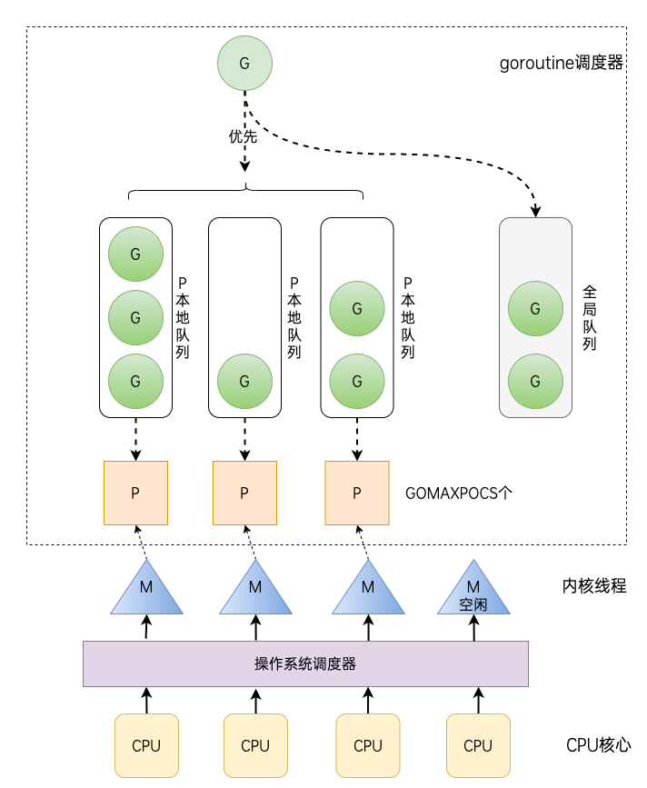

## 并发

### Goroutine

基础概念:

- 串行、并发与并行

串行：我们都是先读小学，小学毕业后再读初中，读完初中再读高中。

并发：同一时间段内执行多个任务（你在用微信和两个女朋友聊天）。

并行：同一时刻执行多个任务（你和你朋友都在用微信和女朋友聊天）。

- 进程、线程和协程

进程（process）：程序在操作系统中的一次执行过程，系统进行资源分配和调度的一个独立单位。

线程（thread）：操作系统基于进程开启的轻量级进程，是操作系统调度执行的最小单位。

协程（coroutine）：非操作系统提供而是由用户自行创建和控制的用户态‘线程’，比线程更轻量级。

- 并发模型

业界将如何实现并发编程总结归纳为各式各样的并发模型，常见的并发模型有以下几种：

- 线程&锁模型
- Actor模型
- CSP模型
- Fork&Join模型

Go语言中的并发程序主要是通过基于CSP（communicating sequential processes）的goroutine和channel来实现，当然也支持使用传统的多线程共享内存的并发方式。

`goroutine`是`Go`并行设计的核心。`goroutine`说到底其实就是协程，但是它比线程更小，十几个`goroutine`可能体现在底层就是五六个线程，Go语言内部实现了这些`goroutine`之间的内存共享。执行`goroutine`只需极少的栈内存(大概是4~5KB)，当然会根据相应的数据伸缩。也正因为如此，可同时运行成千上万个并发任务。`goroutine`比`thread`更易用、更高效、更轻便。

`goroutine`是通过Go的`runtime`管理的一个线程管理器。`goroutine`通过`go`关键字实现了，其实就是一个普通的函数。在Go语言编程中你不需要去自己写进程、线程、协程，你的技能包里只有一个技能——goroutine，当你需要让某个任务并发执行的时候，你只需要把这个任务包装成一个函数，开启一个 goroutine 去执行这个函数就可以了，就是这么简单粗暴。

通过关键字go就启动了一个`goroutine`。如下例子:

```Go
package main
import (
    "fmt"
    "runtime"
)
func say(s string) {
    for i := 0; i < 5; i++ {
        runtime.Gosched()
        fmt.Println(s)
    }
}
func main() {
    go say("world") //开一个新的Goroutines执行
    say("hello") //当前Goroutines执行
}
// 以上程序执行后将输出：
// hello
// world
// hello
// world
// hello
// world
// hello
// world
// hello
```

可以看到go关键字很方便的就实现了并发编程。

上面的多个`goroutine`运行在同一个进程里面，共享内存数据，不过设计上要遵循：不要通过共享来通信，而要通过通信来共享。

`runtime.Gosched()`表示让CPU把时间片让给别人,下次某个时候继续恢复执行该`goroutine`。

默认情况下，在Go 1.5将标识并发系统线程个数的`runtime.GOMAXPROCS`的初始值由1改为了`运行环境的CPU核数`。

但在Go 1.5以前调度器仅使用单线程，也就是说只实现了并发。想要发挥多核处理器的并行，需要程序中显式调用 `runtime.GOMAXPROCS(n)` 告诉调度器同时使用多个线程。`GOMAXPROCS` 设置了同时运行逻辑代码的系统线程的最大数量，并返回之前的设置。如果`n < 1`，不会改变当前设置。

- goroutine调度

区别于操作系统内核调度操作系统线程，goroutine 的调度是Go语言运行时（runtime）层面的实现，是完全由 Go 语言本身实现的一套调度系统——go scheduler。它的作用是按照一定的规则将所有的 goroutine 调度到操作系统线程上执行。

在经历数个版本的迭代之后，目前 Go 语言的调度器采用的是 `GPM` 调度模型。



### Channel

单纯地将函数并发执行是没有意义的。函数与函数间需要交换数据才能体现并发执行函数的意义。

虽然可以使用共享内存进行数据交换，但是共享内存在不同的 goroutine 中容易发生竞态问题。为了保证数据交换的正确性，很多并发模型中必须使用互斥量对内存进行加锁，这种做法势必造成性能问题。

Go语言采用的并发模型是`CSP（Communicating Sequential Processes）`，提倡**通过通信****共享内存**而不是**通过共享内存而实现通信**。

如果说 goroutine 是Go程序并发的执行体，`channel`就是它们之间的连接。`channel`是可以让一个 goroutine 发送特定值到另一个 goroutine 的通信机制。

Go 语言中的通道（channel）是一种特殊的类型。通道像一个传送带或者队列，总是遵循先入先出（First In First Out）的规则，保证收发数据的顺序。每一个通道都是一个具体类型的导管，也就是声明channel的时候需要为其指定元素类型。

- channel类型

`channel`是 Go 语言中一种特有的类型。声明通道类型变量的格式如下：

```Go
var 变量名 chan 元素类型
```

其中：

- chan：是关键字
- 元素类型：是指通道中传递元素的类型

```Go
var ch chan []int  // 声明一个传递int切片的通道
```

- channel零值

未初始化的通道变量默认零值是nil

```Go
var ch chan int
fmt.Println(ch) // <nil>
```

- 初始化channel

必须使用`make` 创建`channel`

```Go
ci := make(chan int)
cs := make(chan string)
cf := make(chan interface{})
```

`channel`通过操作符`<-`来接收和发送数据

```Go
ch <- v    // 发送v到channel ch.
v := <-ch  // 从ch中接收数据，并赋值给v
```

应用例子:

```Go
package main
import "fmt"
func sum(a []int, c chan int) {
    total := 0
    for _, v := range a {
        total += v
    }
    c <- total  // send total to c
}
func main() {
    a := []int{7, 2, 8, -9, 4, 0}
    c := make(chan int)
    go sum(a[:len(a)/2], c)
    go sum(a[len(a)/2:], c)
    x, y := <-c, <-c  // receive from c
    fmt.Println(x, y, x + y)
}
```

默认情况下，`channel`接收和发送数据都是**阻塞**的，除非另一端已经准备好，这样就使得`Goroutines`同步变的更加的简单，而不需要显式的`lock`。所谓阻塞，也就是如果读取（`value := <-ch`）它将会被阻塞，直到有数据接收。其次，任何发送（`ch<-5`）将会被阻塞，直到数据被读出。**无缓冲**`channel`是在多个`goroutine`之间同步很棒的工具。

- **Buffered channels**

Go也允许指定channel的缓冲大小，很简单，就是channel可以存储多少元素。`ch:= make(chan bool`, 4)，创建了可以存储4个元素的bool 型channel。在这个channel 中，前4个元素可以无阻塞的写入。当写入第5个元素时，代码将会阻塞，直到其他goroutine从channel 中读取一些元素，腾出空间。

```Go
ch := make(chan type, value)
```

当 `value = 0` 时，channel 是**无缓冲阻塞**读写的，当`value > 0` 时，channel **有缓冲、是非阻塞**的，直到写满 value 个元素才阻塞写入。

```Go
package main
import "fmt"
func main() {
    c := make(chan int, 2)//修改2为1就报错，修改2为3可以正常运行
    c <- 1
    c <- 2
    fmt.Println(<-c)
    fmt.Println(<-c)
}
//修改为1报如下的错误:
//fatal error: all goroutines are asleep - deadlock!
```

- **Range和Close**

上面这个例子中，需要读取两次c，这样不是很方便，Go考虑到了这一点，所以也可以通过range，像操作slice或者map一样操作缓存类型的channel.

```Go
package main
import (
    "fmt"
)
func fibonacci(n int, c chan int) {
    x, y := 1, 1
    for i := 0; i < n; i++ {
        c <- x
        x, y = y, x + y
    }
    close(c)
}
func main() {
    c := make(chan int, 10)
    go fibonacci(cap(c), c)
    for i := range c {
        fmt.Println(i)
    }
}
```

`for i := range c`能够不断的读取`channel`里面的数据，直到该`channel`被显式的关闭。上面代码看到可以显式的关闭`channel`，生产者通过内置函数`close`关闭`channel`。关闭`channel`之后就无法再发送任何数据了，在消费方可以通过语法`v, ok := <-ch`测试`channel`是否被关闭。如果ok返回false，那么说明`channel`已经没有任何数据并且已经被关闭。

- 记住**应该在生产者的地方**关闭`channel`，而不是消费的地方去关闭它，这样容易引起`panic`
- 另外记住一点的就是`channel`不像文件之类的，不需要经常去关闭，只有确实没有任何发送数据了，或者想显式的结束`range`循环之类的
- **Select**

上面介绍的都是只有一个`channel`的情况，那么如果存在多个`channel`的时候，该如何操作呢，Go里面提供了一个关键字`select`，通过`select`可以监听`channel`上的数据流动。

`select`默认是阻塞的，只有当监听的`channel`中有发送或接收可以进行时才会运行，当多个`channel`都准备好的时候，`select`是随机的选择一个执行的。

```Go
package main
import "fmt"
func fibonacci(c, quit chan int) {
    x, y := 1, 1
    for {
        select {
        case c <- x:
            x, y = y, x + y
        case <-quit:
            fmt.Println("quit")
            return
        }
    }
}
func main() {
    c := make(chan int)
    quit := make(chan int)
    go func() {
        for i := 0; i < 10; i++ {
            fmt.Println(<-c)
        }
        quit <- 0
    }()
    fibonacci(c, quit)
}
```

在`select`里面还有`default`语法，`select`其实就是类似`switch`的功能，`default`就是当监听的`channel`都没有准备好的时候，默认执行的（`select`不再阻塞等待`channel`）。

```Go
select {
case i := <-c:
    // use i
default:
    // 当c阻塞的时候执行这里
}
```

### 锁

有时候我们的代码中可能会存在多个 goroutine 同时操作一个资源（临界区）的情况，这种情况下就会发生`竞态问题`（数据竞态）。这就好比现实生活中十字路口被各个方向的汽车竞争，还有火车上的卫生间被车厢里的人竞争。

```Go
package main

import (
        "fmt"
        "sync"
)

var (
        x int64

        wg sync.WaitGroup // 等待组
)

// add 对全局变量x执行5000次加1操作
func add() {
        for i := 0; i < 5000; i++ {
                x = x + 1
        }
        wg.Done()
}

func main() {
        wg.Add(2)

        go add()
        go add()

        wg.Wait()
        fmt.Println(x)
}
```

在上面的示例代码片中，我们开启了两个 goroutine 分别执行 add 函数，这两个 goroutine 在访问和修改全局的`x`变量时就会存在数据竞争，某个 goroutine 中对全局变量`x`的修改可能会覆盖掉另一个 goroutine 中的操作，所以导致最后的结果与预期不符。

- **互斥锁**

互斥锁是一种常用的控制共享资源访问的方法，它能够保证同一时间只有一个 goroutine 可以访问共享资源。Go 语言中使用`sync`包中提供的`Mutex`类型来实现互斥锁。

`sync.Mutex`提供了两个方法供我们使用。

| 方法名                   | 功能       |
| ------------------------ | ---------- |
| func (m *Mutex) Lock()   | 获取互斥锁 |
| func (m *Mutex) Unlock() | 释放互斥锁 |

我们在下面的示例代码中使用互斥锁限制每次只有一个 goroutine 才能修改全局变量`x`，从而修复上面代码中的问题。

```Go
package main

import (
        "fmt"
        "sync"
)

// sync.Mutex

var (
        x int64

        wg sync.WaitGroup // 等待组

        m sync.Mutex // 互斥锁
)

// add 对全局变量x执行5000次加1操作
func add() {
        for i := 0; i < 5000; i++ {
                m.Lock() // 修改x前加锁
                x = x + 1
                m.Unlock() // 改完解锁
        }
        wg.Done()
}

func main() {
        wg.Add(2)

        go add()
        go add()

        wg.Wait()
        fmt.Println(x)
}
```

- **读写****互斥锁**

互斥锁是完全互斥的，但是实际上有很多场景是读多写少的，当我们并发的去读取一个资源而不涉及资源修改的时候是没有必要加互斥锁的，这种场景下使用读写锁是更好的一种选择。读写锁在 Go 语言中使用`sync`包中的`RWMutex`类型。

`sync.RWMutex`提供了以下5个方法。

| 方法名                              | 功能                           |
| ----------------------------------- | ------------------------------ |
| func (rw *RWMutex) Lock()           | 获取写锁                       |
| func (rw *RWMutex) Unlock()         | 释放写锁                       |
| func (rw *RWMutex) RLock()          | 获取读锁                       |
| func (rw *RWMutex) RUnlock()        | 释放读锁                       |
| func (rw *RWMutex) RLocker() Locker | 返回一个实现Locker接口的读写锁 |

读写锁分为两种：读锁和写锁。当一个 goroutine 获取到读锁之后，其他的 goroutine 如果是获取读锁会继续获得锁，如果是获取写锁就会等待；而当一个 goroutine 获取写锁之后，其他的 goroutine 无论是获取读锁还是写锁都会等待。

- **sync.WaitGroup**

在代码中生硬的使用`time.Sleep`肯定是不合适的，Go语言中可以使用`sync.WaitGroup`来实现并发任务的同步。 `sync.WaitGroup`有以下几个方法：

| 方法名                               | 功能                |
| ------------------------------------ | ------------------- |
| func (wg * WaitGroup) Add(delta int) | 计数器+delta        |
| (wg *WaitGroup) Done()               | 计数器-1            |
| (wg *WaitGroup) Wait()               | 阻塞直到计数器变为0 |

`sync.WaitGroup`内部维护着一个计数器，计数器的值可以增加和减少。例如当我们启动了 N 个并发任务时，就将计数器值增加N。每个任务完成时通过调用 Done 方法将计数器减1。通过调用 Wait 来等待并发任务执行完，当计数器值为 0 时，表示所有并发任务已经完成。

```Go
var wg sync.WaitGroup

func hello() {
        defer wg.Done()
        fmt.Println("Hello Goroutine!")
}
func main() {
        wg.Add(1)
        go hello() // 启动另外一个goroutine去执行hello函数
        fmt.Println("main goroutine done!")
        wg.Wait()
}
```

- **sync.Once**

在某些场景下我们需要确保某些操作即使在高并发的场景下也只会被执行一次，例如只加载一次配置文件等。

Go语言中的`sync`包中提供了一个针对只执行一次场景的解决方案——`sync.Once`，`sync.Once`只有一个`Do`方法，其签名如下：

```Go
func (o *Once) Do(f func())
```

注意：如果要执行的函数`f`需要传递参数就需要搭配闭包来使用。

`sync.Once`其实内部包含一个互斥锁和一个布尔值，互斥锁保证布尔值和数据的安全，而布尔值用来记录初始化是否完成。这样设计就能保证初始化操作的时候是并发安全的并且初始化操作也不会被执行多次。

- **sync.Map**

Go 语言中内置的 map 不是并发安全的。Go语言的`sync`包中提供了一个开箱即用的并发安全版 map——`sync.Map`。开箱即用表示其不用像内置的 map 一样使用 make 函数初始化就能直接使用。同时`sync.Map`内置了诸如`Store`、`Load`、`LoadOrStore`、`Delete`、`Range`等操作方法。

| 方法名                                                       | 功能                            |
| ------------------------------------------------------------ | ------------------------------- |
| func (m *Map) Store(key, value interface{})                  | 存储key-value数据               |
| func (m *Map) Load(key interface{}) (value interface{}, ok bool) | 查询key对应的value              |
| func (m *Map) LoadOrStore(key, value interface{}) (actual interface{}, loaded bool) | 查询或存储key对应的value        |
| func (m *Map) LoadAndDelete(key interface{}) (value interface{}, loaded bool) | 查询并删除key                   |
| func (m *Map) Delete(key interface{})                        | 删除key                         |
| func (m *Map) Range(f func(key, value interface{}) bool)     | 对map中的每个key-value依次调用f |

下面的代码示例演示了并发读写`sync.Map`。

```Go
package main

import (
        "fmt"
        "strconv"
        "sync"
)

// 并发安全的map
var m = sync.Map{}

func main() {
        wg := sync.WaitGroup{}
        // 对m执行20个并发的读写操作
        for i := 0; i < 20; i++ {
                wg.Add(1)
                go func(n int) {
                        key := strconv.Itoa(n)
                        m.Store(key, n)         // 存储key-value
                        value, _ := m.Load(key) // 根据key取值
                        fmt.Printf("k=:%v,v:=%v\n", key, value)
                        wg.Done()
                }(i)
        }
        wg.Wait()
}
```

- **sync.Cond**

`sync.Cond` 是 Go 中用于**条件变量**的类型，它允许一个或多个 goroutine 等待某个条件满足时被唤醒。与互斥锁 `sync.Mutex` 或 `sync.RWMutex` 配合使用，`sync.Cond` 提供了一种**线程间通信**的机制，能够让 goroutine 在某个条件满足之前处于**阻塞**状态。

`sync.Cond` 的基本组成：

- **`Mutex`**：`sync.Cond` 通常与 `Mutex`（互斥锁）一起使用，确保对共享资源的访问是安全的。
- **`Wait()`**：阻塞当前 goroutine，直到条件满足。调用 `Wait` 时会自动释放锁，并在被唤醒时重新获得锁。
- **`Signal()`**：唤醒一个正在等待的 goroutine。
- **`Broadcast()`**：唤醒所有正在等待的 goroutine。

**使用场景：**

- 当一个 goroutine 需要等待某个条件成立时，其他 goroutine 可以通过 `Signal` 或 `Broadcast` 来通知它。
- 典型的生产者-消费者模型中，消费者可以等待某个资源可用，而生产者可以通过通知唤醒消费者。

```Go
package main

import (
    "fmt"
    "sync"
    "time"
)

var cond = sync.NewCond(&sync.Mutex{})
var sharedResource int

// 消费者 Goroutine
func consumer(id int) {
    cond.L.Lock()
    for sharedResource == 0 {
        fmt.Printf("Consumer %d is waiting...\n", id)
        cond.Wait()  // 等待条件成立
    }
    fmt.Printf("Consumer %d consumed: %d\n", id, sharedResource)
    sharedResource = 0  // 消费资源
    cond.L.Unlock()
}

// 生产者 Goroutine
func producer() {
    cond.L.Lock()
    sharedResource = 42  // 生产资源
    fmt.Println("Producer produced:", sharedResource)
    cond.Signal()  // 唤醒一个等待的消费者
    cond.L.Unlock()
}

func main() {
    go consumer(1)
    go consumer(2)

    time.Sleep(1 * time.Second)

    go producer()

    time.Sleep(1 * time.Second)
}
```

- 可以一发多收

```Go
func producer() {  
   cond.L.Lock() 
       ready = true  // 修改条件    
       fmt.Println("Producer is broadcasting...")   
       cond.Broadcast()  // 一发多收，唤醒所有消费者     
    cond.L.Unlock() }
```

- **sync.Pool**

`sync.Pool` 是 Go 语言中的对象池，主要用于**缓存和复用临时对象**，以减少内存分配和垃圾回收（GC）的负担。`sync.Pool` 可以在高并发场景中提高对象的复用率，减少不必要的内存分配和回收。

`sync.Pool` 的特点：

- `sync.Pool` 适用于创建和销毁频率较高的对象。
- 对象池中的对象会在 GC 时被清理掉。
- 在调用 `Get()` 时，如果池中有对象，它会返回现有对象；如果没有对象，它会调用 `New()` 方法（如果定义了）来创建新对象。
- `Put()` 方法将对象放回池中，以便下次复用。

```Go
package main

import (
    "fmt"
    "sync"
)

type Resource struct {
    ID int
}

var pool = sync.Pool{
    New: func() interface{} {
        fmt.Println("Creating new resource")
        return &Resource{}
    },
}

func main() {
    // 从池中获取对象
    res1 := pool.Get().(*Resource)
    res1.ID = 1
    fmt.Println("Resource 1 ID:", res1.ID)

    // 将对象放回池中
    pool.Put(res1)

    // 从池中再次获取对象
    res2 := pool.Get().(*Resource)
    fmt.Println("Resource 2 ID:", res2.ID)  // 复用了 res1

    // 再次从池中获取，没有对象时会创建新的
    res3 := pool.Get().(*Resource)
    fmt.Println("Resource 3 ID:", res3.ID)  // 新对象
}
```

**使用场景：**

- 适用于需要频繁创建和销毁的短生命周期对象，例如：缓冲区、临时数据结构等。
- 在高并发环境下，可以通过对象池减少 GC 压力，提升性能。

## Defer

- 执行时机与资源释放

Go语言中有种不错的设计，即延迟（defer）语句，可以在函数中添加多个defer语句。当函数执行到最后时，这些defer语句会按照逆序执行，最后该函数返回。特别是当进行一些打开资源的操作时，遇到错误需要提前返回，在返回前需要关闭相应的资源，不然很容易造成资源泄露等问题。如下代码所示，一般写打开一个资源是这样操作的：

```Go
func ReadWrite() bool {
    file.Open("file")
// 做一些工作
    if failureX {
        file.Close()
        return false
    }
    if failureY {
        file.Close()
        return false
    }
    file.Close()
    return true
}
```

上面有很多重复的代码，Go的`defer`有效解决了这个问题。使用它后，不但代码量减少了很多，而且程序变得更优雅。在`defer`后指定的函数会在函数退出前调用。

```Go
func ReadWrite() bool {
    file.Open("file")
    defer file.Close()
    if failureX {
        return false
    }
    if failureY {
        return false
    }
    return true
}
```

如果有很多调用`defer`，那么`defer`是采用后进先出模式，所以如下代码会输出`4 3 2 1 0`

```Go
for i := 0; i < 5; i++ {
    defer fmt.Printf("%d ", i)
}
```

- `defer/recover` 应用程序异常的捕获和处理

`recover` 是一个内置函数，用于捕获因 `panic` 引发的异常。它通常与 `defer` 结合使用，以便在发生异常时恢复程序的正常执行。

```Go
func safeExecute() {
    defer func() {
        if r := recover(); r != nil {
            fmt.Println("Recovered from panic:", r)
        }
    }()

    // 可能引发 panic 的代码
    panic("something went wrong")
}

func main() {
    safeExecute()
    fmt.Println("Program continues...")
}
```

## interface隐式实现

接口是一种抽象类型，定义了一组方法的集合。任何类型只要实现了接口中定义的所有方法，就被认为实现了该接口，不需要显式声明 "implements" 关键字。

```Go
type MyInterface interface {
    Method1()
    Method2(param string) string
}
```

在上面的例子中，`MyInterface` 定义了两个方法 `Method1` 和 `Method2`。任何类型只要实现了这两个方法就自动实现了 `MyInterface`。

Go 语言使用**隐式实现**机制。也就是说，一个类型只要实现了接口中的所有方法，就被认为实现了该接口。类型不需要明确声明实现了某个接口。

```Go
type MyType struct{}
func (m MyType) Method1() {
    fmt.Println("Method1 implementation")
}

func (m MyType) Method2(param string) string {
    return "Method2 implementation: "param
}

func main() {
    var i MyInterface
    i = MyType{} // 隐式实现
    i.Method1()
    fmt.Println(i.Method2("test"))
}
```

在上面的例子中，`MyType` 实现了 `MyInterface` 接口中的 `Method1` 和 `Method2`，因此它被认为实现了 `MyInterface`，并且可以赋值给接口变量 `i`。

- **类型T和\*T对接口实现的区别**

在 Go 中，类型 `T` 和类型 `*T` 对接口的实现是有区别的。主要体现在值类型和指针类型的区别。

- **值类型** **`T`** 可以直接调用其方法。
- **指针类型** **`\*T`** 可以调用值类型的方法，也可以调用指针接收者的方法。

-  值类型 `T` 实现接口

如果方法的接收者是**值类型** **`T`**，那么**值类型** **`T`** **和指针类型** **`\*T`** 都可以调用该方法。

```Go
type MyType struct{}
func (m MyType) Method1() {
    fmt.Println("Method1 from value receiver")
}

type MyInterface interface {
    Method1()
}

func main() {
    var i MyInterface
    // 值类型实现接口
    i = MyType{}  // OK
    i.Method1()

    i = &MyType{} // OK
    i.Method1()   // 指针类型也能调用值接收者的方法
}
```

在上面的例子中，`Method1` 的接收者是 `MyType` 值类型。因为 Go 会自动解引用，所以即便 `i` 是指向 `MyType` 的指针，在方法调用时，Go 会自动处理解引用，因此 `*MyType` 也可以调用 `Method1`。

- 指针类型 `*T` 实现接口

如果方法的接收者是**指针类型** **`\*T`**，那么**只有指针类型** **`\*T`** 能调用该方法，而**值类型** **`T`** 无法调用。

```Go
type MyType struct{}
func (m *MyType) Method1() {
    fmt.Println("Method1 from pointer receiver")
}

type MyInterface interface {
    Method1()
}

func main() {
    var i MyInterface
    // 指针类型实现接口
    i = &MyType{}  // OK
    i.Method1()

    // i = MyType{}  // 错误：不能将值类型赋给接口
}
```

在这个例子中，`Method1` 的接收者是 `*MyType` 指针类型。因为方法接收者是指针类型，所以只有 `*MyType`（指针）可以调用该方法，而 `MyType`（值类型）无法调用。将 `MyType{}` 赋值给 `i` 会导致编译错误。

## 函数式编程

### 头等函数

Go 语言支持**头等函数**，这意味着函数在 Go 中被视为一种**一等公民（first-class citizen）**。具体来说，函数可以像其他数据类型一样使用，可以：

- **赋值给变量**。
- **作为参数传递给其他函数**。
- **作为返回值从函数中返回**。

```Go
package main

import "fmt"

// 定义一个简单的函数
func add(a, b int) int {
    return a + b
}
func main() {
    // 将函数赋值给变量
    sum := add

    // 调用函数
    result := sum(4, 5)
    fmt.Println("Result:", result)  // 输出: Result: 9
}
```

### 函数中间件

**中间件**是一种设计模式，通常用于在不改变具体业务逻辑的前提下，添加处理逻辑。中间件通常用于 HTTP 服务器、日志记录、认证等场景。Go 中的中间件主要是通过**高阶函数**来实现的。

中间件的定义：

> 中间件本质上是一个**接受函数作为参数并返回另一个函数**的函数。它可以在一个函数执行前后添加额外的逻辑。

```Go
package main

import "fmt"

// 定义一个简单的函数类型
type HandlerFunc func(string) string

// 一个中间件函数，它接收一个处理函数并返回一个新的函数
func LoggingMiddleware(next HandlerFunc) HandlerFunc {
    return func(s string) string {
        fmt.Println("Before handling:", s)
        result := next(s)
        fmt.Println("After handling:", result)
        return result
    }
}

// 一个实际的处理函数
func HelloHandler(name string) string {
    return "Hello, " + name
}

func main() {
    // 使用中间件包装处理函数
    handler := LoggingMiddleware(HelloHandler)

    // 调用包装后的函数
    result := handler("Gopher")
    fmt.Println(result)  // 输出: Hello, Gopher
}
```

中间件模式的主要优点是可以**动态扩展**函数的功能，而无需修改原始函数的实现。这种模式在 Web 框架（如 Go 的 `net/http` 包）中广泛使用。

### 函数对象

在 Go 中，**函数也是一种对象**，这意味着函数可以像其他变量一样被操作、传递和返回。函数对象的概念与头等函数非常类似，但更强调函数本身作为一种值或对象的使用。

### 闭包函数

**闭包**是函数式编程中的一个重要概念。闭包函数是指**可以捕获并保存其外部****作用域****变量的函数**。在 Go 中，闭包函数可以引用并操作定义在函数外部的变量，即使这些变量的生命周期已经结束。

```Go
package main

import "fmt"

// 返回一个闭包函数
func counter() func() int {
    count := 0
    return func() int {
        count++
        return count
    }
}

func main() {
    // 创建一个闭包函数
    increment := counter()

    // 调用闭包函数
    fmt.Println(increment())  // 输出: 1
    fmt.Println(increment())  // 输出: 2
    fmt.Println(increment())  // 输出: 3
}
```

在这个例子中，`counter` 函数返回一个闭包函数。这个闭包函数可以访问 `counter` 函数内部的变量 `count`，即使 `counter` 函数已经返回。每次调用闭包函数时，它都会修改并返回 `count` 的值。

闭包的强大之处在于它可以**保持对外部变量的引用**，从而实现状态的保存。

### 闭包陷阱

在使用闭包时，特别是在闭包中引用循环变量时，容易遇到一个常见的错误，这被称为**闭包陷阱**。问题的核心在于闭包捕获的是**变量的引用**，而不是变量的值。因此，当闭包在循环中被创建时，所有闭包捕获的是同一个循环变量的引用，导致意外的行为。

## Context

`context.Context` 是一个接口，用于在 goroutine 之间传递数据和控制信号。可以使用 `WithValue` 方法在上下文中携带值：

```Go
type key string
const myKey key = "example"
ctx := context.WithValue(context.Background(), myKey, "value")
// 从上下文中获取值
value := ctx.Value(myKey).(string)
```

在这个例子中，`myKey` 和 `"value"` 被存储在上下文中，后续可以通过 `ctx.Value(myKey)` 访问。

1. 父子 goroutine 间取消信号传递

使用 `context` 还可以在父 goroutine 中控制子 goroutine 的生命周期。当父 goroutine 取消上下文时，所有使用该上下文的子 goroutine 也会被通知取消。

```Go
ctx, cancel := context.WithCancel(context.Background())
go func() {
    // 子 goroutine
    select {
    case <-ctx.Done():
        // 处理取消信号
        fmt.Println("Cancelled")
        return
    }
}()

// 取消上下文
cancel()
```

在这个示例中，子 goroutine 在 `ctx.Done()` 通道上等待取消信号。一旦调用 `cancel()`，子 goroutine 会接收到取消信号并执行相应的处理。

1. 客户端与服务端信息传递

在处理 HTTP 请求时，`context` 通常用于在客户端和服务端之间传递请求范围内的信息。例如，您可以在请求的上下文中携带用户认证信息或请求 ID，并在服务端进行处理。

```Go
func handler(w http.ResponseWriter, r *http.Request) {
    ctx := r.Context()
    userID := ctx.Value("userID").(string)
    // 使用 userID 处理请求
    fmt.Fprintf(w, "User ID: %s", userID)
}

func main() {
    http.HandleFunc("/", handler)
    http.ListenAndServe(":8080", nil)
}
```

在这个例子中，`userID` 被假设在请求的上下文中传递，服务端可以在处理请求时访问。

1. 超时取消设置

使用 `context`，可以方便地设置超时。当上下文超时后，所有使用该上下文的 goroutine 会收到取消信号。

```Go
ctx, cancel := context.WithTimeout(context.Background(), 2*time.Second)
defer cancel()
go func() {
    select {
    case <-ctx.Done():
        fmt.Println("Operation cancelled due to timeout")
    }
}()

// 模拟长时间操作
time.Sleep(3time.Second)
```

在这个示例中，`WithTimeout` 创建了一个上下文，该上下文在 2 秒后自动取消。即使 goroutine 中的操作还在继续，超时后也会收到取消信号。

## 网络编程

### TCP通信

> TCP/IP(Transmission Control Protocol/Internet Protocol) 即传输控制协议/网间协议，是一种面向连接（连接导向）的、可靠的、基于字节流的传输层（Transport layer）通信协议，因为是面向连接的协议，数据像水流一样传输，会存在黏包问题。

TCP服务端程序的处理流程：

1. 监听端口
2. 接收客户端请求建立链接
3. 创建goroutine处理链接。

我们使用Go语言的net包实现的TCP服务端代码如下：

```Go
// tcp/server/main.go

// TCP server端

// 处理函数
func process(conn net.Conn) {
        defer conn.Close() // 关闭连接
        for {
                reader := bufio.NewReader(conn)
                var buf [128]byte
                n, err := reader.Read(buf[:]) // 读取数据
                if err != nil {
                        fmt.Println("read from client failed, err:", err)
                        break
                }
                recvStr := string(buf[:n])
                fmt.Println("收到client端发来的数据：", recvStr)
                conn.Write([]byte(recvStr)) // 发送数据
        }
}

func main() {
        listen, err := net.Listen("tcp", "127.0.0.1:20000")
        if err != nil {
                fmt.Println("listen failed, err:", err)
                return
        }
        for {
                conn, err := listen.Accept() // 建立连接
                if err != nil {
                        fmt.Println("accept failed, err:", err)
                        continue
                }
                go process(conn) // 启动一个goroutine处理连接
        }
}
```

一个TCP客户端进行TCP通信的流程如下：

1. 建立与服务端的链接
2. 进行数据收发
3. 关闭链接

使用Go语言的net包实现的TCP客户端代码如下：

```Go
// tcp/client/main.go

// 客户端
func main() {
        conn, err := net.Dial("tcp", "127.0.0.1:20000")
        if err != nil {
                fmt.Println("err :", err)
                return
        }
        defer conn.Close() // 关闭连接
        inputReader := bufio.NewReader(os.Stdin)
        for {
                input, _ := inputReader.ReadString('\n') // 读取用户输入
                inputInfo := strings.Trim(input, "\r\n")
                if strings.ToUpper(inputInfo) == "Q" { // 如果输入q就退出
                        return
                }
                _, err = conn.Write([]byte(inputInfo)) // 发送数据
                if err != nil {
                        return
                }
                buf := [512]byte{}
                n, err := conn.Read(buf[:])
                if err != nil {
                        fmt.Println("recv failed, err:", err)
                        return
                }
                fmt.Println(string(buf[:n]))
        }
}
```

- TCP粘包

上述代码客户端分10次发送的数据，在服务端并没有成功的输出10次，而是多条数据“粘”到了一起。

主要原因就是tcp数据传递模式是流模式，在保持长连接的时候可以进行多次的收和发。

“**粘包**"可发生在发送端也可发生在接收端：

1. 由Nagle算法造成的发送端的粘包：Nagle算法是一种改善网络传输效率的算法。简单来说就是当我们提交一段数据给TCP发送时，TCP并不立刻发送此段数据，而是等待一小段时间看看在等待期间是否还有要发送的数据，若有则会一次把这两段数据发送出去。
2. 接收端接收不及时造成的接收端粘包：TCP会把接收到的数据存在自己的缓冲区中，然后通知应用层取数据。当应用层由于某些原因不能及时的把TCP的数据取出来，就会造成TCP缓冲区中存放了几段数据。

**解决办法**：

出现"粘包"的关键在于接收方不确定将要传输的数据包的大小，因此我们可以对数据包进行封包和拆包的操作。

封包：封包就是给一段数据加上包头，这样一来数据包就分为包头和包体两部分内容了(过滤非法包时封包会加入"包尾"内容)。包头部分的长度是固定的，并且它存储了包体的长度，根据包头长度固定以及包头中含有包体长度的变量就能正确的拆分出一个完整的数据包。

### UDP通信

UDP协议（User Datagram Protocol）中文名称是用户数据报协议，是OSI（Open System Interconnection，开放式系统互联）参考模型中一种**无连接**的传输层协议，不需要建立连接就能直接进行数据发送和接收，属于不可靠的、没有时序的通信，但是UDP协议的实时性比较好，通常用于视频直播相关领域。

UDP服务端

```Go
// UDP/server/main.go

// UDP server端
func main() {
        listen, err := net.ListenUDP("udp", &net.UDPAddr{
                IP:   net.IPv4(0, 0, 0, 0),
                Port: 30000,
        })
        if err != nil {
                fmt.Println("listen failed, err:", err)
                return
        }
        defer listen.Close()
        for {
                var data [1024]byte
                n, addr, err := listen.ReadFromUDP(data[:]) // 接收数据
                if err != nil {
                        fmt.Println("read udp failed, err:", err)
                        continue
                }
                fmt.Printf("data:%v addr:%v count:%v\n", string(data[:n]), addr, n)
                _, err = listen.WriteToUDP(data[:n], addr) // 发送数据
                if err != nil {
                        fmt.Println("write to udp failed, err:", err)
                        continue
                }
        }
}
```

客户端

```Go
// UDP 客户端
func main() {
        socket, err := net.DialUDP("udp", nil, &net.UDPAddr{
                IP:   net.IPv4(0, 0, 0, 0),
                Port: 30000,
        })
        if err != nil {
                fmt.Println("连接服务端失败，err:", err)
                return
        }
        defer socket.Close()
        sendData := []byte("Hello server")
        _, err = socket.Write(sendData) // 发送数据
        if err != nil {
                fmt.Println("发送数据失败，err:", err)
                return
        }
        data := make([]byte, 4096)
        n, remoteAddr, err := socket.ReadFromUDP(data) // 接收数据
        if err != nil {
                fmt.Println("接收数据失败，err:", err)
                return
        }
        fmt.Printf("recv:%v addr:%v count:%v\n", string(data[:n]), remoteAddr, n)
}
```

## Go Test

Go语言中的测试依赖`go test`命令。编写测试代码和编写普通的Go代码过程是类似的，并不需要学习新的语法、规则或工具。

go test命令是一个按照一定约定和组织的测试代码的驱动程序。在包目录内，所有以`_test.go`为后缀名的源代码文件都是`go test`测试的一部分，不会被`go build`编译到最终的可执行文件中。

在`*_test.go`文件中有三种类型的函数，单元测试函数、基准测试函数和示例函数。

| 类型     | 格式                  | 作用                           |
| -------- | --------------------- | ------------------------------ |
| 测试函数 | 函数名前缀为Test      | 测试程序的一些逻辑行为是否正确 |
| 基准函数 | 函数名前缀为Benchmark | 测试函数的性能                 |
| 示例函数 | 函数名前缀为Example   | 为文档提供示例文档             |

`go test`命令会遍历所有的`*_test.go`文件中符合上述命名规则的函数，然后生成一个临时的main包用于调用相应的测试函数，然后构建并运行、报告测试结果，最后清理测试中生成的临时文件。

### 测试函数

- 格式

每个测试函数必须导入`testing`包，测试函数的基本格式（签名）如下：

```Go
func TestName(t *testing.T){
    // ...
}
```

测试函数的名字必须以`Test`开头，可选的后缀名必须以大写字母开头，举几个例子：

```Go
func TestAdd(t *testing.T){ ... }
func TestSum(t *testing.T){ ... }
func TestLog(t *testing.T){ ... }
```

其中参数`t`用于报告测试失败和附加的日志信息。 `testing.T`的拥有的方法如下：

```Go
func (c *T) Error(args ...interface{})
func (c *T) Errorf(format string, args ...interface{})
func (c *T) Fail()
func (c *T) FailNow()
func (c *T) Failed() boolfunc (c *T) Fatal(args ...interface{})
func (c *T) Fatalf(format string, args ...interface{})
func (c *T) Log(args ...interface{})
func (c *T) Logf(format string, args ...interface{})
func (c *T) Name() stringfunc (t *T) Parallel()
func (t *T) Run(name string, f func(t *T)) boolfunc (c *T) Skip(args ...interface{})
func (c *T) SkipNow()
func (c *T) Skipf(format string, args ...interface{})
func (c *T) Skipped() bool
```

- 示例

我们定义一个`split`的包，包中定义了一个`Split`函数，具体实现如下：

```Go
// split/split.go
package split

import "strings"
// split package with a single split function.
// Split slices s into all substrings separated by sep and
// returns a slice of the substrings between those separators.
func Split(s, sep string) (result []string) {
        i := strings.Index(s, sep)

        for i > -1 {
                result = append(result, s[:i])
                s = s[i+1:]
                i = strings.Index(s, sep)
        }
        result = append(result, s)
        return}
```

在当前目录下，我们创建一个`split_test.go`的测试文件，并定义一个测试函数如下：

```Go
// split/split_test.go
package split

import (
        "reflect"        "testing")

func TestSplit(t *testing.T) { // 测试函数名必须以Test开头，必须接收一个*testing.T类型参数
        got := Split("a:b:c", ":")         // 程序输出的结果
        want := []string{"a", "b", "c"}    // 期望的结果
        if !reflect.DeepEqual(want, got) { // 因为slice不能比较直接，借助反射包中的方法比较
                t.Errorf("expected:%v, got:%v", want, got) // 测试失败输出错误提示
        }
}
```

此时`split`这个包中的文件如下：

```Bash
split $ ls -l
total 16-rw-r--r--  1 liwenzhou  staff  408  4 29 15:50 split.go
-rw-r--r--  1 liwenzhou  staff  466  4 29 16:04 split_test.go
```

在`split`包路径下，执行`go test`命令，可以看到输出结果如下：

```Bash
split $ go testPASS
ok      github.com/Q1mi/studygo/code_demo/test_demo/split       0.005s
```

可以用如下切片添加更多测试用例

```Go
func TestSplit(t *testing.T) {
   // 定义一个测试用例类型
        type test struct {
                input string
                sep   string
                want  []string
        }
        // 定义一个存储测试用例的切片
        tests := []test{
                {input: "a:b:c", sep: ":", want: []string{"a", "b", "c"}},
                {input: "a:b:c", sep: ",", want: []string{"a:b:c"}},
                {input: "abcd", sep: "bc", want: []string{"a", "d"}},
                {input: "沙河有沙又有河", sep: "沙", want: []string{"河有", "又有河"}},
        }
        // 遍历切片，逐一执行测试用例
        for _, tc := range tests {
                got := Split(tc.input, tc.sep)
                if !reflect.DeepEqual(got, tc.want) {
                        t.Errorf("expected:%v, got:%v", tc.want, got)
                }
        }
}
```

### 基准测试

基准测试就是在一定的工作负载之下检测程序性能的一种方法。基准测试的基本格式如下：

```Go
func BenchmarkName(b *testing.B){
    // ...
}
```

基准测试以`Benchmark`为前缀，需要一个`*testing.B`类型的参数b，基准测试必须要执行`b.N`次，这样的测试才有对照性，`b.N`的值是系统根据实际情况去调整的，从而保证测试的稳定性。 `testing.B`拥有的方法如下：

```Go
func (c *B) Error(args ...interface{})
func (c *B) Errorf(format string, args ...interface{})
func (c *B) Fail()
func (c *B) FailNow()
func (c *B) Failed() boolfunc (c *B) Fatal(args ...interface{})
func (c *B) Fatalf(format string, args ...interface{})
func (c *B) Log(args ...interface{})
func (c *B) Logf(format string, args ...interface{})
func (c *B) Name() stringfunc (b *B) ReportAllocs()
func (b *B) ResetTimer()
func (b *B) Run(name string, f func(b *B)) boolfunc (b *B) RunParallel(body func(*PB))
func (b *B) SetBytes(n int64)
func (b *B) SetParallelism(p int)
func (c *B) Skip(args ...interface{})
func (c *B) SkipNow()
func (c *B) Skipf(format string, args ...interface{})
func (c *B) Skipped() boolfunc (b *B) StartTimer()
func (b *B) StopTimer()
```

- 示例

我们为split包中的`Split`函数编写基准测试如下：

```Go
func BenchmarkSplit(b *testing.B) {
        for i := 0; i < b.N; i++ {
                Split("沙河有沙又有河", "沙")
        }
}
```

基准测试并不会默认执行，需要增加`-bench`参数，所以我们通过执行`go test -bench=Split`命令执行基准测试，输出结果如下：

```Bash
split $ go test -bench=Split
goos: darwin
goarch: amd64
pkg: github.com/Q1mi/studygo/code_demo/test_demo/split
BenchmarkSplit-8        10000000               203 ns/op
PASS
ok      github.com/Q1mi/studygo/code_demo/test_demo/split       2.255s
```

其中`BenchmarkSplit-8`表示对Split函数进行基准测试，数字`8`表示`GOMAXPROCS`的值，这个对于并发基准测试很重要。`10000000`和`203ns/op`表示每次调用`Split`函数耗时`203ns`，这个结果是`10000000`次调用的平均值。

我们还可以为基准测试添加`-benchmem`参数，来获得内存分配的统计数据。

```Bash
split $ go test -bench=Split -benchmem
goos: darwin
goarch: amd64
pkg: github.com/Q1mi/studygo/code_demo/test_demo/split
BenchmarkSplit-8        10000000               215 ns/op             112 B/op          3 allocs/op
PASS
ok      github.com/Q1mi/studygo/code_demo/test_demo/split       2.394s
```

其中，`112 B/op`表示每次操作内存分配了112字节，`3 allocs/op`则表示每次操作进行了3次内存分配。 我们将我们的`Split`函数优化如下：

```Go
func Split(s, sep string) (result []string) {
        result = make([]string, 0, strings.Count(s, sep)+1)
        i := strings.Index(s, sep)
        for i > -1 {
                result = append(result, s[:i])
                s = s[i+len(sep):] // 这里使用len(sep)获取sep的长度
                i = strings.Index(s, sep)
        }
        result = append(result, s)
        return}
```

这一次我们提前使用make函数将result初始化为一个容量足够大的切片，而不再像之前一样通过调用append函数来追加。我们来看一下这个改进会带来多大的性能提升：

```Bash
split $ go test -bench=Split -benchmem
goos: darwin
goarch: amd64
pkg: github.com/Q1mi/studygo/code_demo/test_demo/split
BenchmarkSplit-8        10000000               127 ns/op              48 B/op          1 allocs/op
PASS
ok      github.com/Q1mi/studygo/code_demo/test_demo/split       1.423s
```

这个使用make函数提前分配内存的改动，减少了2/3的内存分配次数，并且减少了一半的内存分配。

### http测试

实际工作中的业务场景往往会比较复杂，无论我们的代码是作为server端对外提供服务或者还是我们依赖别人提供的网络服务（调用别人提供的API接口）的场景，我们通常都不想在测试过程中真正的建立网络连接。

这里介绍mock网络测试。

在Web开发场景下的单元测试，如果涉及到HTTP请求推荐使用Go标准库 `net/http/httptest` 进行测试，能够显著提高测试效率。

这里以常见的**gin**框架为例，演示如何为http server编写单元测试。

假设我们的业务逻辑是搭建一个http server端，对外提供HTTP服务。我们编写了一个`helloHandler`函数，用来处理用户请求。

```Go
// gin.go
package httptest_demo

import (
        "fmt"
        "net/http"

        "github.com/gin-gonic/gin"
)

// Param 请求参数
type Param struct {
        Name string `json:"name"`
}

// helloHandler /hello请求处理函数
func helloHandler(c *gin.Context) {
        var p Param
        if err := c.ShouldBindJSON(&p); err != nil {
                c.JSON(http.StatusOK, gin.H{
                        "msg": "we need a name",
                })
                return
        }
        c.JSON(http.StatusOK, gin.H{
                "msg": fmt.Sprintf("hello %s", p.Name),
        })
}

// SetupRouter 路由
func SetupRouter() *gin.Engine {
        router := gin.Default()
        router.POST("/hello", helloHandler)
        return router
}
```

现在我们需要为`helloHandler`函数编写单元测试，这种情况下我们就可以使用`httptest`这个工具mock一个HTTP请求和响应记录器，让我们的server端接收并处理我们mock的HTTP请求，同时使用响应记录器来记录server端返回的响应内容。

```Go
// gin_test.go
package httptest_demo

import (
        "encoding/json"
        "net/http"
        "net/http/httptest"
        "strings"
        "testing"

        "github.com/stretchr/testify/assert"
)

func Test_helloHandler(t *testing.T) {
        // 定义两个测试用例
        tests := []struct {
                name   string
                param  string
                expect string
        }{
                {"base case", `{"name": "liwenzhou"}`, "hello liwenzhou"},
                {"bad case", "", "we need a name"},
        }

        r := SetupRouter()

        for _, tt := range tests {
                t.Run(tt.name, func(t *testing.T) {
                        // mock一个HTTP请求
                        req := httptest.NewRequest(
                                "POST",                      // 请求方法
                                "/hello",                    // 请求URL
                                strings.NewReader(tt.param), // 请求参数
                        )

                        // mock一个响应记录器
                        w := httptest.NewRecorder()

                        // 让server端处理mock请求并记录返回的响应内容
                        r.ServeHTTP(w, req)

                        // 校验状态码是否符合预期
                        assert.Equal(t, http.StatusOK, w.Code)

                        // 解析并检验响应内容是否复合预期
                        var resp map[string]string
                        err := json.Unmarshal([]byte(w.Body.String()), &resp)
                        assert.Nil(t, err)
                        assert.Equal(t, tt.expect, resp["msg"])
                })
        }
}
```

执行单元测试，查看测试结果

```Go
❯ go test -v
=== RUN   Test_helloHandler
[GIN-debug] [WARNING] Creating an Engine instance with the Logger and Recovery middleware already attached.

[GIN-debug] [WARNING] Running in "debug" mode. Switch to "release" mode in production.
 - using env:   export GIN_MODE=release
 - using code:  gin.SetMode(gin.ReleaseMode)

[GIN-debug] POST   /hello                    --> golang-unit-test-demo/httptest_demo.helloHandler (3 handlers)
=== RUN   Test_helloHandler/base_case
[GIN] 2021/09/14 - 22:00:04 | 200 |     164.839µs |       192.0.2.1 | POST     "/hello"
=== RUN   Test_helloHandler/bad_case
[GIN] 2021/09/14 - 22:00:04 | 200 |      23.723µs |       192.0.2.1 | POST     "/hello"
--- PASS: Test_helloHandler (0.00s)
    --- PASS: Test_helloHandler/base_case (0.00s)
    --- PASS: Test_helloHandler/bad_case (0.00s)
PASS
ok      golang-unit-test-demo/httptest_demo     0.055s
```

- Gork

在对类似上述这类业务代码编写单元测试的时候，如果不想在测试过程中真正去发送请求或者依赖的外部接口还没有开发完成时，我们可以在单元测试中对依赖的API进行mock。

这里推荐使用[gock](https://github.com/h2non/gock)这个库。

```Go
go get -u gopkg.in/h2non/gock.v1
```

示例:

使用`gock`对外部API进行mock，即mock指定参数返回约定好的响应内容。 下面的代码中mock了两组数据，组成了两个测试用例。

```Go
// api_test.go
package gock_demo

import (
        "testing"

        "github.com/stretchr/testify/assert"
        "gopkg.in/h2non/gock.v1"
)

func TestGetResultByAPI(t *testing.T) {
        defer gock.Off() // 测试执行后刷新挂起的mock

        // mock 请求外部api时传参x=1返回100
        gock.New("http://your-api.com").
                Post("/post").
                MatchType("json").
                JSON(map[string]int{"x": 1}).
                Reply(200).
                JSON(map[string]int{"value": 100})

        // 调用我们的业务函数
        res := GetResultByAPI(1, 1)
        // 校验返回结果是否符合预期
        assert.Equal(t, res, 101)

        // mock 请求外部api时传参x=2返回200
        gock.New("http://your-api.com").
                Post("/post").
                MatchType("json").
                JSON(map[string]int{"x": 2}).
                Reply(200).
                JSON(map[string]int{"value": 200})

        // 调用我们的业务函数
        res = GetResultByAPI(2, 2)
        // 校验返回结果是否符合预期
        assert.Equal(t, res, 202)

        assert.True(t, gock.IsDone()) // 断言mock被触发
}
```

## Pprof性能分析

在 Go 语言中，`pprof` 是一个强大的性能分析工具，它可以帮助开发者分析程序的性能瓶颈、内存使用情况以及 goroutine 的状态。使用pprof有三种方法，一种是使用`runtime/pprof/pprof.go`另一种是使用`net/http/pprof/pprof.go`（底层也是使用`runtime/pprof`）,还有一种是在单元测试中生成profile 数据。详细的方法在对应的`pprof.go`文件开头有说明。

最常用的就是`net/http/pprof/pprof.go`

1. 引入 `net/http/pprof`

要使用 `pprof`，首先需要在你的 Go 程序中导入 `net/http/pprof` 包。通常，我们会在 `main` 包中导入。

```Go
import (
    _ "net/http/pprof"
    "net/http"
)
```

1. 启动 HTTP 服务器

在你的程序中启动一个 HTTP 服务器，以便访问 `pprof` 提供的分析信息。通常，我们会将它放在 goroutine 中运行，以便与主程序并行运行。

```Go
func main() {
    go func() {
        log.Println(http.ListenAndServe("localhost:6060", nil))
    }()

    // 你的程序逻辑
}
```

1. 访问 pprof 接口

一旦你启动了 HTTP 服务器，可以通过浏览器或 `curl` 访问以下 URL 来查看分析数据：

- **CPU** **Profile**: `http://localhost:6060/debug/pprof/profile`
- **Heap** **Profile**: `http://localhost:6060/debug/pprof/heap`
- **Goroutine Profile**: `http://localhost:6060/debug/pprof/goroutine`
- **Block Profile**: `http://localhost:6060/debug/pprof/block`
- **Threadcreate Profile**: `http://localhost:6060/debug/pprof/threadcreate`
- **Trace**: `http://localhost:6060/debug/pprof/trace`

1. 收集性能数据

- **CPU** **Profiling**

要进行 CPU 性能分析，可以在命令行中使用 `go tool pprof` 命令来抓取 CPU profile：

```Go
go tool pprof http://localhost:6060/debug/pprof/profile
```

这会生成一个 CPU profile 文件，随后会进入一个交互式的 pprof 命令行界面。你可以在这里使用一些命令来分析性能数据，例如：

- `top`：显示最耗费 CPU 的函数。
- `list <function>`：显示某个函数的源代码和性能数据。
- `web`：生成图形界面并在浏览器中查看。

执行`top10`,输出采样期间CPU使用最高的10个方法

> flat：指的是该方法所占用的CPU时间（不包含这个方法中调用其他方法所占用的时间）
>
> flat%: 指的是该方法flat时间占全部采样时间的比例
>
> cum：指的是该方法以及方法中调用其他方法所占用的CPU时间总和，这里注意区别于flat
>
> cum%:指的是该方法cum时间占全部采样时间的比例
>
> sum%: 指的是执行到当前方法累积占用的CPU时间总和，也即是前面flat%总和

- **Memory Profiling**

要进行内存分析，可以使用以下命令：

```Plain
go tool pprof http://localhost:6060/debug/pprof/heap
```

同样你可以使用 `top`、`list`、`web` 等命令来分析内存使用情况。

1. 示例代码

以下是一个简单的示例，展示如何使用 `pprof`：

```Go
package main
import (
    "log"
    "net/http"
    _ "net/http/pprof" // 引入 pprof 包
)

func main() {
    go func() {
        log.Println(http.ListenAndServe("localhost:6060", nil)) // 启动 pprof HTTP 服务器
    }()

    // 模拟一个耗时操作
    for {
        _ = make([]byte, 1<<20) // 每次分配 1 MB 的内存
    }
}
```

总而言之，pprof可以用来解决定位CPU问题、定位内存问题、定位goroutine、定位锁问题、定位goroutine阻塞等待同步问题。