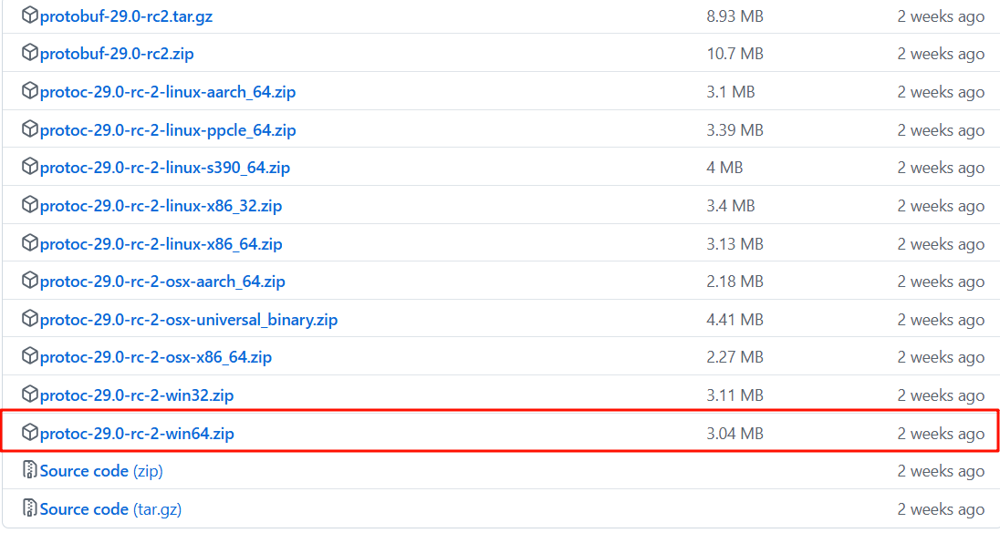
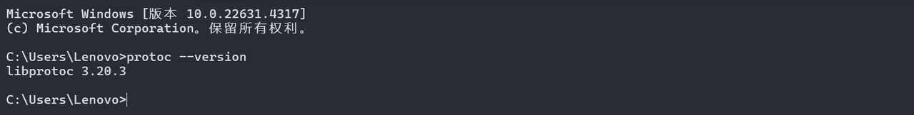
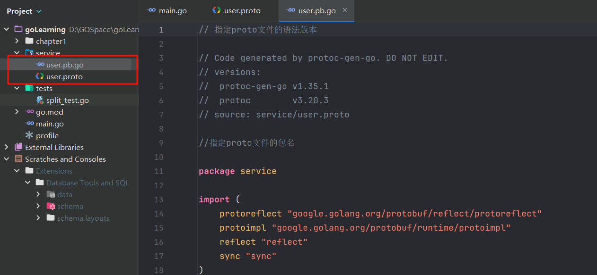

## **Protobuf**

### 使用概述

Protocol buffers 是语言中立、平台中立、可扩展的结构化数据序列化机制，就像 XML，但是它更小、更快、更简单。你只需定义一次数据的结构化方式，然后就可以使用特殊生成的源代码轻松地将结构化数据写入和读取各种数据流，支持各种语言。因为profobuf是二进制数据格式，需要编码和解码。数据本身不具有可读性。因此只能反序列化之后得到真正可读的数据。

- 下载

```
https://github.com/protocolbuffers/protobuf/releases/
```


然后配置好环境变量即可。



- 下载与go相关的插件

```Go
go install google.golang.org/protobuf/cmd/protoc-gen-go@latest
//如果使用gRPC
go install google.golang.org/grpc/cmd/protoc-gen-go-grpc
```

- 概述

定义了一种源文件，扩展名为 `.proto`，使用这种源文件，可以定义存储类的内容(消息类型)

protobuf有自己的编译器 `protoc`，可以将 `.proto` 编译成对应语言的文件，就可以进行使用了，对于Go，编译器为文件中每种消息类型生成一个`.pb.go`文件。

- 使用例子

假设，我们现在需要传输用户信息，其中有username和age两个字段，创建文件user.proto，文件内容如下：

```Go
// 指定proto文件的语法版本
syntax = "proto3";
// option go_package = "path;name"; path 表示生成的go文件的存放地址，会自动生成目录
// name 表示生成的go文件所属的包名
option go_package = "../service";
//指定proto文件的包名
package service;
message User{
  string username = 1;
  int32 age = 2;
}
```

执行命令`protoc --go_out=service  service/user.proto`后出现`user.pb.go`



测试:

```Go
//main.go
package main

import (
    "fmt"
    "goLearning/service"
    "google.golang.org/protobuf/proto"
)

func main() {
    user := &service.User{
       Username: "zhangsan",
       Age:      20,
    }
    //转换为protobuf
    marshal, err := proto.Marshal(user)
    if err != nil {
       panic(err)
    }
    newUser := &service.User{}
    err = proto.Unmarshal(marshal, newUser)
    if err != nil {
       panic(err)
    }
    fmt.Println(newUser.String())
}
```

- protoc编译器生成go

```Go
protoc --go_out=. --go_opt=paths=source_relative \
       --go-grpc_out=. --go-grpc_opt=paths=source_relative \
       path/to/yourfile.proto
```

### 消息格式

`protobuf`中定义一个消息类型是通过关键字`message`字段指定的，消息就是需要传输的数据格式的定义。message可以包含多种类型字段（field），每个字段声明以分号结尾。message经过protoc编译后会生成对应的class类，field则会生成对应的方法。

message关键字类似于C++中的class，Java中的class，go中的struct

```Go
message User {
  string username = 1;
  int32 age = 2;
}
```

在消息中承载的数据分别对应于每一个字段。其中每个字段都有一个名字和一种类型 。

- 字段规则

1. `required`:消息体中必填字段，不设置会导致编解码异常，此关键字可以忽略，例如message user中的username和age字段都是忽略required的必填字段。
2. `optional`: 消息体中可选字段。
3. `repeated`: 消息体中可重复字段，重复的值的顺序会被保留，在go中重复字段会被定义为切片。

```Go
message User {
  string username = 1;
  int32 age = 2;
  optional string password = 3;  // 生成的是指针
  repeated string address = 4;   // 生产的是切片
}
```

- 字段映射

| .proto Type | Notes                                                        | C++ Type | Python Type | Go Type |
| ----------- | ------------------------------------------------------------ | -------- | ----------- | ------- |
| double      |                                                              | double   | float       | float64 |
| float       |                                                              | float    | float       | float32 |
| int32       | 使用变长编码，对于负值的效率很低，如果你的域有 可能有负值，请使用sint64替代 | int32    | int         | int32   |
| uint32      | 使用变长编码                                                 | uint32   | int/long    | uint32  |
| uint64      | 使用变长编码                                                 | uint64   | int/long    | uint64  |
| sint32      | 使用变长编码，这些编码在负值时比int32高效的多                | int32    | int         | int32   |
| sint64      | 使用变长编码，有符号的整型值。编码时比通常的 int64高效。     | int64    | int/long    | int64   |
| fixed32     | 总是4个字节，如果数值总是比总是比228大的话，这 个类型会比uint32高效。 | uint32   | int         | uint32  |
| fixed64     | 总是8个字节，如果数值总是比总是比256大的话，这 个类型会比uint64高效。 | uint64   | int/long    | uint64  |
| sfixed32    | 总是4个字节                                                  | int32    | int         | int32   |
| sfixed32    | 总是4个字节                                                  | int32    | int         | int32   |
| sfixed64    | 总是8个字节                                                  | int64    | int/long    | int64   |
| bool        |                                                              | bool     | bool        | bool    |
| string      | 一个字符串必须是UTF-8编码或者7-bit ASCII编码的文 本。        | string   | str/unicode | string  |
| bytes       | 可能包含任意顺序的字节数据。                                 | string   | str         | []byte  |

- 字段默认值

protobuf3 删除了 protobuf2 中用来设置默认值的 default 关键字，取而代之的是protobuf3为各类型定义的默认值，也就是约定的默认值，如下表所示：

| 类型     | 默认值                                                       |
| -------- | ------------------------------------------------------------ |
| bool     | FALSE                                                        |
| 整型     | 0                                                            |
| string   | 空字符串""                                                   |
| 枚举enum | 第一个枚举元素的值，因为Protobuf3强制要求第一个枚举元素的值必须是0，所以枚举的默认值就是0； |
| message  | 不是null，而是DEFAULT_INSTANCE                               |

- 标识符

在消息体的定义中，每个字段都必须要有一个唯一的标识号，标识号是[0,2^29-1]范围内的一个整数。

```Go
message Person {
  string name = 1;  // (位置1)
  int32 id = 2; 
  optional string email = 3; 
  repeated string phones = 4; // (位置4)
}
```

### Api消息读写

在生成的Go文件中，每个Protobuf消息都会被映射为一个Go结构体，并且会提供序列化（Marshal）和反序列化（Unmarshal）的方法。下面是如何在Go中使用Protobuf消息的示例：

```Go
package main
import (
        "fmt"
        "log"
        "google.golang.org/protobuf/proto"  // 导入protobuf库
)

// 假设已经生成了user_pb.go文件，并且里面有User结构体
func main() {
        // 创建一个新的User消息
        user := &user.User{
                Id:    1,
                Name:  "Alice",
                Email: "alice@example.com",
        }

        // 序列化消息（将消息转换为二进制数据）
        data, err := proto.Marshal(user)
        if err != nil {
                log.Fatalf("序列化失败: %v", err)
        }

        // 反序列化消息（将二进制数据转换回消息对象）
        newUser := &user.User{}
        err = proto.Unmarshal(data, newUser)
        if err != nil {
                log.Fatalf("反序列化失败: %v", err)
        }

        // 打印反序列化后的结果
        fmt.Printf("反序列化后的用户: %v\n", newUser)
}
```

1. **序列化****（Marshal）**：使用`proto.Marshal()`将Protobuf消息对象序列化为字节数组，以便进行传输或存储。
2. **反序列化（Unmarshal）**：使用`proto.Unmarshal()`将字节数组反序列化为Protobuf消息对象。

## **高级Web框架Gin的应用**

在Golang中，Gin是一个非常流行的高性能Web框架，专门用于构建高并发的Web应用程序。Gin框架以其轻量级、简洁和高效的特性备受欢迎，尤其是在构建RESTful API时。它的路由机制、版本控制、模型绑定和验证功能使得开发人员可以快速构建和维护复杂的Web服务。以下是对Gin框架的一些关键概念的详细介绍和总结。

### RESTful API设计

RESTful API 是一种基于HTTP协议的API设计风格，在Gin中，RESTful API通常通过不同的HTTP方法（GET、POST、PUT、DELETE等）来对应不同的操作。

RESTful API设计的基本原则：

- **资源（Resource）作为核心**：API通常围绕资源（如用户、订单等）进行设计，每个资源都有唯一的URI。
- **使用HTTP方法**：GET用于获取资源，POST用于创建资源，PUT用于更新资源，DELETE用于删除资源。
- **无状态性**：每次请求都应该包含完成操作所需的所有信息。

- 在Gin中构建RESTful API示例：

```Go
package main

import (
        "github.com/gin-gonic/gin"
        "net/http"
)

func main() {
        router := gin.Default()

        // GET请求: 获取用户信息
        router.GET("/users/:id", func(c *gin.Context) {
                id := c.Param("id")
                c.JSON(http.StatusOK, gin.H{
                        "user_id": id,
                })
        })

        // POST请求: 创建新的用户
        router.POST("/users", func(c *gin.Context) {
                var newUser User
                if err := c.BindJSON(&newUser); err != nil {
                        c.JSON(http.StatusBadRequest, gin.H{"error": err.Error()})
                        return
                }
                c.JSON(http.StatusCreated, newUser)
        })

        // 启动服务
        router.Run(":8080")
}

type User struct {
        ID    string json:"id"
        Name  string json:"name"
        Email string json:"email"
}
```

在上面的代码中：

- `/users/:id`：这是一个GET请求，用于获取用户的详细信息，`:id`是路径参数。
- `/users`：这是一个POST请求，用于创建新的用户。

### 路由与API版本控制

Gin框架提供了灵活的路由机制，可以轻松实现路径参数、查询参数和静态路径的处理。同时，通过分组(Group)功能，可以方便地实现API版本控制。

路由分组可以帮助我们将不同版本的API管理在不同的组中，从而确保向后兼容性。通过这种方式，当API需要更新时，旧版API仍然可以继续使用。

- 示例：API版本控制

```Go
package main

import (
        "github.com/gin-gonic/gin"
        "net/http"
)

func main() {
        router := gin.Default()

        // API v1 版本组
        v1 := router.Group("/api/v1")
        {
                v1.GET("/users/:id", func(c *gin.Context) {
                        id := c.Param("id")
                        c.JSON(http.StatusOK, gin.H{"version": "v1", "user_id": id})
                })
        }

        // API v2 版本组
        v2 := router.Group("/api/v2")
        {
                v2.GET("/users/:id", func(c *gin.Context) {
                        id := c.Param("id")
                        c.JSON(http.StatusOK, gin.H{"version": "v2", "user_id": id})
                })
        }

        router.Run(":8080")
}
```

在上面的代码中：

- `/api/v1/users/:id`：这是v1版本的API。
- `/api/v2/users/:id`：这是v2版本的API。通过不同的路由分组，可以轻松实现API版本的管理。

### Controller模型绑定与验证

Gin框架提供了强大的模型绑定功能，可以自动将请求中的参数绑定到结构体中，并支持对数据进行验证。模型绑定可以处理多种请求数据格式，如JSON、表单数据、查询参数等。

- 模型绑定：

Gin支持自动将请求体中的数据绑定到结构体，通过`BindJSON`、`BindQuery`等方法可以轻松实现。

- 示例：使用模型绑定处理POST请求：

```Go
type User struct {
        Name  string json:"name" binding:"required"
        Email string json:"email" binding:"required,email"
}

func main() {
        router := gin.Default()

        // POST请求: 创建新的用户
        router.POST("/users", func(c *gin.Context) {
                var newUser User
                // 绑定JSON并验证
                if err := c.ShouldBindJSON(&newUser); err != nil {
                        c.JSON(http.StatusBadRequest, gin.H{"error": err.Error()})
                        return
                }
                c.JSON(http.StatusCreated, newUser)
        })

        router.Run(":8080")
}
```

在这个示例中，Gin会将POST请求体中的JSON数据自动绑定到`User`结构体中，并且通过`binding:"required"`和`binding:"email"`验证字段的必填性和邮箱格式。

1. 绑定与验证的常见标签：

- `required`：字段是必填的。
- `email`：字段必须是有效的电子邮件地址。
- `min`、`max`：限制字段的最小或最大长度。

1. 高效的中间件支持

Gin框架支持中间件机制，可以在请求的生命周期中插入逻辑，如日志记录、认证、跨域处理等。Gin的中间件设计简单且高效，可以灵活地将公共逻辑抽象为中间件并应用到特定的路由或路由组中。

- 示例：使用Gin中间件

```Go
func LoggerMiddleware() gin.HandlerFunc {
        return func(c *gin.Context) {
                // 记录请求开始时间
                t := time.Now()

                // 处理请求
                c.Next()

                // 记录请求结束时间和状态
                latency := time.Since(t)
                status := c.Writer.Status()
                log.Printf("Request processed in %v, Status: %d", latency, status)
        }
}

func main() {
        router := gin.Default()

        // 应用中间件
        router.Use(LoggerMiddleware())

        router.GET("/ping", func(c *gin.Context) {
                c.JSON(http.StatusOK, gin.H{"message": "pong"})
        })

        router.Run(":8080")
}
```

在这个例子中，`LoggerMiddleware`中间件会记录每个请求的处理时间和状态码，并应用在所有路由上。

通过Gin框架，开发者可以快速构建高效、可扩展的Web服务，并能够轻松管理API的复杂性。

## **中间件编程**

### **JWT身份认证**

JWT（JSON Web Token）是一种用于客户端与服务器之间传递信息的紧凑型、URL安全的令牌。它的主要应用场景是身份验证。JWT通常由三个部分组成：

- **Header**：用于描述令牌的类型和签名算法。
- **Payload**：包含具体的用户信息（如用户ID、角色等）。
- **Signature**：用于对令牌的完整性进行验证。

JWT的工作流程：

1. 用户登录时，服务器生成JWT令牌并将其返回给客户端。
2. 客户端在后续请求中将JWT放入`Authorization`头中。
3. 服务器在每次请求时验证JWT的有效性，确定用户的身份。

- 这里给出中间件完整代码:

```Go
package middleware
import ...
var JwtKey = []byte(_utils.Conf.JwtKey)

type MyClaims struct {
        Username string `json:"username"`
        jwt.StandardClaims
}

func SetToken(username string) (string, int) {
        expiredTime := time.Now().Add(7 * 24 * time.Hour)
        SetClaims := &MyClaims{username, jwt.StandardClaims{ExpiresAt: expiredTime.Unix(), Issuer: "WHU"}}
        reqClaim := jwt.NewWithClaims(jwt.SigningMethodHS256, SetClaims)
        token, err := reqClaim.SignedString(JwtKey)
        if err != nil {
                return "", errmsg.ERROR
        }
        return token, errmsg.SUCCESS
}
func CheckToken(token string) (*MyClaims, int) {
        settoken, _ := jwt.ParseWithClaims(token, &MyClaims{}, func(token *jwt.Token) (interface{}, error) {
                return JwtKey, nil
        })
        if key, _ := settoken.Claims.(*MyClaims); settoken.Valid {
                return key, errmsg.SUCCESS
        } else {
                return nil, errmsg.ERROR
        }
}

func JwtToken() gin.HandlerFunc {
        return func(c *gin.Context) {
                tokenHeader := c.Request.Header.Get("Authorization")
                code := errmsg.SUCCESS
                if tokenHeader == "" {
                        code = errmsg.ERROR_TOKEN_NOT_EXIST
                        c.JSON(http.StatusOK, gin.H{"code": 401,
                                "message": errmsg.GetErrMsg(code)})
                        c.Abort()
                        return
                }
                //格式验证
                checkToken := strings.SplitN(tokenHeader, " ", 2)
                if len(checkToken) != 2 && checkToken[0] != "Bearer" {
                        code = errmsg.ERROR_TOKEN_TYPE_WRONG
                        c.JSON(http.StatusOK, gin.H{"code": 401,
                                "message": errmsg.GetErrMsg(code)})
                        c.Abort()
                        return
                }
                //token正确性验证
                key, tCode := CheckToken(checkToken[1])
                if tCode == errmsg.ERROR {
                        code = errmsg.ERROR_TOKEN_WRONG
                        c.JSON(http.StatusOK, gin.H{"code": 401,
                                "message": errmsg.GetErrMsg(code)})
                        c.Abort()
                        return
                }
                //是否过期
                if time.Now().Unix() > key.ExpiresAt {
                        code = errmsg.ERROR_TOKEN_RUNTIME
                        c.JSON(http.StatusOK, gin.H{"code": 401,
                                "message": errmsg.GetErrMsg(code)})
                        c.Abort()
                        return
                }
                //存入上下文
                _ = utils.UpdateLastActiveTime(key.Username)
                c.Set("username", key.Username)
                c.Next()
        }
}
```

### **Protobuf消息传输**

在Gin中，默认情况下处理的是JSON或表单格式的数据。如果要传输Protobuf格式的数据，我们需要对请求和响应进行特殊处理。

在Gin中，可以通过自定义`Content-Type`来处理Protobuf格式的请求和响应。通常，Protobuf请求的`Content-Type`是`application/x-protobuf`。

```Go
import (
        "net/http"
        "github.com/gin-gonic/gin"
        "google.golang.org/protobuf/proto"
        "io"
)

// 假设已经生成了user.pb.go文件，里面有User结构体

func main() {
        router := gin.Default()

        // POST请求: 接收Protobuf格式的数据
        router.POST("/protobuf", func(c *gin.Context) {
                // 检查Content-Type是否是Protobuf格式
                if c.Request.Header.Get("Content-Type") != "application/x-protobuf" {
                        c.JSON(http.StatusUnsupportedMediaType, gin.H{"error": "Content-Type must be application/x-protobuf"})
                        return
                }

                // 读取请求体中的Protobuf数据
                body, err := io.ReadAll(c.Request.Body)
                if err != nil {
                        c.JSON(http.StatusInternalServerError, gin.H{"error": "Failed to read request body"})
                        return
                }

                // 解析Protobuf数据
                var user user.User
                if err := proto.Unmarshal(body, &user); err != nil {
                        c.JSON(http.StatusBadRequest, gin.H{"error": "Failed to parse protobuf"})
                        return
                }

                // 返回解析后的数据
                c.JSON(http.StatusOK, gin.H{
                        "id":    user.Id,
                        "name":  user.Name,
                        "email": user.Email,
                })
        })

        // GET请求: 返回Protobuf格式的数据
        router.GET("/protobuf", func(c *gin.Context) {
                // 创建一个User消息
                user := &user.User{
                        Id:    1,
                        Name:  "Alice",
                        Email: "alice@example.com",
                }

                // 将消息序列化为Protobuf格式
                data, err := proto.Marshal(user)
                if err != nil {
                        c.JSON(http.StatusInternalServerError, gin.H{"error": "Failed to marshal protobuf"})
                        return
                }

                // 设置Content-Type为Protobuf并返回数据
                c.Data(http.StatusOK, "application/x-protobuf", data)
        })

        router.Run(":8080")
}
```

## **高级RPC框架gRPC的应用**

gRPC是由Google开发的一种高效、跨平台的远程过程调用（RPC）框架，基于HTTP/2协议进行通信，并使用Protobuf（Protocol Buffers）作为数据序列化格式。它允许客户端直接调用远程服务端提供的方法，就像调用本地方法一样，从而实现了分布式系统中服务之间的透明通信。gRPC支持多种编程语言，并具有高效的通信能力，尤其适合微服务架构。

### Protobuf服务定义

gRPC服务是通过Protobuf文件来定义的。在Protobuf文件中，除了定义数据结构（message）外，还可以定义服务（service）以及服务中的具体方法。

```Go
syntax = "proto3";

package user;

// 定义消息结构
message UserRequest {
    int32 id = 1;
}

message UserResponse {
    int32 id = 1;
    string name = 2;
    string email = 3;
}

// 定义gRPC服务
service UserService {
    // 一元请求：客户端发起一个请求，服务端返回一个响应
    rpc GetUser (UserRequest) returns (UserResponse);

    // 服务器流式请求：客户端发起一个请求，服务端返回多个响应
    rpc ListUsers (UserRequest) returns (stream UserResponse);
}
```

然后，在项目中使用`protoc`命令生成Go代码：

```Plain
protoc --go_out=. --go-grpc_out=. user.proto
```

这会生成两个文件：

- `user.pb.go`（包含Protobuf消息的定义）
- `user_grpc.pb.go`（包含服务的接口定义）

### 一元请求与响应实现

- 服务端实现一元响应

```Go
package main

import (
        "context"
        "log"
        "net"

        "google.golang.org/grpc"
        pb "path/to/your/proto/package/user"
)

// 实现UserService的服务器
type server struct {
        pb.UnimplementedUserServiceServer
}

// 实现GetUser方法
func (s *server) GetUser(ctx context.Context, req *pb.UserRequest) (*pb.UserResponse, error) {
        log.Printf("Received request for user ID: %d", req.GetId())

        // 模拟从数据库获取用户
        user := &pb.UserResponse{
                Id:    req.GetId(),
                Name:  "John Doe",
                Email: "johndoe@example.com",
        }

        return user, nil
}

func main() {
        lis, err := net.Listen("tcp", ":50051")
        if err != nil {
                log.Fatalf("Failed to listen: %v", err)
        }

        s := grpc.NewServer()
        pb.RegisterUserServiceServer(s, &server{})

        log.Printf("Server is running on port 50051")
        if err := s.Serve(lis); err != nil {
                log.Fatalf("Failed to serve: %v", err)
        }
}
```

- 客户端实现一元请求

```Go
package main

import (
        "context"
        "log"
        "time"

        "google.golang.org/grpc"
        pb "path/to/your/proto/package/user"
)

func main() {
        // 连接到gRPC服务器
        conn, err := grpc.Dial("localhost:50051", grpc.WithInsecure())
        if err != nil {
                log.Fatalf("Failed to connect: %v", err)
        }
        defer conn.Close()

        client := pb.NewUserServiceClient(conn)

        // 发送一元请求
        req := &pb.UserRequest{Id: 1}

        ctx, cancel := context.WithTimeout(context.Background(), time.Second)
        defer cancel()

        res, err := client.GetUser(ctx, req)
        if err != nil {
                log.Fatalf("Error while calling GetUser: %v", err)
        }

        log.Printf("Response from server: Id=%d, Name=%s, Email=%s", res.GetId(), res.GetName(), res.GetEmail())
}
```

### 流式请求与响应实现

服务器流式请求允许服务端在接收到客户端的请求后，返回多个响应。这在需要持续提供数据的场景（如消息流、数据推送等）中非常有用。

- 服务端

```Go
package main

import (
        "log"
        "net"
        "time"

        "google.golang.org/grpc"
        pb "path/to/your/proto/package/user"
)

// 实现UserService的服务器
type server struct {
        pb.UnimplementedUserServiceServer
}

// 实现ListUsers方法
func (s *server) ListUsers(req *pb.UserRequest, stream pb.UserService_ListUsersServer) error {
        log.Printf("Received request to list users starting from ID: %d", req.GetId())

        // 模拟从数据库获取多个用户
        for i := 1; i <= 5; i++ {
                user := &pb.UserResponse{
                        Id:    int32(i),
                        Name:  "User" + string(i),
                        Email: "user" + string(i) + "@example.com",
                }

                // 发送每个用户的响应
                if err := stream.Send(user); err != nil {
                        return err
                }

                // 模拟延迟
                time.Sleep(time.Second)
        }

        return nil
}

func main() {
        lis, err := net.Listen("tcp", ":50051")
        if err != nil {
                log.Fatalf("Failed to listen: %v", err)
        }

        s := grpc.NewServer()
        pb.RegisterUserServiceServer(s, &server{})

        log.Printf("Server is running on port 50051")
        if err := s.Serve(lis); err != nil {
                log.Fatalf("Failed to serve: %v", err)
        }
}
```

- 客户端

```Go
package main

import (
        "context"
        "log"

        "google.golang.org/grpc"
        pb "path/to/your/proto/package/user"
)

func main() {
        // 连接到gRPC服务器
        conn, err := grpc.Dial("localhost:50051", grpc.WithInsecure())
        if err != nil {
                log.Fatalf("Failed to connect: %v", err)
        }
        defer conn.Close()

        client := pb.NewUserServiceClient(conn)

        // 发送流式请求
        req := &pb.UserRequest{Id: 1}
        stream, err := client.ListUsers(context.Background(), req)
        if err != nil {
                log.Fatalf("Error while calling ListUsers: %v", err)
        }

        // 接收服务端的多个响应
        for {
                res, err := stream.Recv()
                if err != nil {
                        log.Fatalf("Error while receiving stream: %v", err)
                }
                log.Printf("Received user: Id=%d, Name=%s, Email=%s", res.GetId(), res.GetName(), res.GetEmail())
        }
}
```

## **安全性与数据传输**

###  Header和Trailer元数据传输

 header和trailer元数据最后会设置到[http](https://so.csdn.net/so/search?q=http&spm=1001.2101.3001.7020) header。 用于传输除了proto定义以外的额外信息。比如用户身份认证信息，代理信息，访问令牌等。在grpc里统称为metadata.MD

- 元数据构建

```Go
// MD is a mapping from metadata keys to values. Users should use the following
// two convenience functions New and Pairs to generate MD.
type MD map[string][]string
//grpc 元数据处理
func getMetadataByMap(mp map[string]string) metadata.MD {
    // 返回值 type MD map[string][]string

    // 通过map 初始化元数据，后续要放到上下文中
    md := metadata.New(mp)
    return md
}

// 根据键值对获取 元数据
func getMetadataByKV(kv ...string) metadata.MD {
    md := metadata.Pairs(kv...)
    return md
}

// 元数据附加
func appendMetadata(md *metadata.MD, k string, kv ...string) {
    md.Append(k, kv...)
    
}
```

- 客户端发送

首先将元数据设置到上下文中，方法如下`metadata.NewOutgoingContext(ctx, md)`用于发送方设置，该方法会重置ctx中的元数据。`IncomingContext`则是用于接收

`metadata.AppendToOutgoingContext(ctx, kv…)` 将键值 附加到上下文中

```Go
package client

import (
    "context"
    "google.golang.org/grpc/metadata"
)

//grpc 元数据处理
func getMetadataByMap(mp map[string]string) metadata.MD {
    // 返回值 type MD map[string][]string

    // 通过map 初始化元数据，后续要放到上下文中
    md := metadata.New(mp)
    return md
}

// 根据键值对获取 元数据
func getMetadataByKV(kv ...string) metadata.MD {
    md := metadata.Pairs(kv...)
    return md
}

// 元数据附加
func appendMetadata(md *metadata.MD, k string, kv ...string) {
    md.Append(k, kv...)
    
}

// 元数据设置到上下文中,传递出去的ctx(发送数据) 和接收的ctx(接收数据)
func getOutgoingContext(ctx context.Context, md metadata.MD) context.Context{
    // OutgoingContext 用于请求发送方，包装数据传递出去
    // IncomingContext 用于请求接收方，用于获取发送方传递的数据
    // Context 通过序列化放到http2里的header里进行传输
    // new 方法会覆盖ctx 原有的元数据，如果不覆盖，则用append
    return metadata.NewOutgoingContext(ctx, md)
}

// 将数据附加到OutgoingContext
func appendOutgoingContext(ctx context.Context, kv ...string) context.Context{
    return metadata.AppendToOutgoingContext(ctx, kv...)
}


func getContext(ctx context.Context) context.Context {
    md := getMetadataByMap(map[string]string{
        "time":time.Now().Format("2006-01-02 15:04:05"),
        "header_data": "true",
        })
    // 将数据写入context上下文 (覆盖的形式)
    ctx = getOutgoingContext(ctx, md)
    // 附加数据
    ctx = appendOutgoingContext(ctx, "token", "zsdfww+", "user", "aka")

    // 打印一下元数据
    //md1, _ := metadata.FromOutgoingContext(ctx)
    //fmt.Println(md1)
    return ctx
}

// CallUnary 一元请求
func CallUnary(client echo.EchoClient) {
    ctx, cancel := context.WithTimeout(context.Background(), time.Second)

    ctx = getContext(ctx)

    defer cancel()
    in := &echo.EchoRequest{
        Message: "client send message",
        Time: timestamppb.New(time.Now()),
    }
    res, err := client.UnaryEcho(ctx, in, grpc.Header(&header), grpc.Trailer(&trailer))
    if err != nil {
        log.Fatal(err)
    }

    fmt.Printf("client recv: %v\n", res.Message)

}
```

- 一元接收

```Go
func (EchoServer) UnaryEcho(ctx context.Context, in *echo.EchoRequest) (*echo.EchoResponse, error) {

           // 业务

    fmt.Printf("server recv :%v\n", in.Message)
        // 接收客户端元数据
    md, ok:= metadata.FromIncomingContext(ctx)
    if !ok {
        log.Fatal("get metadata error")
    } else {
        log.Printf("get metadata :%v\n", md)
        fmt.Println(md)
    }
    return &echo.EchoResponse{
        Message: "server send message",
    }, nil
}
```

### TLS与双向TLS安全通信

**TLS** **（****传输层****安全性）** 于1999年发布，是继 **SSL****（安全套接字层）** 认证和加密协议。 TLS 1.3在中定义 [RFC 8446](https://link.juejin.cn/?target=https%3A%2F%2Ftools.ietf.org%2Fhtml%2Frfc8446) （八月2018）。

双向TLS（mTLS）是指在服务器端和客户端之间使用双向加密通道。如今，mTLS是确保**云原生**应用程序中微服务之间的通信安全的首选协议。

> 双向认证，顾名思义，客户端和服务器端都需要验证对方的身份，在建立Https连接的过程中，握手的流程比单向认证多了几步。单向认证的过程，客户端从服务器端下载服务器端公钥证书进行验证，然后建立安全通信通道。双向通信流程，客户端除了需要从服务器端下载服务器的公钥证书进行验证外，还需要把客户端的公钥证书上传到服务器端给服务器端进行验证，等双方都认证通过了，才开始建立安全通信通道进行数据传输。

传输层安全性（TLS）已用于保护Internet上客户端和服务器之间的流量很多年，但通常使用单向身份验证-服务器向用户提供证书以证明其身份。这种单向身份验证的基本示例是–在线访问银行帐户时，服务器向你的计算机发送证书，以证明它实际上是你要连接的银行。该证书还包含一个公共加密密钥，该密钥用于在你和数据通过的银行之间创建一个安全的加密链接。

双向TLS扩展了客户端-服务器TLS模型，以包括双方的身份验证。在银行依靠其他特定于应用程序的机制来确认客户身份的情况下，例如用户名和密码（通常带有两因素身份验证），mTLS使用x.509证书来识别和验证每个微服务。每个证书都包含一个公共加密密钥和一个身份，并由受信任的证书颁发机构签名，该证书颁发机构证明该证书代表提出该证书的实体。

在mTLS中，服务网格中的每个微服务都会验证对方的证书，并使用公共密钥来创建每个会话唯一的加密密钥。

- **TLS** **服务器端**提供一个授信证书，当我们使用 https 协议访问**服务器端**时，**客户端**会向**服务器端**索取证书并认证（浏览器会与自己的授信域匹配或弹出不安全的页面）。
- **mTLS** 则是由同一个 **Root** **CA** 生成两套证书，即**客户端证书**和**服务端证书**。客户端使用 https 访问服务端时，双方会交换证书，并进行认证，认证通过方可通信。
- **golang**中使用示例

在 Go 语言中，TLS 通常用于构建安全的 HTTP/HTTPS 服务，或者实现与外部 API 的安全通信。Go 的标准库 `crypto/tls` 提供了对 TLS 和双向 TLS 的支持，让开发者可以轻松地在应用中实现加密通信。

1. **在 Go 中使用** **TLS**

要在 Go 中启用 TLS，通常使用 `http.Server` 的 `TLSConfig` 字段，或者直接使用 `ListenAndServeTLS` 方法。示例代码如下：

```Go
package main

import (
    "log"
    "net/http"
)

func handler(w http.ResponseWriter, r *http.Request) {
    w.Write([]byte("Hello, TLS!"))
}

func main() {
    http.HandleFunc("/", handler)
    log.Fatal(http.ListenAndServeTLS(":443", "server.crt", "server.key", nil))
}
```

1. **在 Go 中使用双向** **TLS**

双向 TLS 的实现稍微复杂一些，因为除了服务器证书外，还需要验证客户端证书。可以通过设置 `tls.Config` 的 `ClientCAs` 和 `ClientAuth` 字段来实现。

```Go
package main

import (
    "crypto/tls"
    "crypto/x509"
    "io/ioutil"
    "log"
    "net/http"
)

func handler(w http.ResponseWriter, r *http.Request) {
    w.Write([]byte("Hello, Mutual TLS!"))
}

func main() {
    // 加载服务器证书
    cert, err := tls.LoadX509KeyPair("server.crt", "server.key")
    if err != nil {
        log.Fatalf("server: loadkeys: %s", err)
    }

    // 加载客户端 CA 证书
    caCert, err := ioutil.ReadFile("ca.crt")
    if err != nil {
        log.Fatalf("server: read ca cert: %s", err)
    }
    caCertPool := x509.NewCertPool()
    caCertPool.AppendCertsFromPEM(caCert)

    // 配置 TLS
    tlsConfig := &tls.Config{
        Certificates: []tls.Certificate{cert},
        ClientCAs:    caCertPool,
        ClientAuth:   tls.RequireAndVerifyClientCert, // 双向 TLS
    }
    tlsConfig.BuildNameToCertificate()

    server := &http.Server{
        Addr:      ":443",
        TLSConfig: tlsConfig,
        Handler:   http.HandlerFunc(handler),
    }

    log.Println("Server is starting...")
    log.Fatal(server.ListenAndServeTLS("", ""))
}
```

### OAuth2认证与传输

- 概述

OAuth 2.0 是一种**开放授权****协议**，它允许第三方应用在不暴露用户密码的情况下，代表用户访问资源。OAuth 2.0 提供了一种**访问授权**的安全机制，广泛应用于互联网服务中，如登录第三方网站、获取用户社交媒体数据、授权 API 调用等。

OAuth 2.0 是一种授权协议而不是认证协议，它允许用户授予第三方应用访问其资源的权限，但并不提供身份验证功能。OAuth 2.0 通过访问令牌（Access Token）来实现授权，令牌本身并不包含用户身份信息，而是一个访问资源的凭证。

- 主要角色

OAuth 2.0 规范定义了四个主要角色：

1. **资源拥有者（Resource Owner）**：通常是最终用户（End User），即拥有资源的主体。
2. **客户端（Client）**：请求资源的第三方应用程序，它需要获得资源拥有者的授权才能访问资源。
3. **授权服务器（Authorization Server）**：负责处理客户端的授权请求，颁发访问令牌（Access Token）。
4. **资源服务器（Resource Server）**：提供资源的服务器，使用访问令牌来验证客户端的请求。资源服务器和授权服务器可以是同一台服务器，也可以是不同的服务器。

- 授权流程

OAuth 2.0 定义了多种授权流程（授权模式），以适应不同的使用场景。主要的授权方式包括：

- **授权码模式（Authorization Code Grant）**
- **简化模式（Implicit Grant）**
- **密码模式（Resource Owner Password Credentials Grant）**
- **客户端凭证模式（Client Credentials Grant）**
- **刷新令牌机制（Refresh Token Grant）**
- 关键元素

1. 访问令牌

访问令牌是 OAuth 2.0 授权协议的核心，它是客户端访问资源服务器的凭证。访问令牌通常是一个不透明的字符串，授权服务器会对其进行签名以防篡改。客户端在请求资源时，需要在 HTTP 请求头中包含访问令牌。

```Go
GET /api/resource HTTP/1.1
Host: api.example.com
Authorization: Bearer ACCESS_TOKEN
```

1. 刷新令牌

刷新令牌用于在访问令牌过期后，获取新的访问令牌。与访问令牌不同，刷新令牌不能直接用于访问资源，而是提交给授权服务器进行令牌刷新。刷新令牌通常具有较长的有效期，但也可能会被撤销。

## **网络连接管理**

### Keepalive长链接

> http 1.0默认使用的是短连接。 http 1.1以后默认使用的是[长连接](https://so.csdn.net/so/search?q=长连接&spm=1001.2101.3001.7020)。

如果使用长连接的http协议，则在请求响应头加入代码：

Connection:keep-alive，但是这个连接不是永久的保持连接，这个时间可以在服务器软件中进行设定（如Apache、nginx），web 服务软件一般都会提供 keepalive_timeout 参数。如果客户端在完后一个 HTTP 请求后，在 x 秒内都没有再发起新的请求，定时器的时间一到，就会触发回调函数来释放该连接。

**keep-alive 技术创建的目的**，就是能在多次 HTTP 之间重用同一个 TCP 连接，从而减少创建/关闭多个 TCP 连接的开销（包括响应时间、CPU 资源、减少拥堵等）


显然，如果客户端和服务端的确需要进行多次通信，则开启 keep-alive 是更好的选择，例如在微服务架构中，通常微服务的使用方和提供方会长期有交流，此时最好开启 keep-alive。

在一些 TPS/QPS 很高的 REST 服务中，如果使用的是短连接（即没有开启keep-alive），则很可能发生客户端端口被占满的情形。这是由于短时间内会创建大量TCP 连接，而在 TCP 四次挥手结束后，客户端的端口会处于 TIME_WAIT一段时间(2*MSL)，这期间端口不会被释放，从而导致端口被占满。这种情况下最好使用长连接。

### Resolver服务名称解析器

`Resolver` 是用于服务名称解析的机制，主要用于将服务名称转换为其对应的网络地址（如 IP 地址）。它在微服务架构中尤为重要，因为微服务通常需要通过服务名称来相互通信，而不是直接使用静态的 IP 地址。

- 基本概念

1. **服务发现**：在动态环境中，服务的地址可能会变化。服务发现机制可以动态地找到服务实例的地址。
2. **Resolver 接口**：在 Go 的 `net` 包中，`Resolver` 是一个接口，负责将服务名称解析为地址。默认情况下，Go 使用 DNS 作为解析器，但也可以实现自定义的解析器。
3. **实现**：Go 允许用户实现自己的解析器，通过实现 `Resolver` 接口的 `Resolve` 方法，可以根据自定义的逻辑解析服务名称。

- 示例

```Go
package main

import (
    "fmt"
    "net"
)

func main() {
    // 使用 DNS 解析器解析服务名称
    addresses, err := net.LookupHost("example.com")
    if err != nil {
        fmt.Println("解析错误:", err)
        return
    }

    for _, addr := range addresses {
        fmt.Println("找到地址:", addr)
    }
}
```

### Client连接池

在Go语言中，连接池（Connection Pool）是一种常用的设计模式，用于有效管理和复用网络连接，尤其是在高并发的应用场景中。通过连接池，可以减少创建和关闭连接的开销，提高应用程序的性能和响应速度。

Go 标准库并没有内置连接池的功能，但可以使用第三方库或自己实现简单的连接池。下面是一个简单的连接池实现示例。

- 简单连接池实现

```Go
package main

import (
    "fmt"
    "sync"
)

// Connection 模拟一个连接
type Connection struct {
    ID int
}

// Connect 模拟连接的创建
func Connect(id int) *Connection {
    fmt.Printf("创建连接 %d\n", id)
    return &Connection{ID: id}
}

// ConnectionPool 连接池
type ConnectionPool struct {
    mu        sync.Mutex
    pool      []*Connection
    maxSize   int
    nextID    int
}

// NewConnectionPool 创建一个新的连接池
func NewConnectionPool(maxSize int) *ConnectionPool {
    return &ConnectionPool{maxSize: maxSize}
}

// Get 获取一个连接
func (cp *ConnectionPool) Get() *Connection {
    cp.mu.Lock()
    defer cp.mu.Unlock()

    if len(cp.pool) > 0 {
        conn := cp.pool[len(cp.pool)-1]
        cp.pool = cp.pool[:len(cp.pool)-1]
        return conn
    }

    // 如果没有可用的连接，创建一个新的连接
    cp.nextID++
    return Connect(cp.nextID)
}

// Put 将连接放回连接池
func (cp *ConnectionPool) Put(conn *Connection) {
    cp.mu.Lock()
    defer cp.mu.Unlock()

    // 如果连接池未满，则将连接放回池中
    if len(cp.pool) < cp.maxSize {
        cp.pool = append(cp.pool, conn)
    } else {
        fmt.Printf("关闭连接 %d\n", conn.ID)
    }
}

// 测试连接池
func main() {
    pool := NewConnectionPool(2)

    for i := 0; i < 5; i++ {
        conn := pool.Get()
        fmt.Printf("使用连接 %d\n", conn.ID)
        pool.Put(conn)
    }
}
```

连接池是高效管理网络连接的重要工具，尤其在高并发的场景中，合理使用连接池可以显著提升应用性能。

### gRPC 中的多路复用 (Multiplexing)

在 gRPC 中，多路复用的概念是指在同一个 TCP 连接上同时传输多个独立的请求和响应。gRPC 使用 HTTP/2 协议，而 HTTP/2 本身支持多路复用，因此 gRPC 自然而然继承了这一特性。

- 多路复用的工作原理：

1. **HTTP/2 协议的使用**：gRPC 基于 HTTP/2 协议实现，而 HTTP/2 的一个关键特性就是多路复用。HTTP/2 允许多个请求和响应通过同一个 TCP 连接同时传输，而不需要为每个请求单独创建连接。

  

1. **流 (Stream)**：在 HTTP/2 中，每个请求和响应都被分配到一个独立的流（Stream）。每个流都有唯一的流 ID。gRPC 服务可以在同一个 TCP 连接上同时处理多个流，它们可以同时发送和接收数据，而不会相互阻塞。

1. **头压缩 (Header Compression)**：HTTP/2 还提供了头压缩，可以减少重复数据的传输，提高带宽利用率。

1. **双向流式传输 (Bidirectional Streaming)**：gRPC 支持双向流式传输，这意味着客户端和服务器可以同时发送和接收消息，而不需要等待对方完成。这种特性在流式 RPC 调用中尤为重要。

- **多路复用的优点：**
  - **减少连接开销**：由于多个请求和响应可以复用同一个连接，减少了因为频繁建立和关闭 TCP 连接而带来的开销。
  - **提高性能**：多路复用减少了延迟，因为请求之间不会因为队头阻塞（Head-of-line blocking）而相互影响。
  - **资源节约**：通过复用连接，节省了服务器和客户端的资源，尤其在大规模的微服务架构中，效果更加明显。

### gRPC 中的健康检查 

在分布式系统中，健康检查是保证服务可用性和稳定性的重要机制。gRPC 提供了标准的健康检查协议，帮助客户端和负载均衡器判断服务的健康状态，以便进行故障转移或流量分配。

- 健康检查的标准：

gRPC 健康检查使用了一个标准的 protobuf 接口定义，并且可以通过 gRPC 的 RPC 通信协议进行通信。健康检查通常包括以下几种状态：

1. **SERVING**：服务正常运行，可以接受请求。
2. **NOT_SERVING**：服务存在问题，暂时无法处理请求。
3. **UNKNOWN**：服务的状态不确定，通常在服务刚启动或健康检查服务未配置时返回。

- 健康检查的工作流程：

1. **客户端请求健康状态**：客户端（或负载均衡器）会向 gRPC 服务发送健康检查请求，询问服务的健康状态。这个请求通常是一个简单的 RPC 调用。

1. **服务返回健康状态**：gRPC 服务会根据其自身的状态，返回相应的健康状态，例如 `SERVING` 或 `NOT_SERVING`。

1. **负载均衡****器/客户端行为**：基于返回的健康状态，客户端或负载均衡器可以决定是否继续向该服务发送请求，或者将流量转移到其他健康的服务实例。

- 健康检查的实现：

gRPC 提供了一个 [标准的健康检查协议定义](https://github.com/grpc/grpc/blob/master/doc/health-checking.md)，在 `grpc-health-probe` 工具中也有详细的实现。服务端只需要实现这个接口，并注册到 gRPC Server 上即可。

```ProtoBuf
syntax = "proto3";

package grpc.health.v1;

service Health {
  rpc Check (HealthCheckRequest) returns (HealthCheckResponse);
}

message HealthCheckRequest {
  string service = 1;
}

message HealthCheckResponse {
  enum ServingStatus {
    UNKNOWN = 0;
    SERVING = 1;
    NOT_SERVING = 2;
  }
  ServingStatus status = 1;
}
```

通过这个接口，服务可以向负载均衡器或客户端报告其健康状态。

- 健康检查的典型应用场景：
  - **负载均衡**：负载均衡器可以使用健康检查来确定哪些服务实例是健康的，并将流量分发给这些实例。
  - **自动恢复**：在 Kubernetes 等容器编排系统中，健康检查可以帮助检测和恢复异常的服务实例，例如通过重启服务来恢复健康状态。
  - **弹性伸缩**：健康检查也可以帮助在弹性伸缩时判断哪些服务实例可以正常处理请求，从而决定扩展或缩减实例的数量。

## **gRPC-Gateway的配置与使用**

在使用 gRPC-Gateway 时，我们可以通过在 `.proto` 文件中定义 HTTP 规则，来将 HTTP 请求映射到 gRPC 方法。此外，HTTP 请求中的 Header 也可以传递到 gRPC 上下文中，这对于在 HTTP 和 gRPC 之间进行无缝的转换非常重要。

### 配置文件定义HTTP规则

在 gRPC-Gateway 中，HTTP 请求是通过在 `.proto` 文件中使用 `google.api.http` 选项来配置的。通过这种方式，你可以为每个 gRPC 方法定义对应的 HTTP 映射规则，包括 HTTP 方法（如 `GET`、`POST` 等）、URL 路径，以及如何将 URL 参数映射到 gRPC 请求参数。

- 示例：

假设我们有一个简单的 gRPC 服务 `BookService`，它有一个方法 `GetBook` 来获取书籍信息。我们可以通过在 `.proto` 文件中定义 HTTP 规则，将 HTTP 请求映射到 `GetBook` 方法

```Go
syntax = "proto3";

package example;

import "google/api/annotations.proto";

service BookService {
  rpc GetBook(GetBookRequest) returns (GetBookResponse) {
    option (google.api.http) = {
      get: "/v1/books/{book_id}"
    };
  }
}

message GetBookRequest {
  string book_id = 1;
}

message GetBookResponse {
  string title = 1;
  string author = 2;
}
```

- `get`：映射到 HTTP GET
- `post`：映射到 HTTP POST
- `put`：映射到 HTTP PUT
- `delete`：映射到 HTTP DELETE
- `patch`：映射到 HTTP PATCH

### Http Header转换到gRPC上下文

gRPC-Gateway 提供了将 HTTP 请求头转换为 gRPC 元数据（metadata）的机制，这样你可以在 gRPC 服务中访问 HTTP 请求头内容。

- 转换机制：
  - gRPC 的元数据（Metadata）是键值对的形式，类似于 HTTP Headers。
  - gRPC-Gateway 会自动将某些 HTTP Headers 转换为 gRPC 元数据，这些元数据可以在 gRPC 服务端的上下文中访问。
  - 一般情况下，HTTP Headers 会被转换为 gRPC 元数据，键名为 HTTP Header 的小写形式，并加上前缀 `grpc-gateway-`。

假设客户端发送了一个包含自定义 HTTP Header `X-User-Id` 的请求：

```Go
GET /v1/books/123
Host: example.com
X-User-Id: 456
```

gRPC-Gateway 会将 `X-User-Id` 转换为 gRPC 元数据，键为 `grpc-gateway-x-user-id`，这样你可以在 gRPC 服务端的上下文中访问它。

```Go
package main

import (
    "context"
    "fmt"
    "google.golang.org/grpc/metadata"
    pb "example/bookservice"
)

type server struct {
    pb.UnimplementedBookServiceServer
}

func (s *server) GetBook(ctx context.Context, req *pb.GetBookRequest) (*pb.GetBookResponse, error) {
    // 从 gRPC 上下文中获取元数据
    md, ok := metadata.FromIncomingContext(ctx)
    if ok {
        if userId, found := md["grpc-gateway-x-user-id"]; found {
            fmt.Printf("User ID: %s\n", userId[0])
        }
    }

    // 返回书籍信息
    return &pb.GetBookResponse{
        Title:  "The Go Programming Language",
        Author: "Alan A. A. Donovan",
    }, nil
}
```

## **字段验证与结构体映射**

### Struct标签与多层级验证

- 标签语法

标签通常是一个字符串，格式如下：

```Go
type User struct {
    Name  string json:"name" validate:"required"
    Age   int    json:"age" validate:"min=0,max=130"
}
```

在这个例子中，`json` 标签用于指定 JSON 编码时字段的名称，而 `validate` 标签则用于指定字段的验证规则。

- 多层级验证

在复杂应用中，可能需要对嵌套结构体进行验证。Go 的验证库（如 `go-playground/validator`）支持多层级验证。

```Go
type Address struct {
    City  string `json:"city" validate:"required"`
    State string `json:"state" validate:"required"`
}

type User struct {
    Name    string  `json:"name" validate:"required"`
    Age     int     `json:"age" validate:"min=0,max=130"`
    Address Address `json:"address" validate:"required"`
}
```

在这个例子中，`User` 结构体包含一个 `Address` 结构体。在进行验证时，`Address` 的字段也会被验证。

### 标签符号及单字段验证

单字段验证是指对结构体中的单个字段进行验证。例如，可以使用标签指定字段必须是必填的、符合某种格式或在某个值范围内。

```Go
type Product struct {
    ID    int     `json:"id" validate:"required"`
    Price float64 `json:"price" validate:"required,min=0"`
}
```

在这个例子中，`ID` 字段是必填的，而 `Price` 字段必须大于或等于 0。

### Struct绑定与自定义验证

`struct` 绑定指的是将数据（如 JSON、表单数据）解码到结构体中。Go 提供了多种方式来实现这一点，最常用的是使用 `encoding/json` 包。

```Go
data := `{"name": "John", "age": 30, "address": {"city": "New York", "state": "NY"}}`
var user User

err := json.Unmarshal([]byte(data), &user)
if err != nil {
    log.Fatal(err)
}
```

- 自定义验证

除了使用内置的验证规则外，Go 还允许你定义自己的验证逻辑。可以通过实现 `validator.CustomTypeFunc` 方法来实现。

```Go
import (
    "github.com/go-playground/validator/v10"
)

func isValidEmail(fl validator.FieldLevel) bool {
    email := fl.Field().String()
    // 简单的邮箱验证逻辑
    return strings.Contains(email, "@")
}

func main() {
    validate := validator.New()
    validate.RegisterValidation("email", isValidEmail)

    user := User{
        Name: "John",
        Age:  30,
    }

    _ = validate.Struct(user)
}
```

### Struct与map基于map验证、本地化

在 Go 中，可以使用 `map` 来动态地定义验证规则。这种方式在某些情况下比使用 `struct` 更灵活，因为 `map` 允许动态添加字段和规则。

- 示例

```Go
package main

import (
    "fmt"
    "github.com/go-playground/validator/v10"
)

func main() {
    validate := validator.New()

    // 定义一个 map，表示要验证的数据
    data := map[string]interface{}{
        "name":  "John",
        "age":   30,
        "email": "john@example.com",
    }

    // 定义验证规则
    rules := map[string]string{
        "name":  "required",
        "age":   "required,min=0,max=130",
        "email": "required,email",
    }

    // 进行验证
    for field, rule := range rules {
        if err := validate.Var(data[field], rule); err != nil {
            fmt.Printf("Field %s failed validation: %s\n", field, err)
        }
    }
}
```

- 本地化

在实际应用中，验证错误信息的本地化是非常重要的。使用 `go-playground/validator` 包时，可以通过设置自定义的翻译器来实现本地化。

- 实现本地化的步骤

1. **安装翻译器库**： 需要引入翻译器库，例如 `github.com/go-playground/locales` 和 `github.com/go-playground/universal-translator`。

```Go
go get github.com/go-playground/locales
go get github.com/go-playground/universal-translator
```

1. **设置翻译器**：

```Go
package main
import (
    "fmt"
    "github.com/go-playground/locales/zh"
    "github.com/go-playground/universal-translator"
    "github.com/go-playground/validator/v10"
)

func main() {
    validate := validator.New()

    // 创建一个翻译器
    zhLocale := zh.New()
    uni := ut.New(zhLocale, zhLocale)

    translator, _ := uni.GetTranslator("zh")
    // 注册翻译器
    validate.RegisterTranslation("required", translator, func(ut ut.Translator) error {
        return ut.Add("required", "{0} 是必填的", true)
    }, func(ut ut.Translator, fe validator.FieldError) string {
        t, _ := ut.T("required", fe.Field())
        return t
    })

    // 示例数据
    user := struct {
        Name string validate:"required"
    }{
        Name: "",
    }

    // 验证
    err := validate.Struct(user)
    if err != nil {
        for _, err := range err.(validator.ValidationErrors) {
            fmt.Println(err.Translate(translator))
        }
    }
}
```

在这个示例中，我们创建了一个本地化的翻译器，并注册了一个 `required` 规则的翻译。通过调用 `Translate` 方法，我们可以获取到本地化的错误信息。

## **对象关系映射****（****ORM****）**

在 Go 语言中，对象关系映射（ORM）是一个非常重要的概念，它使得开发者能够以更简单的方式与数据库交互。

### Model的定义与Tag的使用

在 ORM 中，模型通常是一个结构体，代表数据库中的一张表。每个结构体字段对应表中的一列。通过使用结构体标签，开发者可以指定字段与数据库列之间的映射关系。

- 示例

```Go
package main

import (
    "github.com/jinzhu/gorm"
    _ "github.com/jinzhu/gorm/dialects/mysql" // 导入 MySQL 驱动
)

type User struct {
    ID    uint   `gorm:"primary_key"` // 主键
    Name  string `gorm:"size:100"`    // 字段大小
    Email string `gorm:"unique"`       // 唯一约束
    Age   int    `gorm:"default:18"`   // 默认值
}
```

### 基于orm的CRUD与原生SQL

ORM 提供了丰富的方法来执行 CRUD（创建、读取、更新和删除）操作。以下是使用 GORM（一个流行的 Go ORM 库）执行 CRUD 操作的示例。

- 创建（Create）

```Go
func CreateUser(db *gorm.DB, user User) error {
    return db.Create(&user).Error
}
```

- 读取（Read）

```Go
func GetUserByID(db *gorm.DB, id uint) (User, error) {
    var user User
    err := db.First(&user, id).Error
    return user, err
}
```

- 更新（Update）

```Go
func UpdateUser(db *gorm.DB, user User) error {
    return db.Save(&user).Error
}
```

- 删除（Delete）

```Go
func DeleteUser(db *gorm.DB, id uint) error {
    return db.Delete(&User{}, id).Error
}
```

- 原生 SQL

尽管 ORM 提供了许多便利，但在某些情况下，您可能需要直接执行原生 SQL 查询。GORM 允许您执行原生 SQL，并且可以和结构体结合使用。

- 执行原生 SQL 查询

```Go
func GetUsersByEmail(db *gorm.DB, email string) ([]User, error) {
    var users []User
    err := db.Raw("SELECT * FROM users WHERE email = ?", email).Scan(&users).Error
    return users, err
}
```

在这个示例中，`Raw` 方法允许我们执行原生 SQL 查询，并使用 `Scan` 方法将结果扫描到结构体切片中。

## **事务管理与****钩子函数**

事务是数据库操作中的一个重要概念，它确保一系列操作要么全部成功，要么全部失败。在 GORM 中，可以通过 `db.Transaction` 方法来管理事务。

- 开始事务

```Go
func CreateUserWithTransaction(db *gorm.DB, user User) error {
    return db.Transaction(func(tx *gorm.DB) error {
        if err := tx.Create(&user).Error; err != nil {
            return err // 发生错误时，回滚事务
        }
        // 其他操作...
        return nil // 所有操作成功，提交事务
    })
}
```

### 嵌套事务

在一些复杂的业务逻辑中，可能需要使用嵌套事务。GORM 支持嵌套事务，但要注意，只有最外层的事务会被提交或回滚。

```Go
func NestedTransaction(db *gorm.DB, user User, profile Profile) error {
    return db.Transaction(func(tx *gorm.DB) error {
        if err := tx.Create(&user).Error; err != nil {
            return err
        }

        return tx.Transaction(func(tx2 *gorm.DB) error { // 嵌套事务
            if err := tx2.Create(&profile).Error; err != nil {
                return err
            }
            return nil
        })
    })
}
```

在这个例子中，外层事务用于创建用户，内层事务用于创建用户的个人资料。如果内层事务失败，外层事务也会回滚。

### SavePoint与Rollback事务

在一些场景中，可能需要在事务中使用保存点（SavePoint）来恢复到某个特定的状态。GORM 支持保存点和回滚到保存点。

```Go
func TransactionWithSavePoint(db *gorm.DB) error {
    return db.Transaction(func(tx *gorm.DB) error {
        if err := tx.Create(&User{Name: "Alice"}).Error; err != nil {
            return err
        }

        // 设置保存点
        if err := tx.Exec("SAVEPOINT savepoint1").Error; err != nil {
            return err
        }

        if err := tx.Create(&User{Name: "Bob"}).Error; err != nil {
            // 回滚到保存点
            if errRollback := tx.Exec("ROLLBACK TO SAVEPOINT savepoint1").Error; errRollback != nil {
                return errRollback
            }
        }

        return nil // 提交事务
    })
}
```

### Hook与Session管理

GORM 允许在特定操作之前或之后执行钩子（Hooks）。常见的钩子包括 `BeforeSave`、`AfterSave`、`BeforeDelete` 和 `AfterDelete`。

```Go
type User struct {
    ID   uint
    Name string
}

func (u *User) BeforeSave(tx *gorm.DB) (err error) {
    fmt.Println("Before saving user:", u.Name)
    return
}

func (u *User) AfterSave(tx *gorm.DB) (err error) {
    fmt.Println("After saving user:", u.Name)
    return
}
```

- Session

GORM 还支持会话（Session）管理，允许在多个操作中共享状态。可以使用 `Session` 方法来创建一个新的会话。

在 GORM 中，Session 是一个用于存储和管理数据库操作状态的上下文。通过 Session，开发者可以：

- 共享特定的配置（如日志、事务、连接池等）；
- 在多个操作之间保持一致性；
- 进行更复杂的操作，而不必在每次调用时重新配置。

创建session

```Go
package main

import (
    "fmt"
    "github.com/jinzhu/gorm"
    _ "github.com/jinzhu/gorm/dialects/mysql"
)

type User struct {
    ID   uint   `gorm:"primary_key"`
    Name string
}

func main() {
    db, err := gorm.Open("mysql", "user:password@/dbname?charset=utf8&parseTime=True&loc=Local")
    if err != nil {
        panic("failed to connect database")
    }
    defer db.Close()

    // 创建一个新的 Session
    session := db.Session(&gorm.Session{})

    // 使用 Session 创建用户
    user := User{Name: "Alice"}
    if err := session.Create(&user).Error; err != nil {
        fmt.Println("Error creating user:", err)
    } else {
        fmt.Println("User created with ID:", user.ID)
    }
}
```

- session共享状态

可以在 Session 中执行多个操作，并在这些操作之间共享数据。例如，可以在一个事务中创建多个用户，并在其中共享用户的信息。

```Go
func CreateUsers(db *gorm.DB) error {
    // 创建一个新的 Session
    session := db.Session(&gorm.Session{})

    // 使用事务
    return session.Transaction(func(tx *gorm.DB) error {
        users := []User{
            {Name: "Alice"},
            {Name: "Bob"},
            {Name: "Charlie"},
        }

        for _, user := range users {
            if err := tx.Create(&user).Error; err != nil {
                return err // 发生错误时，回滚事务
            }
            fmt.Printf("Created user: %s\n", user.Name)
        }

        // 其他操作可以在同一事务中执行
        return nil // 所有操作成功，提交事务
    })
}
```

当有多个相关操作需要共享一些状态（如上下文信息、连接配置等）时，可以使用 Session 来管理这些状态。这对于执行相互依赖的操作非常有用。

```Go
func ProcessUserData(db *gorm.DB, userID uint) error {
    session := db.Session(&gorm.Session{})
    
    var user User
    if err := session.First(&user, userID).Error; err != nil {
        return err
    }

    // 处理与 user 相关的其他操作
    // 例如，更新用户信息、记录日志等
    return nil
}
```

## **日志管理与配置**

### Logrus日志框架的使用

`Logrus` 是一个流行的 Go 日志框架，支持格式化输出、日志级别控制、钩子机制、JSON 输出等。

- 安装

```Go
go get github.com/sirupsen/logrus
```

- 基本使用

```Go
package main

import (
    "github.com/sirupsen/logrus"
)

func main() {
    // 创建一个新的 logrus 实例
    var log = logrus.New()

    // 设置日志级别
    log.SetLevel(logrus.InfoLevel)

    // 设置日志格式（例如为 JSON 格式）
    log.SetFormatter(&logrus.JSONFormatter{})

    // 使用 logrus 记录不同级别的日志
    log.WithFields(logrus.Fields{
        "event": "event_example",
        "topic": "example_topic",
    }).Info("This is an info message")

    log.Warn("This is a warning message")
    log.Error("This is an error message")
}
```

Logrus 支持以下日志级别，按照从低到高的顺序：

- `logrus.TraceLevel`
- `logrus.DebugLevel`
- `logrus.InfoLevel`
- `logrus.WarnLevel`
- `logrus.ErrorLevel`
- `logrus.FatalLevel`
- `logrus.PanicLevel`

**Logrus 支持多种日志输出格式：**

- **TextFormatter**：默认的文本格式
- **JSONFormatter**：JSON 格式，非常适合结构化日志

```Go
log.SetFormatter(&logrus.TextFormatter{})  // 文本格式
log.SetFormatter(&logrus.JSONFormatter{})  // JSON 格式
```

### Hooks多位置日志记录

`Hooks` 是 Logrus 提供的一个强大特性，它允许用户在日志记录时执行额外的操作，例如将日志写入多个位置、发送到外部服务等。

- 将日志同时写入文件和控制台

我们可以通过 Hook 实现将日志写入多个目的地（如文件和控制台）。

```Go
package main

import (
    "os"
    "github.com/sirupsen/logrus"
)

type FileHook struct {
    Writer   *os.File
    LogLevel []logrus.Level
}

// 实现 Levels 方法，指定 Hook 适用于哪些日志级别
func (hook *FileHook) Levels() []logrus.Level {
    return hook.LogLevel
}

// 实现 Fire 方法，在日志触发时执行写入文件的操作
func (hook *FileHook) Fire(entry *logrus.Entry) error {
    line, err := entry.String()
    if err != nil {
        return err
    }
    _, err = hook.Writer.Write([]byte(line))
    return err
}

func main() {
    // 创建 logrus 实例
    log := logrus.New()

    // 打开一个文件用于写入日志
    logFile, err := os.OpenFile("app.log", os.O_CREATE|os.O_WRONLY|os.O_APPEND, 0666)
    if err != nil {
        log.Fatal(err)
    }
    defer logFile.Close()

    // 创建文件 Hook
    fileHook := &FileHook{
        Writer:   logFile,
        LogLevel: logrus.AllLevels, // 可以将所有日志级别写入文件
    }

    // 添加 Hook 到 logrus 实例
    log.AddHook(fileHook)

    // 配置日志同时输出到控制台
    log.SetOutput(os.Stdout)

    // 设置日志格式为 JSON
    log.SetFormatter(&logrus.JSONFormatter{})

    // 记录日志
    log.Info("This is an info message")
    log.Warn("This is a warning message")
    log.Error("This is an error message")
}
```

- 多位置日志记录

通过 `Hooks`，我们可以轻松实现将日志记录到多个位置（例如文件、远程服务、数据库等）。以下是一个简单示例，实现将日志写入两个不同的文件：

```Go
package main

import (
    "os"
    "github.com/sirupsen/logrus"
)

// FileHook 是一个自定义 Hook，用于将日志写入指定的文件
type FileHook struct {
    Writer   *os.File
    LogLevel []logrus.Level
}

func (hook *FileHook) Levels() []logrus.Level {
    return hook.LogLevel
}

func (hook *FileHook) Fire(entry *logrus.Entry) error {
    line, err := entry.String()
    if err != nil {
        return err
    }
    _, err = hook.Writer.Write([]byte(line))
    return err
}

func main() {
    log := logrus.New()

    // 打开两个不同的文件
    logFile1, err := os.OpenFile("app1.log", os.O_CREATE|os.O_WRONLY|os.O_APPEND, 0666)
    if err != nil {
        log.Fatal(err)
    }
    defer logFile1.Close()

    logFile2, err := os.OpenFile("app2.log", os.O_CREATE|os.O_WRONLY|os.O_APPEND, 0666)
    if err != nil {
        log.Fatal(err)
    }
    defer logFile2.Close()

    // 创建两个文件 Hook，分别用于写入不同的文件
    fileHook1 := &FileHook{
        Writer:   logFile1,
        LogLevel: logrus.AllLevels,
    }

    fileHook2 := &FileHook{
        Writer:   logFile2,
        LogLevel: logrus.AllLevels,
    }

    // 添加两个 Hook 到 logrus 实例
    log.AddHook(fileHook1)
    log.AddHook(fileHook2)

    // 同时输出到控制台
    log.SetOutput(os.Stdout)

    // 设置为文本格式
    log.SetFormatter(&logrus.TextFormatter{})

    // 记录日志
    log.Info("This is an info message")
    log.Warn("This is a warning message")
    log.Error("This is an error message")
}
```

## **配置解决方案viper**

`Viper` 是一个流行的配置解决方案，它为应用提供了灵活的配置管理机制，支持多种配置格式和数据源，同时还支持配置热更新。

- 安装

```Go
go get github.com/spf13/viper
```

- 基本使用

Viper 可以从文件、环境变量、命令行参数等多种途径进行配置加载。下面是一个简单的示例，展示如何从配置文件加载配置：

```Go
package main

import (
    "fmt"
    "github.com/spf13/viper"
)

func main() {
    // 设置配置文件名（不包括扩展名）
    viper.SetConfigName("config")

    // 设置配置文件的路径
    viper.AddConfigPath(".") // 当前目录

    // 设置配置文件类型 (yaml/json/toml等)
    viper.SetConfigType("yaml")

    // 尝试读取配置文件
    err := viper.ReadInConfig()
    if err != nil {
        panic(fmt.Errorf("Fatal error config file: %w \n", err))
    }

    // 获取配置项
    fmt.Println("Database host:", viper.GetString("database.host"))
    fmt.Println("Database port:", viper.GetInt("database.port"))

    // 设定默认值
    viper.SetDefault("database.port", 3306)
}
```

### 配置格式与支持的数据源

Viper 支持多种配置文件格式以及不同的数据源，包括：

1. **配置文件格式**

Viper 支持以下常用的配置文件格式：

- **YAML**: 常用的配置文件格式，支持复杂的嵌套结构。
- **JSON**: 适合用于结构化数据。
- **TOML**: 类似于 INI，但更具表达力。
- **HCL**: HashiCorp Configuration Language，类似 JSON。
- **INI**: 简单的键值对配置。
- **环境变量**: 直接从环境变量中读取配置。
- **命令行参数**: 从命令行读取配置值。

1. **支持的****数据源**

Viper 不仅支持从文件中读取配置，还支持以下数据源：

- **本地文件系统**：可以从各种格式的文件中读取配置。
- **环境变量**：可以从环境变量中获取配置。
- **远程配置系统**：支持从远程服务器（如 etcd、Consul）拉取配置。
- **命令行标志**：可以与如 `pflag` 库集成，用于从命令行标志中获取配置。
- **键值对存储**：通过 `Viper` 可以直接从键值对存储系统如 `etcd` 或 `Consul` 中读取配置。

1. YAML 配置文件示例

```YAML
app:
  name: "MyApp"
  version: "1.0.0"
database:
  host: "localhost"
  port: 5432
  user: "admin"
  password: "secret"
```

### 应用配置与配置热更新

Viper 提供了多种加载配置的方式，除了基本的文件读取，还可以通过环境变量和命令行参数灵活扩展应用配置。

- 环境变量

```Go
package main

import (
    "fmt"
    "github.com/spf13/viper"
)

func main() {
    // 将环境变量绑定到指定键
    viper.BindEnv("database.port", "DATABASE_PORT")

    // 设定默认值
    viper.SetDefault("database.port", 5432)

    // 读取环境变量
    fmt.Println("Database port:", viper.GetInt("database.port"))
}
```

- 命令行参数

Viper 也可以与命令行参数库（如 `pflag`）集成，支持从命令行读取配置。

首先，安装 `pflag`：

```Go
go get github.com/spf13/pflag
package main

import (
    "fmt"
    "github.com/spf13/pflag"
    "github.com/spf13/viper"
)

func main() {
    // 使用 pflag 定义命令行标志
    pflag.String("db-host", "localhost", "Database host")
    pflag.Int("db-port", 5432, "Database port")
    pflag.Parse()

    // 将命令行标志绑定到 Viper
    viper.BindPFlag("database.host", pflag.Lookup("db-host"))
    viper.BindPFlag("database.port", pflag.Lookup("db-port"))

    // 获取配置项
    fmt.Println("Database host:", viper.GetString("database.host"))
    fmt.Println("Database port:", viper.GetInt("database.port"))
}
```

- 热更新

配置热更新指的是在应用运行期间无需重启应用，能够自动检测到配置文件的变化并重新加载新的配置。Viper 提供了这种能力，主要通过 `WatchConfig` 方法来实现。

```Go
package main

import (
    "fmt"
    "github.com/spf13/viper"
    "log"
)

func main() {
    // 设置配置文件名和路径
    viper.SetConfigName("config")
    viper.AddConfigPath(".")

    // 读取初始配置
    err := viper.ReadInConfig()
    if err != nil {
        log.Fatalf("Error reading config file: %v", err)
    }

    // 打印初始配置
    fmt.Println("Initial config:")
    fmt.Println("App name:", viper.GetString("app.name"))
    fmt.Println("Database host:", viper.GetString("database.host"))

    // 监视配置文件的变化，并在变化时重新加载
    viper.WatchConfig()

    // 当配置文件改变时执行的回调函数
    viper.OnConfigChange(func(e fsnotify.Event) {
        fmt.Println("Config file changed:", e.Name)

        // 打印更新后的配置
        fmt.Println("Updated config:")
        fmt.Println("App name:", viper.GetString("app.name"))
        fmt.Println("Database host:", viper.GetString("database.host"))
    })

    // 为了持续监控配置变化，我们需要阻塞主线程
    select {}
}
```

- 应用场景

**微服务**：在微服务中，服务的配置可能会随时变化。通过 Viper 的配置热更新，服务可以在不中断的情况下动态调整配置项（如数据库连接信息、日志级别等）。

**动态调整限流和缓存策略**：在某些高并发服务中，可以通过热更新方式动态调整限流和缓存等策略，提升服务的灵活性。