## Nosql概述

### 发展历史

**单机mysql时代**

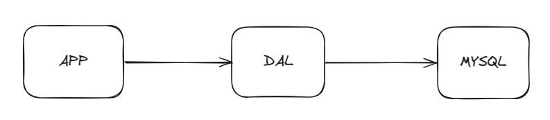

1. 数据量太大，一个机器就放不下
2. 数据的索引（B+Tree）,一个机器内存也放不下
3. 访问量（读写混合），一个机器承受不了

**Memcached****（缓存）+****MySQL****+垂直拆分**(读写分离)

网站80%的情况都是在读，每次都要去查询数据库的话就十分的麻烦！所以说我们希望减轻数据的压力，我们可以使用缓存来保证效率！

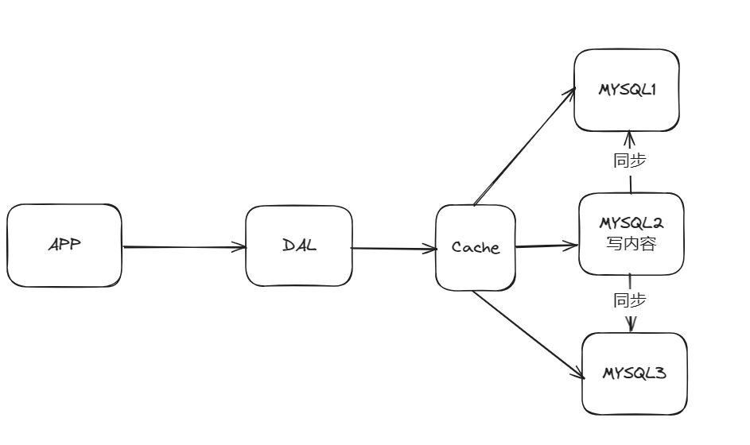

发展过程：优化数据结构和索引->文件缓存（IO)->Memcached(当时最热门的技术)

**分库分表+水平拆分+****MySQL****集群**

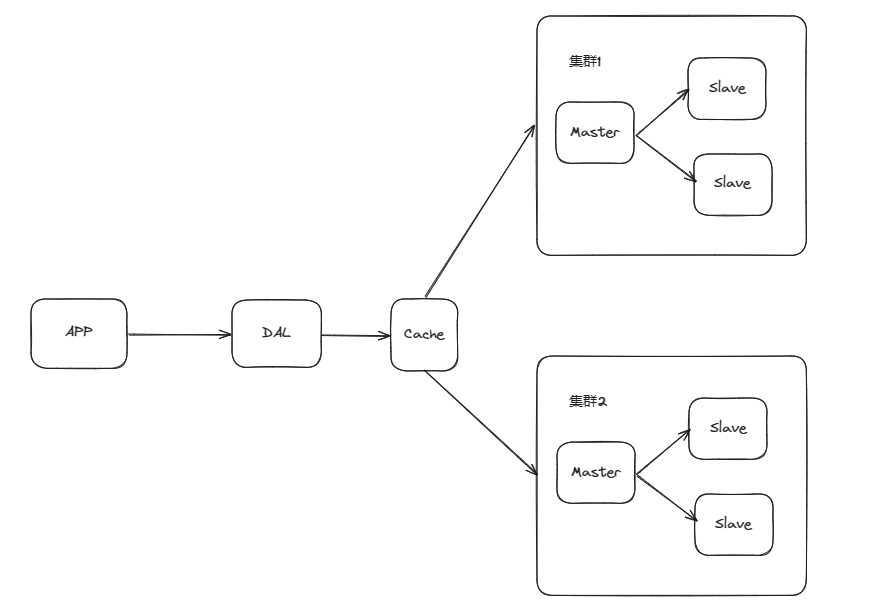

- 早些年MyISAM：表锁，十分影响效率！高并发下就会出现严重的锁问题
- 转战InnoDB：行锁

慢慢的就开始使用分库分表来解决写的压力。MySQL在那个年代推出了表分区！这个并没有多少公司使用。

**最近年代**

2010--2020十年之间，世界已经发生了翻天覆地的变化；（定位，也是一种数据，音乐，热榜！）

MySQL等关系型数据库就不够用了！数据量很多，变化很快！

MySOL有的使用它来存一些比较大的文件，博客，图片！数据库表很大，效率就低了。

**目前一个基本的互联网企业**

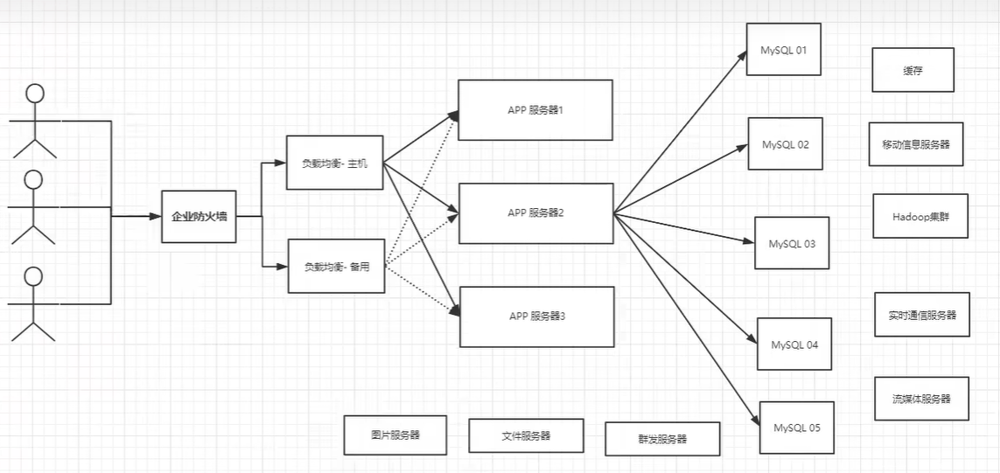

### Why NoSQL?

> NoSQL databases **use a variety of data models for accessing and managing data**.These types of databases are optimized specifically for applications that require flexible data models, large data volume, and low latency, which are achieved by relaxing some of the data consistency restrictions of relational databases.

用户的个人信息，社交网络，地理位置。用户自己产生的数据，用户日志等等爆发式增长！

这时候我们就需要使用NoSQL数据库的，NoSQL 可以很好的处理以上的情况.

NoSQL = Not Only SQL (不仅仅是SQL)

泛指非关系型数据库,随着web2.0互联网的诞生！传统的关系型数据库很难对付web2.0时代,尤其是超大规模的高并发的社区。

**NoSQL特点**

解耦！

1. 方便扩展（数据之间没有关系，很好扩展！）
2. 大数据量高性能（NoSQL的缓存记录级，是一种细粒度的缓存，性能会比较高）
3. 数据类型是多样性的！（不需要事先设计数据库！随取随用！）

### 阿里巴巴演进分析

了解（页面的数据多种多样，肯定不能用一个mysql存储）


演进：

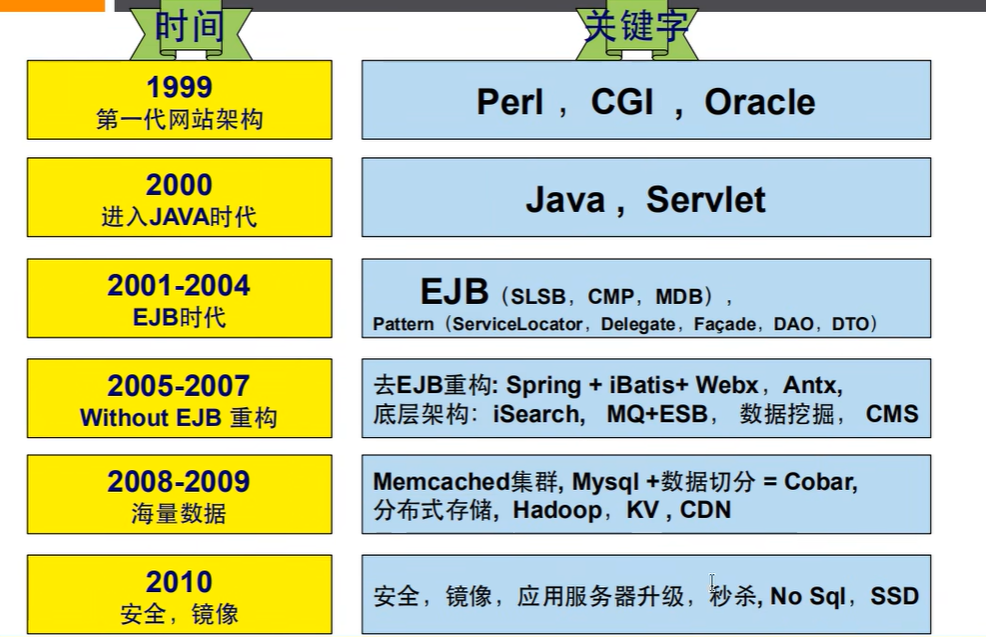

1. 商品的基本信息名称、价格、商家信息：关系型数据库就可以解决了！MySQL/orac1e（淘宝早年就去IOE了！-王坚：推荐文章：阿里云的这群疯子） 淘宝内部的 MvSQL 不是大家用的 MySQL
2. 商品的描述、评论（文字比较多） -文档型数据库中，MongoDB
3. 图片 -分布式文件系统 FastDFS -淘宝自己的TFS

​      -Gooale的GFS      -Hadoop HDFs

​      -阿里云的oss

1. 商品的关键字

​      -搜索引擎 solr elasticsearch

​      -ISerach

1. 商品热门的波段信息

​        -内存数据库

​        -Redis Tair Memache

1. 商品的交易，外部的支付接口

​        -三方应用

### NoSQL的四大分类

**KV键值对**

- 新浪：Redis
- 美团:  Redis+Tair
- 阿里、百度：Redis+memcache

**文档型数据库（bson格式和json一样）**

- MongoDB(一般必须要掌握)
  - MongoDB是一个基于分布式文件存储的数据库，c++编写，主要用于处理大量的文档
  - MongoDB 是一个介于关系型数据库和非关系型数据中中间的产品！MongoDB 是非关系型数据库中功能最丰富，最像关系型数据库的！
- ConthDB 

**列存储数据库**

- HBase
- 分布式文件系统 

**图关系数据库**

不是存图片的，是存关系的，比如朋友圈社交网络，广告推荐

- NEO4j, InfoGrid

## Redis入门

### 概述

- Redis是什么？

Redis（Remote Dictionary Server ），即远程字典服务，是一个开源的使用ANSI [C语言](https://baike.baidu.com/item/C语言/105958?fromModule=lemma_inlink)编写、支持网络、可基于内存亦可持久化的日志型、Key-Value[数据库](https://baike.baidu.com/item/数据库/103728?fromModule=lemma_inlink)，并提供多种语言的API。

- Redis能干什么？

1. 内存存储，持久化。内存是断电即失的，所以持久化很重要（rdb,aof）
2. 效率高，可以用于高速缓存
3. 发布订阅系统
4. 地图信息服务
5. 计时器，计数器（浏览量！）

- Redis特性

1. 多样的数据类型
2. 持久化
3. 集群
4. 事务

学习要用的：

- 官网：https://redis.io/
- 中文网：https://www.redis.net.cn/tutorial/3501.html

### Redis安装

推荐是linux环境，Windows的版本官方不推荐

#### **安装流程**

https://redis.io/downloads/

- finashell上传
- 解压

```C++
tar -zxvf redis-7.0.15.tar.gz
```

- 进入解压后文件可以看到redis配置文件，最好做一份拷贝

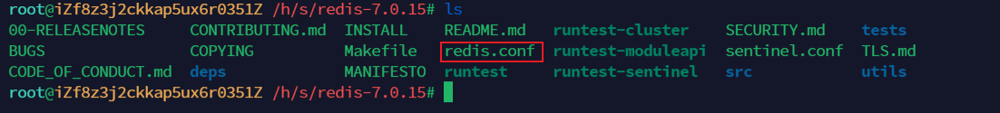

- 环境配置

```Shell
apt -y install gcc
make
```

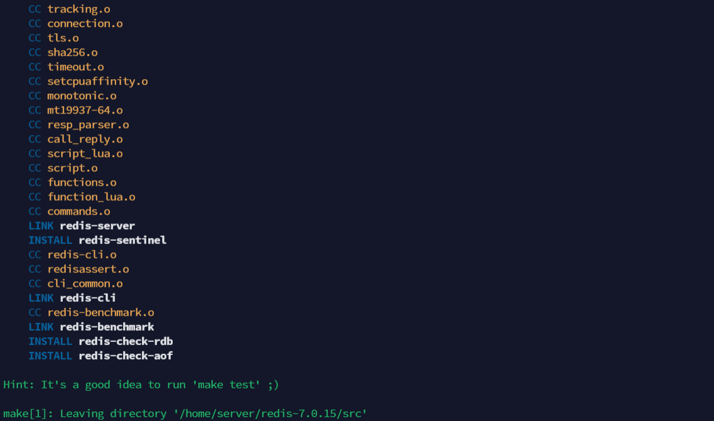

- 安装

make install


- user/local/bin下会多出命令

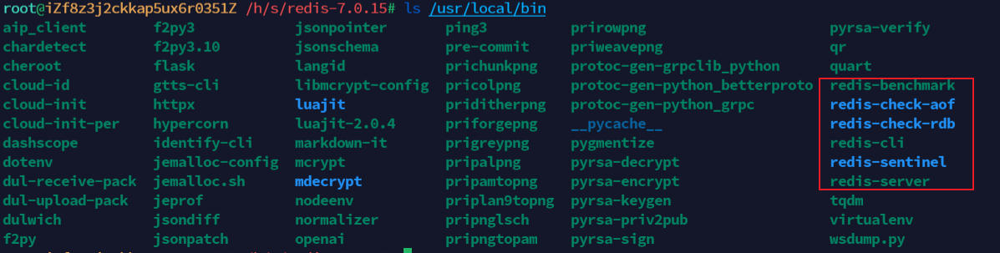

```Shell
redis-benchmark：测试电脑性能的
redis-check-aof -> redis-server：检查修复aof文件的，本质是执行了redis-server文件
redis-check-rdb -> redis-server：检查修复rdb文件的，本质是执行了redis-server文件
redis-cli：redis自带的客户端，可以使用它来连接redis服务端。（这个自带的通常不会使用）
redis-sentinel：redis哨兵，用于监控redis集群中Master状态的工具。
redis-server：启动服务
```

- 后台启动配置

1. 在/root目录下创建myredis目录

```Bash
cd /root
mkdir myredis
cd /myredis
```

1. 拷贝一份redis.conf到myredis目录

```Bash
cp /home/server/redis-7.0.15/redis.conf /root/myredis
```

1. 修改配置文件，配置让服务在后台启动

```Bash
vim redis.conf
```

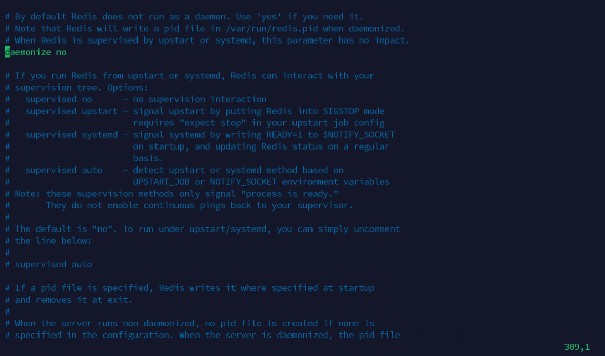

在309行把daemonize no改成yes。

1. 使用新的配置文件启动redis

```Bash
redis-server /root/myredis/redis.conf
```

检查是否成功启动

```Bash
ps -ef | grep redis
```


1. 自动客户端测试(连接指定端口号)


1. 关闭redis
   1. 单实例关闭
   2. ```Bash
      redis-cli shutdown
      ```

   3. 也可以进入终端后关闭当前实例：
   4. ```Bash
      #先进入redis客户端终端
      redis-cli
      #在终端里关闭redis
      shutdown
      ```

   5. 实例关闭
   6. ```Bash
      redis-cli -p 6379 shutdown
      ```

#### **Docker部署Redis**

1. 创建本机存放redis配置和数据目录

> 创建 redis 配置存放目录

```Bash
mkdir -p /usr/local/docker/redis/conf
```

> 创建 redis 数据存放目录

```Bash
mkdir -p /usr/local/docker/redis/data
```

> 给刚创建的两个目录授权

```Bash
chmod 777 /usr/local/docker/redis/conf
chmod 777 /usr/local/docker/redis/data
```

1. 复制配置文件到`/usr/local/docker/redis/conf/`
2. 拉取镜像

```Bash
docker pull redis
```

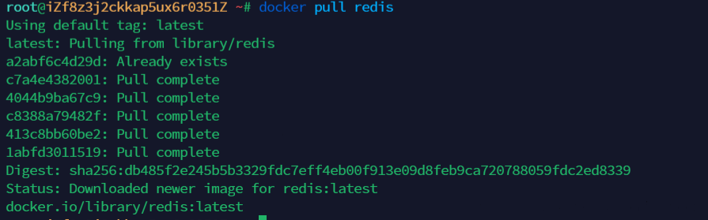

1. 运行容器

```Bash
docker run \
    -d \
    -p 6379:6379 \
    --name myRedis \
    --restart=always \
    -v /usr/local/docker/redis/data:/data \
    -v /usr/local/docker/redis/conf/redis.conf:/etc/redis \
    redis
    
    docker run \
    -d \
    -p 6379:6379 \
    --name myRedis \
    --restart=always \
    -v home/redis/data:/data \
    -v home/redis/conf/redis.conf:/etc/redis \
    redis:7.2
```

1. 停止容器

```JavaScript
docker stop myRedis
```

1. 停止后重新运行容器

```JavaScript
docker start myRedis
```

1. 重启容器

```JavaScript
docker restart myRedis
```

1. 删除容器

-f 强制移除正在运行的容器(不写-f只能移除不在运行的容器)

```JavaScript
docker rm -f myRedis
```

1. 进入运行的容器

```JavaScript
docker exec -it myRedis bash
```

### Redis-key

> redis默认有16个数据库

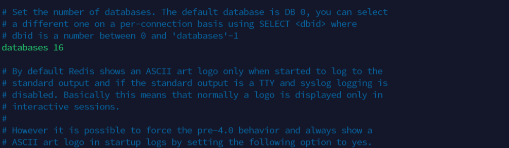

默认使用的是第0个

```JavaScript
select index #选择第index个数据库
dbsize #数据库大小查看
```

插入一个值后就变成1了


#### **基础命令**

```JavaScript
root@35661d5d4fb3:/data# redis-cli
127.0.0.1:6379> ping #测试连通
PONG
127.0.0.1:6379> select 3 #选择第几个数据库
OK
127.0.0.1:6379[3]> dbsize
(integer) 0
127.0.0.1:6379[3]> set name jaehua #插入value
OK
127.0.0.1:6379[3]> dbsize #数据库大小
(integer) 1
127.0.0.1:6379[3]> get name #获得值
"jaehua" 
127.0.0.1:6379[3]> keys * #查看所有的键
"name"
127.0.0.1:6379[3]>flushdb #清空数据库
OK
127.0.0.1:6379[3]>flushall #清空所有数据库
OK
127.0.0.1:6379> EXISTS name #存在关键字
(integer) 1
127.0.0.1:6379> expire name 10 #设置过期时间
(integer) 1
127.0.0.1:6379> ttl name #查看剩余过期时间
(integer) 6
127.0.0.1:6379> ttl name
(integer) 5
127.0.0.1:6379> ttl name
(integer) 0
127.0.0.1:6379> exists name #判断是否存在key
(integer) 0
127.0.0.1:6379> type name #关键字类型
```

#### tips

> redis是单线程的！
>
> redis是很快的，基于内存操作的。Cpu不是redis性能瓶颈，而是根据机器的内存和网络带宽。
>
> Redis为什么单线程还这么快

- 误区1：高性能服务器一定是多线程的？
- 误区2：多线程（CPU上下文切换）一定比单线程效率高？
- 

**核心：**

**Redis是将所有的数据放在内存中，所以说使用单线程处理的速度是最快的。**

## Redis五大数据类型

### String


```Bash
# 这个命令会在key1对应的值后面增加hi字符串
APPEND key1 "hi"
# 获取key1的长度
STRLEN key1
# 获得key1的值
get key1
# 实现值加一减一
incr 和decr 
# 这个直接可以加上10
incrby key 10
# 截取字符串
getrange key 0 3
# 替换指定位置开始字符串
setrange key 1 xx
# 设置过期时间
setex 
# 不存在设置，分布式锁中常常使用
setnx
# 一次性设置多个关键字和值
mset k1 v1 k2 v2 k3 v3
# 批量获取值
mget k1 k2 k3
 #先get再set
getset
```

**对象**

```JavaScript
set user:1 {name:zhangsan,age:3} #设置一个user:1对象

#这里的key是一个巧妙的设计 user:{id}:{field}
127.0.0.1:6379> mset user:1:name zhangsan user:1:age 2
OK
127.0.0.1:6379> mget user:1:name user:1:age
"zhangsan"
"2"
```

**String类似的使用场景：value除了是我们的字符串还可以是我们的数字！**

- 计数器
- 统计多单位的数量

### List

基本的数据类型，列表。

**队列，栈，这些都可以用list来实现**。

> 所有的list命令都是l开头的

- lpush

将一个或者多个值插入到列表的首部

```Bash
127.0.0.1:6379[1]> lpush list one
(integer) 1
127.0.0.1:6379[1]> lpush list two
(integer) 2
127.0.0.1:6379[1]> lpush list three
(integer) 3
```

从尾部插入的话可以用`rpush`

- lrange key start end

获取指定区间的值

```Bash
127.0.0.1:6379[1]> lrange list 0 -1
1) "three"
2) "two"
3) "one"
127.0.0.1:6379[1]> lrange list 0 1
1) "three"
2) "two"
```

- Lpop和Rpop

左边或者右边“弹出”值

```Bash
127.0.0.1:6379[1]> lpop list
"three"
127.0.0.1:6379[1]> rpop list
"one"
127.0.0.1:6379[1]> lrange list 0 -1
1) "two"
```

- Lindex

获取指定下标的值

```Bash
127.0.0.1:6379[1]> lindex list 0
"two"
```

- Llen

```Bash
127.0.0.1:6379[1]> llen lsit
(integer) 0
```

- Lrem list 1 one 

移除指定个数的value

```Bash
127.0.0.1:6379[1]> lrange list 0 -1
1) "three"
2) "three"
3) "two"
127.0.0.1:6379[1]> lrem list 2 three
(integer) 2
127.0.0.1:6379[1]> lrange list 0 -1
1) "two"
```

- Ltrim list index len

截取列表的一段长度

> 还有很多api,不作详细介绍了....

### Set

set中的值是不能重复的，这个是一个重要的特性。

- Sadd myset value

增加元素

```Bash
127.0.0.1:6379[1]> sadd myset one
(integer) 1
127.0.0.1:6379[1]> sadd myset two
(integer) 1
```

- Smembers myset

查看集合中的值

```Bash
127.0.0.1:6379[1]> smembers myset
1) "two"
2) "one"
```

- sismember myset value

判断是否存在这个值

```Bash
127.0.0.1:6379[1]> sismember myset one
(integer) 1
127.0.0.1:6379[1]> sismember myset three
(integer) 0
```

- Scard

获取里面集合个数

```Bash
127.0.0.1:6379[1]> scard myset
(integer) 2
```

- Srem myset value

移除set中的元素

```Bash
127.0.0.1:6379[1]> srem myset one
(integer) 1
127.0.0.1:6379[1]> smembers myset
1) "two"
```

- Srandmember myset count

随机获取指定个数的元素,默认是一个

```Bash
127.0.0.1:6379[1]> srandmember myset
"three"
127.0.0.1:6379[1]> srandmember myset
"two"
```

- Spop

随机删除一个元素

```Bash
127.0.0.1:6379[1]> spop myset
"three"
```

- Sdiff key1 key2

差集

- sinter key1 key2

交集

- Sunion  key1 key2

并集

### Hash

Map集合，是key-map!。本质和“string”类型没有太大的区别，还是一个简单的key-value类型

hash的相关命令以`h`开头

- Hset

插入键值对

```Bash
127.0.0.1:6379[1]> hset myhash field1 one
(integer) 1
127.0.0.1:6379[1]> hset myhash field2 two
(integer) 1
```

- hmset批量插入

- hget

获取值

```Bash
127.0.0.1:6379[1]> hget myhash field1
"one"
```

- Hmget

批量获取

- Hgetall

获取所有键值对

```Bash
127.0.0.1:6379[1]> hgetall myhash
1) "field1"
2) "one"
3) "field2"
4) "two"
```

- Hdel

删除一个键

```Bash
127.0.0.1:6379[1]> hdel myhash field1
(integer) 1
```

- Hlen

获取键值对个数

```Bash
127.0.0.1:6379[1]> hlen myhash
(integer) 1
```

- Hexists

判断某个键是否存在

- hkeys

获取所有的键

```Bash
127.0.0.1:6379[1]> hkeys myhash
1) "field2"
```

- Hvals

获取所有的值

```Bash
127.0.0.1:6379[1]> hvals myhash
1) "two"
```

### Zset

Zset在set的基础上，增加了一个值，set k1 v1, zset k1 score1 v1.实现有序性

最重要的是排序功能

- ZRANGEBYSCORE


