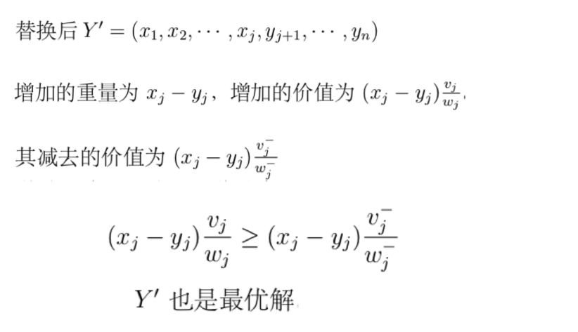

## 基本概念

- 是指算法每次做选择的时是‘贪心’的，也就是尽量选择从目前看来是最好的。
- 局部最优选择，并不一定能达到全局最优

## 重要例子

### 钱币兑换

- 动态规划解法

1. 最优子结构判断

首先要判断一下这个问题解的是否具有最优子结构性质。设X为面值为w纸币的最优解，我们从X中取走一个面值为vi的硬币，即X.xi←X.xi－1，则新的解X'必然是面值为w－vi纸币的最优解（用反证法很容易证明这个结论），所以钱币兑换问题具有最优子结构性质.

1. 递归定义值

至此很容易得到答案

- 贪心算法解法

先兑换大面额的硬币，只有中大面额硬币无法兑换的时候才兑换小面额

**伪代码**

### 小数背包

- 贪心策略

优先选取性价比大的物品，直到背包容量C<Wi

- 策略正确性证明

### 最小生成树

- Kruskal算法

1. 初始化

将图G=(V,E)初始化为n个独立的顶点，并将所有的边从小到大排序。

1. 依次遍历排序好的边，如果边eij的两个顶点vi和vj属于不同的连通分支，则将此边加入到树中，否则忽略

### 哈夫曼编码

- 相关概念

1. 前缀码：没有任何码字是其他码字的前缀
2. 编码：将每个码字连接起来即可
3. 解码

需要从一串编码中解码出每个码字。简单，因为没有重复的前缀

二进制串110001001101解析为1100-0-100-1101,表示FACE

1. 哈夫曼编码是前缀码

